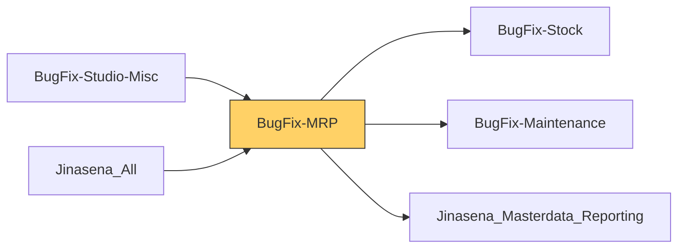

# Functional Documentation — BugFix-MRP

> Generated by `scripts/generate_functional_docs.py` from branch `Visual_Migration_02` (commit 2f7a355 2026-10-06) and the installed module on the clean environment. For every attribute: **Function** = what it does, **Depends on** = the attributes it relies on (owning module in brackets when it is not this repo), **Used by** = the attributes in any Jinasena repo that rely on it.

| Item | Value |
|---|---|
| Technical name | `BugFix-MRP` |
| Title | Jinasena : Module : MRP |
| Version | `17.0.0.0.64` |
| Category | Manufacturing |
| License | LGPL-3 |
| Installed on environment | installed 17.0.0.0.64 |
| History | [CHANGELOG.md](CHANGELOG.md) |

## Purpose

<!-- SUMMARY:repo -->
BugFix-MRP is the Jinasena module that carries the company's Manufacturing customisations, ported from Odoo Studio into Python and XML. It is used by manufacturing, costing and inventory staff who maintain bills of materials and work centers, run manufacturing orders and work orders, generate serial numbers for produced items and manage engineering change orders. Its main theme is direct costing: material, labour, overhead and general (equipment) cost lines kept on each BoM and each manufacturing order by automations.

- BoM and MO costing: four cost-line models, automations that create and update the lines from BoM components, operations and work orders, an Update Cost button on the BoM, and cost tabs and totals on the BoM and MO forms (most totals are not calculated in this port).
- Work center cost rates: labour, overhead, equipment, idle and OT cost per hour, and a Users tab with a visibility rule limiting work centers to their allowed users.
- Mass serial number generation: a pop-up wizard on the MO that generates prefixed running serial numbers and creates the lots, plus Cancel Serial Nos and finished-product-location buttons.
- Approval rules on MO Cancel and Unlock and on ECO Approve and Apply, and ECO tagging automations.
- A Material Management Module app with Material Request M records, lines, stages and tags.
- Install hook and migrations that seed selection values, plus ported access rights and record rules.
<!-- /SUMMARY -->

## Module dependencies

| Kind | Modules |
|---|---|
| Odoo standard / enterprise | `base_setup`, `mrp`, `mrp_plm`, `mrp_workorder`, `maintenance`, `hr_maintenance`, `mrp_maintenance`, `purchase_stock`, `quality`, `quality_mrp`, `quality_mrp_workorder`, `stock_delivery` |
| Jinasena repos | `BugFix-Stock`, `BugFix-Maintenance`, `Jinasena_Masterdata_Reporting` |
| Third-party apps |  |
| Used by (Jinasena repos that depend on this one) | `BugFix-Studio-Misc`, `Jinasena_All` |



## Contents at a glance

| Attribute type | Count |
|---|---|
| Models created | 10 |
| Models extended | 15 |
| Fields | 316 |
| Views | 52 |
| Window actions | 18 |
| Server actions | 41 |
| Automations | 25 |
| Approval rules | 4 |
| Menus | 4 |
| Access rights | 41 |
| Record rules | 19 |
| Install hooks | 2 |
| Migration scripts | 2 |

## Models

| Model | Description | Created / extends | Fields | Views | Actions + automations | Approvals |
|---|---|---|---|---|---|---|
| `mrp.bom` | Bill of Material | extends (mrp) | 12 | 3 | 1 | 0 |
| `mrp.bom.byproduct` | Byproduct | extends (mrp) | 0 | 0 | 0 | 0 |
| `mrp.bom.line` | Bill of Material Line | extends (mrp) | 0 | 0 | 5 | 0 |
| `mrp.document` | Production Document | extends (mrp) | 0 | 0 | 0 | 0 |
| `mrp.eco` | Engineering Change Order (ECO) | extends (mrp_plm) | 4 | 3 | 7 | 2 |
| `mrp.eco.bom.change` | ECO BoM changes | extends (mrp_plm) | 0 | 0 | 0 | 0 |
| `mrp.production` | Production Order | extends (mrp) | 34 | 3 | 12 | 2 |
| `mrp.routing.workcenter` | Work Center Usage | extends (mrp) | 0 | 0 | 12 | 0 |
| `mrp.unbuild` | Unbuild Order | extends (mrp) | 0 | 0 | 0 | 0 |
| `mrp.workcenter` | Work Center | extends (mrp) | 8 | 2 | 3 | 0 |
| `mrp.workcenter.productivity` | Workcenter Productivity Log | extends (mrp) | 1 | 1 | 0 | 0 |
| `mrp.workorder` | Work Order | extends (mrp) | 2 | 2 | 14 | 0 |
| `quality.alert` | Quality Alert | extends (quality) | 0 | 0 | 0 | 0 |
| `quality.check` | Quality Check | extends (quality) | 0 | 0 | 0 | 0 |
| `quality.point` | Quality Control Point | extends (quality) | 0 | 0 | 0 | 0 |
| `x_mass_produce_serial` | Mass Produce Serial | created | 31 | 3 | 9 | 0 |
| `x_mass_produce_serial_` | Mass Produce Serial Line | created | 33 | 1 | 3 | 0 |
| `x_material_request_m` | Material Request M | created | 38 | 9 | 0 | 0 |
| `x_material_request_m_line_af405` | material_request_m_line | created | 9 | 3 | 0 | 0 |
| `x_material_request_m_stage` | Material Request M Stages | created | 8 | 3 | 0 | 0 |
| `x_material_request_m_tag` | Material Request M Tags | created | 8 | 3 | 0 | 0 |
| `x_mrp_bom_general_cost` | mrp.bom.general.cost | created | 30 | 4 | 0 | 0 |
| `x_mrp_bom_labour_cost` | mrp.bom.labour.cost | created | 34 | 4 | 0 | 0 |
| `x_mrp_bom_material_cos` | mrp.bom.material.cost | created | 34 | 4 | 0 | 0 |
| `x_mrp_bom_overhead_cos` | mrp.bom.overhead.cost | created | 30 | 4 | 0 | 0 |

### `mrp.bom` — Bill of Material

*Extends a model created by `mrp`.* Python: `models/mrp_bom.py`.

Other repos that use this model: `server action BugFix-Accounting.sa_f5_x_sales_report_model_srm_rpt_costing_work_sheet` (BugFix-Accounting)<br>`server action BugFix-Accounting.server_action_1144_work_center_costing_model_update_journal_entries` (BugFix-Accounting)<br>`server action BugFix-Accounting.server_action_2490_srm_rpt_costing_work_sheet` (BugFix-Accounting)<br>`server action BugFix-Stock.server_action_1138_work_center_costing_model_create_journal_entries` (BugFix-Stock)<br>`server action BugFix-Stock.server_action_2566_work_center_costing_model_create_journal_entries_original` (BugFix-Stock)<br>`server action BugFix-Studio-Misc.server_action_2836_mst_odoo_data_clean_up_002` (BugFix-Studio-Misc)

**Summary:**

<!-- SUMMARY:model:mrp.bom -->
Adds BoM costing: Direct Material, Labour, Overhead and General Cost tabs holding the cost lines, a Costing section with totals, a currency and Last Updated Date (Cost). The Update Cost header button refreshes material line costs from product cost and labour, overhead and general line costs from the work center rates, then stamps the date. The total cost fields are not calculated in this port (they show 0 or a stored value nothing fills). The BoM list gains optional Display Name and Product Category columns, Product Category being always empty.
<!-- /SUMMARY -->

**Fields (12):**

| Field | Label | Type | Function | How it gets its value | Depends on | Used by |
|---|---|---|---|---|---|---|
| `x_studio_bom_total_general_cost` | Total General Cost | float | Total General Cost of the BoM on the costing tabs; read-only, not stored and with no calculation in this port, so it always shows 0. | not stored |  | `view BugFix-MRP.ported_view_2574_mrp_bom_form` |
| `x_studio_bom_total_labour_cost` | Total Labour Cost | float | Total Labour Cost of the BoM on the costing tabs (has an ir.default); read-only, not stored and with no calculation in this port, so it always shows 0. | not stored |  | `default BugFix-MRP.default_72_mrp_bom_x_studio_bom_total_labour_cost`<br>`view BugFix-MRP.ported_view_2574_mrp_bom_form` |
| `x_studio_bom_total_material_cost` | Total Material Cost | float | Total Material Cost of the BoM on the costing tabs; read-only stored number that nothing in this repo calculates. | stored |  | `view BugFix-MRP.ported_view_2574_mrp_bom_form` |
| `x_studio_bom_total_overhead_cost` | Total Overhead Cost | float | Total Overhead Cost of the BoM on the costing tabs (has an ir.default); read-only, not stored and with no calculation in this port, so it always shows 0. | not stored |  | `default BugFix-MRP.default_73_mrp_bom_x_studio_bom_total_overhead_cost`<br>`view BugFix-MRP.ported_view_2574_mrp_bom_form` |
| `x_studio_currency_id` | Currency | many2one → `res.currency` | Currency used to display the BoM cost amounts (default set by an ir.default record). | stored | `model res.currency` (base) | `default BugFix-MRP.default_220_mrp_bom_x_studio_currency_id`<br>`view BugFix-MRP.ported_view_2574_mrp_bom_form` |
| `x_studio_direct_general_cost` | Direct General Cost | one2many → `x_mrp_bom_general_cost` | General (equipment) cost lines of the BoM, one per operation, created automatically when operations are added; shown on the Direct General Cost tab. | stored | `model x_mrp_bom_general_cost` | `view BugFix-MRP.ported_view_2574_mrp_bom_form` |
| `x_studio_last_updated_date_cost` | Last Updated Date (Cost) | datetime | Date and time the Update Cost button last refreshed the BoM's cost rates; read-only on the BoM form. | stored |  | `server action BugFix-MRP.server_action_1057_update_costs_in_bom`<br>`view BugFix-MRP.ported_view_2574_mrp_bom_form` |
| `x_studio_one2many_field_4rhw9` | Direct Material Cost | one2many → `x_mrp_bom_material_cos` | Material cost lines of the BoM, one per component line, created and updated automatically from BoM lines; shown on the Direct Material Cost tab. | stored | `model x_mrp_bom_material_cos` | `view BugFix-MRP.ported_view_2574_mrp_bom_form` |
| `x_studio_one2many_field_bOopH` | Direct Overhead Cost | one2many → `x_mrp_bom_overhead_cos` | Overhead cost lines of the BoM, one per operation, created automatically when operations are added; shown on the Direct Overhead Cost tab. | stored | `model x_mrp_bom_overhead_cos` | `view BugFix-MRP.ported_view_2574_mrp_bom_form` |
| `x_studio_one2many_field_jPlQP` | Direct Labour Cost | one2many → `x_mrp_bom_labour_cost` | Labour cost lines of the BoM, one per operation, created automatically when operations are added; shown on the Direct Labour Cost tab. | stored | `model x_mrp_bom_labour_cost` | `view BugFix-MRP.ported_view_2574_mrp_bom_form` |
| `x_studio_product_category` | Product Category | char | Product Category column in the BoM list; read-only, not stored and never calculated in this port, so it is always empty. | not stored |  | `view BugFix-MRP.view_5461_odoo_studio_mrp_bom_tree_customization_e` |
| `x_studio_related_field_15j_1iv9vlere` | New Related Field | char | Unconfigured Studio 'New Related Field'; read-only, not stored and without a related target, so always empty. Unused. | not stored |  |  |

**Server actions (1):**

- **Update Costs in BOM** (`server_action_1057_update_costs_in_bom`, type `code`)
  - Function: Update Cost button on the BoM: refreshes material line costs from product cost and labour/overhead/general line costs from the work center rates, then stamps Last Updated Date (Cost).
  - Depends on: `model mrp.bom` (mrp), `model x_mrp_bom_general_cost`, `model x_mrp_bom_labour_cost`, `model x_mrp_bom_material_cos`, `model x_mrp_bom_overhead_cos`<details><summary>+1 more</summary>`mrp.bom.x_studio_last_updated_date_cost`</details>
  - Used by: `view BugFix-MRP.ported_view_2574_mrp_bom_form`, `view BugFix-MRP.ported_view_3945_mrp_bom_form_button`
  <details><summary>code (26 lines)</summary>

```python
if record.id:
  material_cost = env['x_mrp_bom_material_cos'].search([('x_studio_bom_material_cost_ids', '=', record.id)])

  if material_cost:
    for update_material_cost in material_cost:
      update_material_cost.write({'x_studio_cost': update_material_cost.x_studio_product_id.standard_price})

  labour_cost = env['x_mrp_bom_labour_cost'].search([('x_studio_bom_labour_cost_ids', '=', record.id)])

  if labour_cost:
    for update_labour_cost in labour_cost:
      update_labour_cost.write({'x_studio_cost': update_labour_cost.x_studio_operation_id.workcenter_id.x_studio_labour_cost_hour})

  overhead_cost = env['x_mrp_bom_overhead_cos'].search([('x_studio_bom_overhead_cost_ids', '=', record.id)])

  if overhead_cost:
    for update_overhead_cost in overhead_cost:
      update_overhead_cost.write({'x_studio_cost': update_overhead_cost.x_studio_operation_id.workcenter_id.x_studio_overhead_cost_hour})

  general_cost = env['x_mrp_bom_general_cost'].search([('x_studio_bom_general_cost_ids', '=', record.id)])

  if general_cost:
    for update_general_cost in general_cost:
      update_general_cost.write({'x_studio_cost': update_general_cost.x_studio_operation_id.workcenter_id.x_studio_general_cost_hour})

  record['x_studio_last_updated_date_cost'] = datetime.datetime.now()
```
  </details>
**Window actions (3):**

| Name | Record name | Function | Depends on | Used by |
|---|---|---|---|---|
| mrp.bom | `aw_f4_mrp_bom_mrp_bom` | Opens **Bill of Material** records (kanban,tree,form). | `model mrp.bom` (mrp) |  |
| mrp.bom | `action_2838_mrp_bom` | Opens **Bill of Material** records (kanban,tree,form). | `model mrp.bom` (mrp) | `menu BugFix-Studio-Misc.menu_f6r2_test_app_05_mrp_bom` (BugFix-Studio-Misc) |
| mrp.bom | `act_window_2838_mrp_bom` | Opens **Bill of Material** records (kanban,tree,form). | `model mrp.bom` (mrp) |  |

**Views (3):**

| Name | Record name | Type | What it changes | Function | Depends on | Used by |
|---|---|---|---|---|---|---|
| Odoo Studio: mrp.bom.form customization | `ported_view_2574_mrp_bom_form` | form | before `//form[1]/sheet[1]`: add header, header; after `//form[1]/sheet[1]/group[1]/group[2]/field[@name='type']`: add field x_studio_last_updated_date_cost; inside `//field[@name='operation_ids']`: add tree; inside `//form[1]/sheet[1]/notebook[1]`: add page 'Direct Material Cost', page 'Direct Labour Cost', page 'Direct Overhead Cost', page 'Direct General Cost', page 'Costing' | BoM form: adds an Update Cost header button, Last Updated Date (Cost), a custom operations list, and tabs Direct Material/Labour/Overhead/General Cost plus Costing totals. | `mrp.bom.action_mrp_workorder_show_steps()` (Odoo)<br>`mrp.bom.sequence` (mrp)<br>`mrp.bom.x_studio_bom_total_general_cost`<br>`mrp.bom.x_studio_bom_total_labour_cost`<br>`mrp.bom.x_studio_bom_total_material_cost`<details><summary>+44 more</summary>`mrp.bom.x_studio_bom_total_overhead_cost`<br>`mrp.bom.x_studio_currency_id`<br>`mrp.bom.x_studio_direct_general_cost`<br>`mrp.bom.x_studio_last_updated_date_cost`<br>`mrp.bom.x_studio_one2many_field_4rhw9`<br>`mrp.bom.x_studio_one2many_field_bOopH`<br>`mrp.bom.x_studio_one2many_field_jPlQP`<br>`server action BugFix-MRP.server_action_1057_update_costs_in_bom`<br>`view mrp.mrp_bom_form_view` (mrp)<br>`x_mrp_bom_general_cost.x_name`<br>`x_mrp_bom_general_cost.x_studio_bom_general_cost_ids`<br>`x_mrp_bom_general_cost.x_studio_cost`<br>`x_mrp_bom_general_cost.x_studio_currency_id`<br>`x_mrp_bom_general_cost.x_studio_operation_id`<br>`x_mrp_bom_general_cost.x_studio_planned_qty`<br>`x_mrp_bom_general_cost.x_studio_sequence`<br>`x_mrp_bom_general_cost.x_studio_total_cost`<br>`x_mrp_bom_labour_cost.x_name`<br>`x_mrp_bom_labour_cost.x_studio_bom_labour_cost_ids`<br>`x_mrp_bom_labour_cost.x_studio_cost`<br>`x_mrp_bom_labour_cost.x_studio_currency_id`<br>`x_mrp_bom_labour_cost.x_studio_operation_id`<br>`x_mrp_bom_labour_cost.x_studio_planned_qty`<br>`x_mrp_bom_labour_cost.x_studio_sequence`<br>`x_mrp_bom_labour_cost.x_studio_total_cost`<br>`x_mrp_bom_material_cos.x_name`<br>`x_mrp_bom_material_cos.x_studio_bom_material_cost_ids`<br>`x_mrp_bom_material_cos.x_studio_cost`<br>`x_mrp_bom_material_cos.x_studio_currency_id`<br>`x_mrp_bom_material_cos.x_studio_line_id`<br>`x_mrp_bom_material_cos.x_studio_operation_id`<br>`x_mrp_bom_material_cos.x_studio_planned_qty`<br>`x_mrp_bom_material_cos.x_studio_product_id`<br>`x_mrp_bom_material_cos.x_studio_sequence`<br>`x_mrp_bom_material_cos.x_studio_total_cost`<br>`x_mrp_bom_material_cos.x_studio_uom_id`<br>`x_mrp_bom_overhead_cos.x_name`<br>`x_mrp_bom_overhead_cos.x_studio_bom_overhead_cost_ids`<br>`x_mrp_bom_overhead_cos.x_studio_cost`<br>`x_mrp_bom_overhead_cos.x_studio_currency_id`<br>`x_mrp_bom_overhead_cos.x_studio_operation_id`<br>`x_mrp_bom_overhead_cos.x_studio_planned_qty`<br>`x_mrp_bom_overhead_cos.x_studio_sequence`<br>`x_mrp_bom_overhead_cos.x_studio_total_cost`</details> |  |
| Odoo Studio: mrp.bom.form customization-button | `ported_view_3945_mrp_bom_form_button` | form | before `//form[1]/sheet[1]`: add header, header | BoM form: adds a header with an Update Cost button (runs the 'Update Costs in BoM' server action) and an empty header; duplicates the button added by the BoM form customization. | `server action BugFix-MRP.server_action_1057_update_costs_in_bom`<br>`view mrp.mrp_bom_form_view` (mrp) |  |
| Odoo Studio: mrp.bom.tree customization | `view_5461_odoo_studio_mrp_bom_tree_customization_e` | tree | after `//field[@name='product_tmpl_id']`: add field display_name, field x_studio_product_category | BoM list: adds optional Display Name and Product Category columns after Product (Product Category is always empty in this port). | `mrp.bom.x_studio_product_category`<br>`view mrp.mrp_bom_tree_view` (mrp) |  |

**Access rights (2):**

| Name | Record name | Function | Depends on | Used by |
|---|---|---|---|---|
| Inv - Administrator | `access_6250_inv___administrator` | Gives **Inventory / Administrator** read/write/create/delete access to Bill of Material records. | `group stock.group_stock_manager` (stock)<br>`model mrp.bom` (mrp) |  |
| mrp.bom | `access_6852_mrp_bom` | Gives **Sales / Jin - Sales - POS Users** read access to Bill of Material records. | `group BugFix-Approvals.group_132_jin_sales_pos_users` (BugFix-Approvals)<br>`model mrp.bom` (mrp) |  |

**Record rules (1):**

| Name | Record name | Function | Depends on | Used by |
|---|---|---|---|---|
| mrp_bom multi-company | `rule_205_mrp_bom_multi_company` | For everyone (global rule): read/write/create/delete on Bill of Material only where `[('company_id', 'in', company_ids + [False])]`. | `model mrp.bom` (mrp)<br>`mrp.bom.company_id` (mrp) |  |

### `mrp.bom.byproduct` — Byproduct

*Extends a model created by `mrp`.*

**Summary:**

<!-- SUMMARY:model:mrp.bom.byproduct -->
This repo adds no fields or logic to this model. It ships only an access right giving Inventory Users read access and the global multi-company rule.
<!-- /SUMMARY -->

**Access rights (1):**

| Name | Record name | Function | Depends on | Used by |
|---|---|---|---|---|
| User | `access_6969_user` | Gives **Inventory / User** read access to Byproduct records. | `group stock.group_stock_user` (stock)<br>`model mrp.bom.byproduct` (mrp) |  |

**Record rules (1):**

| Name | Record name | Function | Depends on | Used by |
|---|---|---|---|---|
| mrp_bom_byproduct multi-company | `rule_207_mrp_bom_byproduct_multi_company` | For everyone (global rule): read/write/create/delete on Byproduct only where `[('company_id', 'in', company_ids + [False])]`. | `model mrp.bom.byproduct` (mrp)<br>`mrp.bom.byproduct.company_id` (mrp) |  |

### `mrp.bom.line` — Bill of Material Line

*Extends a model created by `mrp`.*

**Summary:**

<!-- SUMMARY:model:mrp.bom.line -->
Adds no fields, but two automations keep BoM material cost lines in sync: when a component line is created a matching material cost line is created, and when it changes the linked cost line's operation, product, planned quantity and unit of measure are updated. A third server action of the same name is not bound to anything and writes cost-line fields onto the BoM line itself. The global multi-company rule is also shipped.
<!-- /SUMMARY -->

**Server actions (3):**

- **Execute Code** (`server_action_1016_create_bom_material_cost`, type `code`)
  - Function: Run by an automation on a new BoM component line: creates the matching material cost line (BoM, operation, planned quantity, UoM, line link, product).
  - Depends on: `model mrp.bom.line` (mrp), `model x_mrp_bom_material_cos`, `mrp.bom.line.bom_id` (mrp), `mrp.bom.line.operation_id` (mrp), `mrp.bom.line.product_id` (mrp)<details><summary>+2 more</summary>`mrp.bom.line.product_qty` (mrp), `mrp.bom.line.product_uom_id` (mrp)</details>
  - Used by: `automation BugFix-MRP.base_automation_21_create_bom_material_cost`
  <details><summary>code (1 lines)</summary>

```python
new_record = env["x_mrp_bom_material_cos"].create({"x_studio_bom_material_cost_ids": record.bom_id.id, "x_studio_operation_id": record.operation_id.id, "x_studio_planned_qty": record.product_qty, "x_studio_uom_id": record.product_uom_id.id, "x_studio_line_id": record.id, "x_studio_product_id": record.product_id.id})
```
  </details>
- **Update BOM Material Cost** (`server_action_1033_update_bom_material_cost`, type `code`)
  - Function: Run by an automation on a changed BoM component line: updates the linked material cost line's operation, product, planned quantity and UoM.
  - Depends on: `model mrp.bom.line` (mrp), `model x_mrp_bom_material_cos`, `mrp.bom.line.bom_id` (mrp), `mrp.bom.line.operation_id` (mrp), `mrp.bom.line.product_id` (mrp)<details><summary>+2 more</summary>`mrp.bom.line.product_qty` (mrp), `mrp.bom.line.product_uom_id` (mrp)</details>
  - Used by: `automation BugFix-MRP.base_automation_23_update_bom_material_cost`
  <details><summary>code (4 lines)</summary>

```python
if record.id:
  update = env['x_mrp_bom_material_cos'].search([('x_studio_line_id', '=', record.id), ('x_studio_bom_material_cost_ids', '=', record.bom_id.id,)], limit=1)
  if update:
    update.write({'x_studio_operation_id':record.operation_id.id,'x_studio_product_id':record.product_id.id,'x_studio_planned_qty':record.product_qty,'x_studio_uom_id':record.product_uom_id.id})
```
  </details>
- **Update BOM Material Cost** (`server_action_1026_update_bom_material_cost`, type `code`)
  - Function: Writes material-cost-line fields (BoM, operation, planned qty, UoM, line, product) onto the BoM line itself, which lacks them; not bound to any automation or button. Looks broken/unused.
  - Depends on: `model mrp.bom.line` (mrp), `mrp.bom.line.bom_id` (mrp), `mrp.bom.line.operation_id` (mrp), `mrp.bom.line.product_id` (mrp), `mrp.bom.line.product_qty` (mrp)<details><summary>+1 more</summary>`mrp.bom.line.product_uom_id` (mrp)</details>
  - Used by: — (not linked to a button, menu or automation)
  <details><summary>code (1 lines)</summary>

```python
record.write({"x_studio_bom_material_cost_ids": record.bom_id.id, "x_studio_operation_id": record.operation_id.id, "x_studio_planned_qty": record.product_qty, "x_studio_uom_id": record.product_uom_id.id, "x_studio_line_id": record.id, "x_studio_product_id": record.product_id.id})
```
  </details>
**Automations (2):**

| Name | Record name | State | Function | Depends on | Used by |
|---|---|---|---|---|---|
| Create BOM Material Cost | `base_automation_21_create_bom_material_cost` |  | When a record is created or updated on Bill of Material Line, runs _Execute Code_. | `model mrp.bom.line` (mrp)<br>`mrp.bom.line.create_date` (mrp)<br>`server action BugFix-MRP.server_action_1016_create_bom_material_cost` |  |
| Update BOM Material Cost | `base_automation_23_update_bom_material_cost` |  | When a record is created or updated on Bill of Material Line, runs _Update BOM Material Cost_. | `model mrp.bom.line` (mrp)<br>`server action BugFix-MRP.server_action_1033_update_bom_material_cost` |  |

**Record rules (1):**

| Name | Record name | Function | Depends on | Used by |
|---|---|---|---|---|
| mrp_bom_line multi-company | `rule_206_mrp_bom_line_multi_company` | For everyone (global rule): read/write/create/delete on Bill of Material Line only where `[('company_id', 'in', company_ids + [False])]`. | `model mrp.bom.line` (mrp)<br>`mrp.bom.line.company_id` (mrp) |  |

### `mrp.document` — Production Document

*Extends a model created by `mrp`.*

**Summary:**

<!-- SUMMARY:model:mrp.document -->
This repo adds no fields or logic to this model. It ships only an access right giving Inventory Users read access to production documents.
<!-- /SUMMARY -->

**Access rights (1):**

| Name | Record name | Function | Depends on | Used by |
|---|---|---|---|---|
| User | `access_6971_user` | Gives **Inventory / User** read access to Production Document records. | `group stock.group_stock_user` (stock)<br>`model mrp.document` (mrp) |  |

### `mrp.eco` — Engineering Change Order (ECO)

*Extends a model created by `mrp_plm`.* Python: `models/mrp_eco.py`, `models/mrp_eco_gap.py`.

**Summary:**

<!-- SUMMARY:model:mrp.eco -->
Adds an approval step to engineering change orders: Approve and Apply both require an approval from Internal Users. On BoM-type ECOs the BoM field stays read-only and an Error message is shown until Approved Item is ticked. Automations copy the ECO name into Tag Description and then find or create an ECO tag with that text and set it as the ECO's only tag. A Filter by Tag button was stripped during porting, so its server action is not called.
<!-- /SUMMARY -->

**Fields (4):**

| Field | Label | Type | Function | How it gets its value | Depends on | Used by |
|---|---|---|---|---|---|---|
| `x_eco_id_mrp_eco_bom_change_count` | Engineering Change count | integer | Integer labelled 'Engineering Change count'; plain stored number that nothing in this repo fills or displays. | stored |  |  |
| `x_studio_error` | Error | char | Read-only error message (default text from an ir.default) shown under the BoM on the ECO form while a BoM-type ECO item is not approved. | stored |  | `default BugFix-MRP.default_371_mrp_eco_x_studio_error`<br>`view BugFix-MRP.ported_view_4830_mrp_eco_form` |
| `x_studio_item_approved` | Approved Item | boolean | Marks the ECO item as approved; while unchecked on a BoM-type ECO the BoM field stays read-only and the Error message is shown. Optional column in the ECO list. | stored |  | `view BugFix-MRP.ported_view_4830_mrp_eco_form`<br>`view BugFix-MRP.ported_view_5062_mrp_eco_tree` |
| `x_studio_tag_description` | Tag Description | char | Copy of the ECO name filled by an automation; another automation finds or creates an ECO tag with this text and links it. Hidden on the form. | stored |  | `server action BugFix-MRP.sa_f5_mrp_eco_plm_tag_create`<br>`server action BugFix-MRP.sa_f5_mrp_eco_plm_tag_description`<br>`server action BugFix-MRP.server_action_2304_plm_tag_description`<br>`server action BugFix-MRP.server_action_2305_plm_tag_create`<br>`server action BugFix-MRP.server_action_2307_plm_filter_by_tag`<details><summary>+1 more</summary>`view BugFix-MRP.ported_view_4830_mrp_eco_form`</details> |

**Server actions (5):**

- **Execute Code** (`server_action_2305_plm_tag_create`, type `code`)
  - Function: Code run by an automation: finds or creates an ECO tag named like the Tag Description and sets it as the ECO's only tag.
  - Depends on: `model mrp.eco.tag` (mrp_plm), `model mrp.eco` (mrp_plm), `mrp.eco.type` (mrp_plm), `mrp.eco.x_studio_tag_description`
  - Used by: `automation BugFix-MRP.base_automation_210_plm_tag_create`
  <details><summary>code (30 lines)</summary>

```python

line_ids = []


eco_tag_search = env['mrp.eco.tag'].search([('name', '=', record.x_studio_tag_description)],limit=1)

if eco_tag_search:

  line_ids.append(eco_tag_search.id)

else:

  eco_tag_create = env['mrp.eco.tag'].create({'name':record.x_studio_tag_description})

  line_ids.append(eco_tag_create.id)


"""if record.type == 'bom': 

  record.write({'tag_ids':[(6, 0, line_ids)], 'active':False})

else:

  record.write({'tag_ids':[(6, 0, line_ids)]})"""

  

record.write({'tag_ids':[(6, 0, line_ids)]})
```
  </details>
- **Execute Code** (`server_action_2304_plm_tag_description`, type `code`)
  - Function: Code run by an automation: copies the ECO name into Tag Description.
  - Depends on: `model mrp.eco` (mrp_plm), `mrp.eco.name` (mrp_plm), `mrp.eco.x_studio_tag_description`
  - Used by: `automation BugFix-MRP.base_automation_209_plm_tag_description`
  <details><summary>code (4 lines)</summary>

```python

#record.write({'x_studio_tag_description':record.name})
if record.name:
  record['x_studio_tag_description'] = record.name
```
  </details>
- **PLM - Filter by Tag** (`server_action_2307_plm_filter_by_tag`, type `code`)
  - Function: Opens a list of ECOs sharing the current ECO's Tag Description; its ECO form button was stripped during porting, so nothing calls it.
  - Depends on: `model mrp.eco` (mrp_plm), `mrp.eco.x_studio_tag_description`
  - Used by: — (not linked to a button, menu or automation)
  <details><summary>code (19 lines)</summary>

```python
action = {

          'name': 'Engineering Change Order ',

          'domain': [('x_studio_tag_description', '=', record.x_studio_tag_description)],

          'type': 'ir.actions.act_window',

          'res_model': 'mrp.eco',

          'view_mode': 'tree,form',

          'view_type': 'form',

          'view_id': False,

          'context': False,

          }
```
  </details>
- **PLM - Tag Create** (`sa_f5_mrp_eco_plm_tag_create`, type `code`)
  - Function: Finds an ECO tag named like the ECO's Tag Description, creating it if missing, and sets it as the ECO's only tag.
  - Depends on: `model mrp.eco.tag` (mrp_plm), `model mrp.eco` (mrp_plm), `mrp.eco.type` (mrp_plm), `mrp.eco.x_studio_tag_description`
  - Used by: — (not linked to a button, menu or automation)
  <details><summary>code (29 lines)</summary>

```python
line_ids = []


eco_tag_search = env['mrp.eco.tag'].search([('name', '=', record.x_studio_tag_description)],limit=1)

if eco_tag_search:

  line_ids.append(eco_tag_search.id)

else:

  eco_tag_create = env['mrp.eco.tag'].create({'name':record.x_studio_tag_description})

  line_ids.append(eco_tag_create.id)


"""if record.type == 'bom': 

  record.write({'tag_ids':[(6, 0, line_ids)], 'active':False})

else:

  record.write({'tag_ids':[(6, 0, line_ids)]})"""

  

record.write({'tag_ids':[(6, 0, line_ids)]})
```
  </details>
- **PLM - Tag Description** (`sa_f5_mrp_eco_plm_tag_description`, type `code`)
  - Function: Copies the ECO name into Tag Description when a name is set.
  - Depends on: `model mrp.eco` (mrp_plm), `mrp.eco.name` (mrp_plm), `mrp.eco.x_studio_tag_description`
  - Used by: — (not linked to a button, menu or automation)
  <details><summary>code (3 lines)</summary>

```python
#record.write({'x_studio_tag_description':record.name})
if record.name:
  record['x_studio_tag_description'] = record.name
```
  </details>
**Automations (2):**

| Name | Record name | State | Function | Depends on | Used by |
|---|---|---|---|---|---|
| PLM - Tag Create | `base_automation_210_plm_tag_create` |  | When a record is created or updated on Engineering Change Order (ECO), runs _Execute Code_. | `model mrp.eco` (mrp_plm)<br>`mrp.eco.create_date` (mrp_plm)<br>`server action BugFix-MRP.server_action_2305_plm_tag_create` |  |
| PLM - Tag Description | `base_automation_209_plm_tag_description` |  | When a watched field changes in the form on Engineering Change Order (ECO), runs _Execute Code_. | `model mrp.eco` (mrp_plm)<br>`mrp.eco.name` (mrp_plm)<br>`server action BugFix-MRP.server_action_2304_plm_tag_description` |  |

**Approval rules (2):**

| Name | Record name | Approver group | Function | Depends on | Used by |
|---|---|---|---|---|---|
| Engineering Change Order (ECO)/action_apply (User types / Internal User) (66) | `approval_rule_66_engineering_change_order_eco_action_apply_user_types_interna` | User types / Internal User | Before button/method `action_apply` on Engineering Change Order (ECO) runs, an approval from **User types / Internal User** is required (step 1). | `group base.group_user` (base)<br>`model mrp.eco` (mrp_plm)<br>`mrp.eco.action_apply()` (Odoo) |  |
| Engineering Change Order (ECO)/approve (User types / Internal User) (65) | `approval_rule_65_engineering_change_order_eco_approve_user_types_internal_use` | User types / Internal User | Before button/method `approve` on Engineering Change Order (ECO) runs, an approval from **User types / Internal User** is required (step 1). | `group base.group_user` (base)<br>`model mrp.eco` (mrp_plm)<br>`mrp.eco.approve()` (Odoo) |  |

**Views (3):**

| Name | Record name | Type | What it changes | Function | Depends on | Used by |
|---|---|---|---|---|---|---|
| Odoo Studio: mrp.eco.view.form customization | `ported_view_4830_mrp_eco_form` | form | inside `//sheet[1]`: add field state, field type; set studio_approval=True on `//button[@name='approve']`; set studio_approval=True on `//button[@name='action_apply']`; after `//field[@name='product_tmpl_id']`: add field x_studio_tag_description; set invisible=(type in ('routing', 'product')) or (type in ['routing', 'product']), readonly=(state != 'confirmed') or (((x_studio_item_approved != True) and (type == 'bom')) or (state != 'confirmed')), required=(type in ('bom', 'both')) or (type in ['bom', 'both']) on `//field[@name='bom_id']`; after `//field[@name='bom_id']`: add field x_studio_error; set invisible=id == 0, readonly=(state == 'done') or (state == 'done') on `//field[@name='effectivity']`; set readonly=(state == 'done') or (state == 'done') on `//field[@name='tag_ids']` … | ECO form: approval rules on Approve and Apply; hidden Tag Description; BoM read-only until Approved Item for BoM-type ECOs, with a read-only Error message; Effectivity hidden on new records; Approved Item after Tags. | `mrp.eco.product_tmpl_id` (mrp_plm)<br>`mrp.eco.state` (mrp_plm)<br>`mrp.eco.type` (mrp_plm)<br>`mrp.eco.x_studio_error`<br>`mrp.eco.x_studio_item_approved`<details><summary>+2 more</summary>`mrp.eco.x_studio_tag_description`<br>`view mrp_plm.mrp_eco_view_form` (mrp_plm)</details> |  |
| Odoo Studio: mrp.eco.view.tree customization | `ported_view_5062_mrp_eco_tree` | tree | after `//field[@name='tag_ids']`: add field x_studio_item_approved; after `//field[@name='stage_id']`: add field active | ECO list: adds optional Approved Item after Tags and a hidden Active column after Stage. | `mrp.eco.active` (mrp_plm)<br>`mrp.eco.x_studio_item_approved`<br>`view mrp_plm.mrp_eco_view_tree` (mrp_plm) |  |
| mrp.eco.view.form_button | `view_5063_mrp_eco_view_form_button_e` | form | after `//header/button[@name='action_new_revision']`: add | ECO form extension that should add a 'Filter by Tag' button after New Revision; the button was stripped (action id unresolvable), so the view has no effect. | `view mrp_plm.mrp_eco_view_form` (mrp_plm) |  |

**Record rules (1):**

| Name | Record name | Function | Depends on | Used by |
|---|---|---|---|---|
| Manufacturing ECO company rule | `rule_222_manufacturing_eco_company_rule` | For everyone (global rule): read/write/create/delete on Engineering Change Order (ECO) only where `[('company_id', 'in', company_ids + [False])]`. | `model mrp.eco` (mrp_plm)<br>`mrp.eco.company_id` (mrp_plm) |  |

### `mrp.eco.bom.change` — ECO BoM changes

*Extends a model created by `mrp_plm`.*

Other repos that use this model: `server action BugFix-Studio-Misc.server_action_2831_mst_odoo_data_clean_up_001` (BugFix-Studio-Misc)<br>`window action BugFix-Studio-Misc.act_window_2306_ecos_d7` (BugFix-Studio-Misc)<br>`window action BugFix-Studio-Misc.act_window_2834_mrp_eco_bom_change_d7` (BugFix-Studio-Misc)

**Summary:**

<!-- SUMMARY:model:mrp.eco.bom.change -->
This repo adds no fields or logic to this model. It ships two window actions that open ECO BoM changes, one filtered to the current ECO.
<!-- /SUMMARY -->

**Window actions (2):**

| Name | Record name | Function | Depends on | Used by |
|---|---|---|---|---|
| ECOs | `act_window_2306_ecos` | Opens **ECO BoM changes** records (tree,form), filtered to `[('eco_id', '=', active_id)]`. | `model mrp.eco.bom.change` (mrp_plm)<br>`mrp.eco.bom.change.eco_id` (mrp_plm) |  |
| mrp.eco.bom.change | `act_window_2834_mrp_eco_bom_change` | Opens **ECO BoM changes** records (form). | `model mrp.eco.bom.change` (mrp_plm) |  |

### `mrp.production` — Production Order

*Extends a model created by `mrp`.* Python: `models/mrp_production.py`.

Other repos that use this model: `approval rule BugFix-Approvals.rule_100_production_order_action_generate_serial_manufacturing_admini` (BugFix-Approvals)<br>`approval rule BugFix-Approvals.rule_101_production_order_action_product_forecast_report_inventory_ji` (BugFix-Approvals)<br>`approval rule BugFix-Approvals.rule_1_production_order_button_unplan_user_types_internal_user_1` (BugFix-Approvals)<br>`approval rule BugFix-Approvals.rule_2_production_order_button_mark_done_user_types_internal_user_2` (BugFix-Approvals)<br>`approval rule BugFix-Approvals.rule_3_production_order_button_mark_done_user_types_internal_user_3` (BugFix-Approvals)<br>`approval rule BugFix-Approvals.rule_4_production_order_button_mark_done_user_types_internal_user_4` (BugFix-Approvals)<br>`approval rule BugFix-Approvals.rule_5_production_order_button_mark_done_manufacturing_administrato` (BugFix-Approvals)<br>`approval rule BugFix-Approvals.rule_91_production_order_button_unbuild_manufacturing_jin_manufactur` (BugFix-Approvals)<details><summary>+18 more</summary>`approval rule BugFix-Approvals.rule_92_production_order_button_scrap_manufacturing_jin_manufacturin` (BugFix-Approvals)<br>`sale.order.line.x_studio_many2one_field_btM1W` (BugFix-Sales)<br>`server action BugFix-Accounting.sa_f5_x_sales_report_model_srm_rpt_costing_work_sheet` (BugFix-Accounting)<br>`server action BugFix-Accounting.sa_f5_x_sales_report_model_srm_rpt_sales_production_purchase_report` (BugFix-Accounting)<br>`server action BugFix-Accounting.server_action_1144_work_center_costing_model_update_journal_entries` (BugFix-Accounting)<br>`server action BugFix-Accounting.server_action_1519_sls_payment_reconciliation_automate` (BugFix-Accounting)<br>`server action BugFix-Accounting.server_action_1726_srm_auto_populate_data` (BugFix-Accounting)<br>`server action BugFix-Accounting.server_action_1763_srm_rpt_sales_production_purchase_report` (BugFix-Accounting)<br>`server action BugFix-Accounting.server_action_2490_srm_rpt_costing_work_sheet` (BugFix-Accounting)<br>`server action BugFix-Stock.server_action_1138_work_center_costing_model_create_journal_entries` (BugFix-Stock)<br>`server action BugFix-Stock.server_action_2566_work_center_costing_model_create_journal_entries_original` (BugFix-Stock)<br>`server action BugFix-Studio-Misc.server_action_2799_mst_odoo_data_clean_up` (BugFix-Studio-Misc)<br>`server action BugFix-Studio-Misc.server_action_2883_mst_odoo_data_clean_up_004` (BugFix-Studio-Misc)<br>`stock.lot.x_studio_production_id` (BugFix-Stock)<br>`x_rm_production_orders.x_studio_production_id` (BugFix-Accounting)<br>`x_rm_production_varian.x_studio_production_id` (BugFix-Accounting)<br>`x_sales_report_model.x_studio_related_field_oeTJK` (Jinasena_Masterdata_Reporting)<br>`x_sales_report_type.x_studio_production_order_id` (Jinasena_Masterdata_Reporting)</details>

**Summary:**

<!-- SUMMARY:model:mrp.production -->
Adds MO costing (Direct Material, Labour, Overhead and General Cost tabs filled per work order by automations, plus planned and actual cost totals that nothing in this repo calculates) and serial-number controls. New buttons open the Mass Produce Serial wizard, cancel generated serials and update the finished product location, and flags such as Mass Produced, Serial Cancelled and Finished Products Location Updated control which standard buttons show; several control flags are not stored and never calculated, so some buttons never appear. Approval rules require an Inventory Administrator before Cancel and Unlock, and the form adds approvals on Mark as Done and other buttons and disables create. Automations set Original MO, the Mark as Done validation message and the Report Type (M-WIP) for in-progress MOs.
<!-- /SUMMARY -->

**Fields (34):**

| Field | Label | Type | Function | How it gets its value | Depends on | Used by |
|---|---|---|---|---|---|---|
| `x_studio_currency_id` | Currency | many2one → `res.currency` | Currency used by the monetary cost columns on the MO cost tabs (default from an ir.default); hidden. | stored | `model res.currency` (base) | `default BugFix-MRP.default_423_mrp_production_x_studio_currency_id`<br>`view BugFix-MRP.ported_view_2325_mrp_production_form` |
| `x_studio_current_user` | Current User | many2one → `res.users` | Read-only user field hidden on the MO form; nothing in this repo sets it. | stored | `model res.users` (base) | `view BugFix-MRP.ported_view_2325_mrp_production_form` |
| `x_studio_direct_general_cost` | Direct General Cost | one2many → `x_mrp_bom_general_cost` | General cost lines of the MO, created and updated per work order by automations; shown on the Direct General Cost tab. | stored | `model x_mrp_bom_general_cost` | `view BugFix-MRP.ported_view_2325_mrp_production_form` |
| `x_studio_direct_material_cost` | Direct Material Cost | one2many → `x_mrp_bom_material_cos` | Material cost lines linked to the MO, shown on the Direct Material Cost tab with planned/actual quantity and cost. | stored | `model x_mrp_bom_material_cos` | `view BugFix-MRP.ported_view_2325_mrp_production_form` |
| `x_studio_finished_product_location` | Finished Product Location | many2one → `stock.location` | Finished-goods location found by the Update Finished Product Location button (sibling location flagged as finished good); hidden and read-only. | stored | `model stock.location` (stock) | `server action BugFix-MRP.server_action_2534_finished_products_location_updated`<br>`view BugFix-MRP.ported_view_2325_mrp_production_form` |
| `x_studio_finished_products_location_updated` | Finished Products Location Updated | boolean | Set by the Update Finished Product Location button; controls visibility of that button, Mass Produce Serial Nos and Mark as Done. | stored |  | `server action BugFix-MRP.server_action_2534_finished_products_location_updated`<br>`view BugFix-MRP.ported_view_2325_mrp_production_form`<br>`view BugFix-MRP.ported_view_3946_mrp_production_form_button` |
| `x_studio_grand_total_actual_cost_1` | Grand Total (Actual Cost) | float | Grand total of actual costs on the MO Costing tab; read-only stored number; nothing in this repo calculates it. | stored |  | `view BugFix-MRP.ported_view_2325_mrp_production_form` |
| `x_studio_grand_total_planned_cost` | Grand Total (Planned Cost) | float | Grand total of planned costs on the MO Costing tab; read-only stored number; nothing in this repo calculates it. | stored |  | `view BugFix-MRP.ported_view_2325_mrp_production_form` |
| `x_studio_mark_as_done_validation` | Mark as Done Validation | text | Warning 'Please enter the Quantity to produce to proceed with Mark as Done.' written by an automation (default from ir.default); shown read-only only when Quantity Validation is set. | stored |  | `default BugFix-MRP.default_475_mrp_production_x_studio_mark_as_done_validation`<br>`server action BugFix-MRP.sa_f5_mrp_production_proj_mark_as_done_validation`<br>`server action BugFix-MRP.server_action_2765_proj_mark_as_done_validation`<br>`view BugFix-MRP.ported_view_2325_mrp_production_form` |
| `x_studio_mass_produced` | Mass Produced | boolean | True once serial numbers were mass-produced for the MO (set by Create Original Serial No, cleared by Cancel Serial Nos in draft); controls Confirm, Plan, Mark as Done, Cancel and serial buttons. | stored |  | `server action BugFix-MRP.server_action_1155_update_original_mo_in_mo`<br>`server action BugFix-MRP.server_action_3202_mass_produce_serial_numbers_cancel_serial_no`<br>`view BugFix-MRP.ported_view_2325_mrp_production_form`<br>`view BugFix-MRP.ported_view_3946_mrp_production_form_button` |
| `x_studio_melt_item` | Melt Item | boolean | Read-only flag hidden on the MO form; nothing in this repo sets it. | stored |  | `view BugFix-MRP.ported_view_2325_mrp_production_form` |
| `x_studio_one2many_field_Fzcvl` | Direct Labour Cost | one2many → `x_mrp_bom_labour_cost` | Labour cost lines of the MO, created and updated per work order by automations (planned/actual hours, normal and OT rates); shown on the Direct Labour Cost tab. | stored | `model x_mrp_bom_labour_cost` | `view BugFix-MRP.ported_view_2325_mrp_production_form` |
| `x_studio_one2many_field_vg1OS` | Direct Overhead Cost | one2many → `x_mrp_bom_overhead_cos` | Overhead cost lines of the MO, created and updated per work order by automations; shown on the Direct Overhead Cost tab. | stored | `model x_mrp_bom_overhead_cos` | `view BugFix-MRP.ported_view_2325_mrp_production_form` |
| `x_studio_original_mo` | Original MO | char | MO reference used for serials: the MO name minus its last 4 characters for tracked, mass-produced MOs, otherwise the MO name; set by an automation and copied to work orders and serial lines. | stored |  | `server action BugFix-MRP.server_action_1155_update_original_mo_in_mo`<br>`view BugFix-MRP.ported_view_2325_mrp_production_form` |
| `x_studio_ot_applicable` | OT  Applicable | boolean | OT Applicable flag hidden on the MO form; read-only, not stored and never calculated, so always False. | not stored |  | `view BugFix-MRP.ported_view_2325_mrp_production_form` |
| `x_studio_pro_bom_total_general_cost` | Total General Cost | float | Total planned general cost on the MO cost tabs; read-only stored number; nothing in this repo calculates it. | stored |  | `view BugFix-MRP.ported_view_2325_mrp_production_form` |
| `x_studio_process_error` | Process Error | text | Read-only process error text (default from ir.default) shown on the MO form when Source Validate is set but the temp-location flag is not. | stored |  | `default BugFix-MRP.default_407_mrp_production_x_studio_process_error`<br>`view BugFix-MRP.ported_view_2325_mrp_production_form` |
| `x_studio_prod_bom_total_actual_labour_cost` | Total Actual Labour Cost | float | Total actual labour cost on the MO Costing tab; read-only stored number; nothing in this repo calculates it. | stored |  | `view BugFix-MRP.ported_view_2325_mrp_production_form` |
| `x_studio_prod_bom_total_actual_labour_cost_ot` | Total Actual Labour Cost (OT) | float | Total actual overtime labour cost on the MO Costing tab; read-only stored number; nothing in this repo calculates it. | stored |  | `view BugFix-MRP.ported_view_2325_mrp_production_form` |
| `x_studio_prod_bom_total_actual_labour_cost_without_ot` | Total Actual Labour Cost (Without OT) | float | Total actual labour cost excluding overtime on the MO Costing tab; read-only stored number; nothing in this repo calculates it. | stored |  | `view BugFix-MRP.ported_view_2325_mrp_production_form` |
| `x_studio_prod_bom_total_actual_material_cost` | Total  Actual Material Cost | float | Total actual material cost on the MO Costing tab; read-only stored number; nothing in this repo calculates it. | stored |  | `view BugFix-MRP.ported_view_2325_mrp_production_form` |
| `x_studio_prod_bom_total_actual_overhead_cost` | Total Actual Overhead Cost | float | Total actual overhead cost on the MO Costing tab; read-only stored number; nothing in this repo calculates it. | stored |  | `view BugFix-MRP.ported_view_2325_mrp_production_form` |
| `x_studio_prod_bom_total_labour_cost` | Total Labour Cost | float | Total planned labour cost on the MO cost tabs; read-only stored number; nothing in this repo calculates it. | stored |  | `view BugFix-MRP.ported_view_2325_mrp_production_form` |
| `x_studio_prod_bom_total_material_cost` | Total Material Cost | float | Total planned material cost on the MO cost tabs; read-only stored number; nothing in this repo calculates it. | stored |  | `view BugFix-MRP.ported_view_2325_mrp_production_form` |
| `x_studio_prod_bom_total_overhead_cost` | Total Overhead Cost | float | Total planned overhead cost on the MO cost tabs; read-only stored number; nothing in this repo calculates it. | stored |  | `view BugFix-MRP.ported_view_2325_mrp_production_form` |
| `x_studio_quantity_validation` | Quantity Validation | boolean | Hidden flag used in the Mark as Done button and validation-message conditions; read-only, not stored and never calculated, so always False and those conditions never trigger. | not stored |  | `view BugFix-MRP.ported_view_2325_mrp_production_form`<br>`view BugFix-MRP.ported_view_3946_mrp_production_form_button` |
| `x_studio_report_type_m_wip` | Report Type (M-WIP) | many2one → `x_sales_report_type` | Sales report type tag for the 'Production Overview - WIP' report, set by an automation when the MO is In Progress; hidden column in the MO list. | stored | `model x_sales_report_type` (Jinasena_Masterdata_Reporting) | `server action BugFix-MRP.server_action_1738_srm_auto_populate_report_type_in_production_order`<br>`view BugFix-MRP.ported_view_2390_mrp_production_tree` |
| `x_studio_serial_cancelled` | Serial Cancelled | boolean | Set by Cancel Serial Nos and reset when serials are created again; controls visibility of the Cancel and Cancel Serial Nos buttons. | stored |  | `server action BugFix-MRP.server_action_3202_mass_produce_serial_numbers_cancel_serial_no`<br>`view BugFix-MRP.ported_view_2325_mrp_production_form`<br>`view BugFix-MRP.ported_view_3946_mrp_production_form_button` |
| `x_studio_source_validate` | Source Validate | boolean | Flag controlling the Update Finished Product Location button, Process Error and Mark as Done; read-only, not stored and never calculated, so always False (that button never shows). | not stored |  | `view BugFix-MRP.ported_view_2325_mrp_production_form`<br>`view BugFix-MRP.ported_view_3946_mrp_production_form_button` |
| `x_studio_super_user` | Super User | boolean | Hidden Super User flag on the MO form; read-only, not stored and never calculated, so always False. | not stored |  | `view BugFix-MRP.ported_view_2325_mrp_production_form` |
| `x_studio_super_user_melt_items` | Super User (Melt Items) | boolean | Super User (Melt Items) flag shown on the MO form (default from ir.default); read-only and nothing in this repo sets it. | stored |  | `default BugFix-MRP.default_641_mrp_production_x_studio_super_user_melt_items`<br>`view BugFix-MRP.ported_view_2325_mrp_production_form` |
| `x_studio_temp_location` | Temp Location | boolean | Hidden read-only flag; when True it hides the Confirm button and affects Process Error. Nothing in this repo sets it. | stored |  | `server action BugFix-MRP.server_action_2534_finished_products_location_updated`<br>`view BugFix-MRP.ported_view_2325_mrp_production_form`<br>`view BugFix-MRP.ported_view_3946_mrp_production_form_button` |
| `x_studio_total_actual_general_cost` | Total Actual General Cost | float | Total actual general cost on the MO Costing tab; read-only stored number; nothing in this repo calculates it. | stored |  | `view BugFix-MRP.ported_view_2325_mrp_production_form` |
| `x_studio_tracked_item` | Tracked Item | boolean | Should mark MOs whose product is serial-tracked (an action writes it), but it is declared not stored with no compute, so it reads False and the Mass Produce Serial Nos button never shows. | not stored |  | `server action BugFix-MRP.server_action_1154_update_tracking_item_status_in_mo`<br>`server action BugFix-MRP.server_action_1155_update_original_mo_in_mo`<br>`view BugFix-MRP.ported_view_2325_mrp_production_form`<br>`view BugFix-MRP.ported_view_3946_mrp_production_form_button` |

**Server actions (8):**

- **Execute Code** (`server_action_2765_proj_mark_as_done_validation`, type `code`)
  - Function: Code run by an automation: writes 'Please enter the Quantity to produce to proceed with Mark as Done.' into the MO's Mark as Done Validation field.
  - Depends on: `model mrp.production` (mrp), `mrp.production.x_studio_mark_as_done_validation`
  - Used by: `automation BugFix-MRP.automation_330_proj_mark_as_done_validation`
  <details><summary>code (2 lines)</summary>

```python

record['x_studio_mark_as_done_validation'] = 'Please enter the Quantity to produce to proceed with Mark as Done.'
```
  </details>
- **Finished Products Location Updated** (`server_action_2534_finished_products_location_updated`, type `code`)
  - Function: Update Finished Product Location button: finds the finished-good location next to the MO's destination and a temp location, resets the MO to draft with the temp destination, stores the finished location and sets the updated flag; errors if missing.
  - Depends on: `model mrp.production` (mrp), `model stock.location` (stock), `mrp.production.location_dest_id` (mrp), `mrp.production.x_studio_finished_product_location`, `mrp.production.x_studio_finished_products_location_updated`<details><summary>+1 more</summary>`mrp.production.x_studio_temp_location`</details>
  - Used by: `view BugFix-MRP.ported_view_3946_mrp_production_form_button`
  <details><summary>code (15 lines)</summary>

```python
if record.id:
  location = env['stock.location'].search([('id', '=', record.location_dest_id.id)], limit=1)
  if location:
    location2 = env['stock.location'].search([('location_id', '=', location.location_id.id),('x_studio_finished_good_location', '=', True)], limit=1)
    if location2:
      temp = env['stock.location'].search([('x_studio_temp_location', '=', True)], limit=1)
      if temp:
        record['state'] = 'draft'
        record['location_dest_id'] = temp.id
        record['x_studio_finished_product_location'] = location2.id
        record['x_studio_finished_products_location_updated'] = True
      else:
        raise UserError('Temp. location has not been setup.')
    else:
      raise UserError('There is no Finished Good Location is setup for the Finished Product Location in Production Order.')
```
  </details>
- **Mass Produce Serial Numbers** (`server_action_1147_mass_produce_serial_numbers`, type `code`)
  - Function: Mass Produce Serial Nos button on the MO: opens the Mass Produce Serial wizard in a pop-up, pre-filled with the MO, product, quantity, size 4, start 1 and current company.
  - Depends on: `model mrp.production` (mrp), `model res.company` (base), `mrp.production.product_id` (mrp), `mrp.production.product_qty` (mrp)
  - Used by: `view BugFix-MRP.ported_view_3946_mrp_production_form_button`
  <details><summary>code (14 lines)</summary>

```python
company_id = env.context.get('allowed_company_ids', [env.user.company_id.id])[0]
company = env['res.company'].browse(company_id)

ctx = env.context
ctx.update({'default_x_studio_production_id':record.id,'default_x_studio_product_id':record.product_id.id,'default_x_studio_product_qty':record.product_qty,'default_x_studio_sequence_size':4,'default_x_studio_starting_serial_no':1,'default_x_studio_company_id':company.id})
action = {
          'name': 'Mass Produce Serial Nos',
          'type': 'ir.actions.act_window',
          'res_model': 'x_mass_produce_serial',
          'view_mode': 'form',
          'view_type': 'form',
          'target': 'new',
          'context': ctx,
          }
```
  </details>
- **Mass Produce Serial Numbers - Cancel Serial No** (`server_action_3202_mass_produce_serial_numbers_cancel_serial_no`, type `code`)
  - Function: Cancel Serial Nos button on the MO: deletes all lots/serials of the current company linked to the MO, clears Mass Produced if the MO is draft, and sets Serial Cancelled.
  - Depends on: `model mrp.production` (mrp), `model res.company` (base), `model stock.lot` (stock), `mrp.production.state` (mrp), `mrp.production.x_studio_mass_produced`<details><summary>+1 more</summary>`mrp.production.x_studio_serial_cancelled`</details>
  - Used by: `view BugFix-MRP.ported_view_3946_mrp_production_form_button`
  <details><summary>code (12 lines)</summary>

```python
if record.id:

  company_id = env.context.get('allowed_company_ids', [env.user.company_id.id])[0]
  company = env['res.company'].browse(company_id)

  serial_no = env['stock.lot'].search([('x_studio_production_id', '=', record.id),('company_id', '=', company.id)])
  for lines in serial_no:
    lines.unlink()
  if record.state == 'draft':
    record['x_studio_mass_produced'] = False

  record['x_studio_serial_cancelled'] = True
```
  </details>
- **PROJ - Mark as Done Validation** (`sa_f5_mrp_production_proj_mark_as_done_validation`, type `code`)
  - Function: Writes the message 'Please enter the Quantity to produce to proceed with Mark as Done.' into the MO's Mark as Done Validation field.
  - Depends on: `model mrp.production` (mrp), `mrp.production.x_studio_mark_as_done_validation`
  - Used by: — (not linked to a button, menu or automation)
  <details><summary>code (1 lines)</summary>

```python
record['x_studio_mark_as_done_validation'] = 'Please enter the Quantity to produce to proceed with Mark as Done.'
```
  </details>
- **SRM - Auto Populate Report Type in Production Order** (`server_action_1738_srm_auto_populate_report_type_in_production_order`, type `code`)
  - Function: Run by an automation: when the MO is In Progress, sets Report Type (M-WIP) to the sales report type coded 'Production Overview - WIP'.
  - Depends on: `model mrp.production` (mrp), `model x_sales_report_type` (Jinasena_Masterdata_Reporting), `mrp.production.state` (mrp), `mrp.production.x_studio_report_type_m_wip` (Jinasena_Masterdata_Reporting)
  - Used by: `automation BugFix-MRP.automation_122_srm_auto_populate_report_type_in_production_order`
  <details><summary>code (4 lines)</summary>

```python
if record.state == 'progress':
  rpt_id= env['x_sales_report_type'].search([('x_studio_report_code', '=', 'Production Overview - WIP')],limit=1)
  if rpt_id:
   record['x_studio_report_type_m_wip'] = rpt_id.id
```
  </details>
- **Update Original MO in MO** (`server_action_1155_update_original_mo_in_mo`, type `code`)
  - Function: Run by an automation: sets Original MO to the MO name minus its last 4 characters when the MO is tracked and mass-produced, otherwise to the MO name.
  - Depends on: `model mrp.production` (mrp), `mrp.production.name` (mrp), `mrp.production.x_studio_mass_produced`, `mrp.production.x_studio_original_mo`, `mrp.production.x_studio_tracked_item`
  - Used by: `automation BugFix-MRP.automation_47_update_original_mo_in_mo`
  <details><summary>code (6 lines)</summary>

```python
if record.id:
  if 	record.x_studio_tracked_item == True and record.x_studio_mass_produced == True:
    size = len(record.name)
    record['x_studio_original_mo'] = record.name[:size - 4]
  else:
    record['x_studio_original_mo'] = record.name
```
  </details>
- **Update Tracking Item Status in MO** (`server_action_1154_update_tracking_item_status_in_mo`, type `code`)
  - Function: Sets Tracked Item True when the MO product is serial-tracked, else False; not bound to any automation here, and the field is unstored so the value is lost.
  - Depends on: `model mrp.production` (mrp), `mrp.production.product_id` (mrp), `mrp.production.x_studio_tracked_item`
  - Used by: — (not linked to a button, menu or automation)
  <details><summary>code (5 lines)</summary>

```python
if record.product_id:
  if record.product_id.tracking == 'serial':
    record['x_studio_tracked_item'] = True
  else:
    record['x_studio_tracked_item'] = False
```
  </details>
**Automations (4):**

| Name | Record name | State | Function | Depends on | Used by |
|---|---|---|---|---|---|
| PROJ - Mark as Done Validation | `automation_330_proj_mark_as_done_validation` |  | When a record is created or updated on Production Order, runs _Execute Code_. | `model mrp.production` (mrp)<br>`server action BugFix-MRP.server_action_2765_proj_mark_as_done_validation` |  |
| SRM - Auto Populate Report Type in Production Order | `automation_122_srm_auto_populate_report_type_in_production_order` |  | When a record is created or updated on Production Order, runs _SRM - Auto Populate Report Type in Production Order_. | `model mrp.production` (mrp)<br>`server action BugFix-MRP.server_action_1738_srm_auto_populate_report_type_in_production_order` |  |
| Update Original MO in MO | `automation_47_update_original_mo_in_mo` |  | When a record is created or updated on Production Order, runs _Update Original MO in MO_. | `model mrp.production` (mrp)<br>`server action BugFix-MRP.server_action_1155_update_original_mo_in_mo` |  |
| Update Tracking Item Status in MO | `base_automation_46_update_tracking_item_status_in_mo` | archived | When a watched field changes in the form on Production Order, runs nothing (no action linked). **Archived — does not run.** | `model mrp.production` (mrp) |  |

**Approval rules (2):**

| Name | Record name | Approver group | Function | Depends on | Used by |
|---|---|---|---|---|---|
| Cancel (Production Order) | `approval_rule_108_cancel_production_order` | Inventory / Administrator | Before button/method `action_cancel` on Production Order runs, an approval from **Inventory / Administrator** is required (step 1). | `group stock.group_stock_manager` (stock)<br>`model mrp.production` (mrp)<br>`mrp.production.action_cancel()` (Odoo) |  |
| Unlock (Production Order) | `approval_rule_107_unlock_production_order` | Inventory / Administrator | Before button/method `action_toggle_is_locked` on Production Order runs, an approval from **Inventory / Administrator** is required (step 1). | `group stock.group_stock_manager` (stock)<br>`model mrp.production` (mrp)<br>`mrp.production.action_toggle_is_locked()` (Odoo) |  |

**Views (3):**

| Name | Record name | Type | What it changes | Function | Depends on | Used by |
|---|---|---|---|---|---|---|
| Odoo Studio: mrp.production.form customization | `ported_view_2325_mrp_production_form` | form | set create=false, delete=true, edit=true on `//form[1]`; set studio_approval=True on `//form[1]/header[1]/button[@name='button_mark_done']`; set studio_approval=True on `//form[1]/header[1]/button[@name='button_mark_done'][2]`; set studio_approval=True on `//form[1]/header[1]/button[@name='button_mark_done'][3]`; set studio_approval=True on `//form[1]/header[1]/button[@name='button_mark_done'][4]`; set studio_approval=True on `//button[@name='button_unplan']`; set invisible=state in [] or not reserve_visible on `//button[@name='action_assign']`; set studio_approval=True on `//button[@name='button_scrap']` … | MO form: disables create, adds approval rules on Mark as Done, Unplan, Scrap, Unbuild and forecast buttons, customises work order/component lists, adds validation and serial fields, and tabs Direct Material/Labour/Overhead/General Cost plus Costing. | `group account.group_account_readonly` (account)<br>`group base.group_multi_company` (base)<br>`group base.group_no_one` (base)<br>`group mrp.group_mrp_manager` (mrp)<br>`group stock.group_adv_location` (stock)<details><summary>+128 more</summary>`group uom.group_uom` (uom)<br>`mrp.production.action_get_account_moves()` (Odoo)<br>`mrp.production.bom_id` (mrp)<br>`mrp.production.button_finish()` (Odoo)<br>`mrp.production.button_pending()` (Odoo)<br>`mrp.production.button_start()` (Odoo)<br>`mrp.production.button_unblock()` (Odoo)<br>`mrp.production.check_ids` (mrp_workorder)<br>`mrp.production.company_id` (mrp)<br>`mrp.production.components_availability_state` (mrp)<br>`mrp.production.consumption` (mrp)<br>`mrp.production.date_deadline` (mrp)<br>`mrp.production.date_finished` (mrp)<br>`mrp.production.date_start` (mrp)<br>`mrp.production.duration_expected` (mrp)<br>`mrp.production.duration` (mrp)<br>`mrp.production.json_popover` (mrp)<br>`mrp.production.location_dest_id` (mrp)<br>`mrp.production.move_dest_ids` (mrp)<br>`mrp.production.name` (mrp)<br>`mrp.production.origin` (mrp)<br>`mrp.production.product_id` (mrp)<br>`mrp.production.product_tracking` (mrp)<br>`mrp.production.product_uom_category_id` (mrp)<br>`mrp.production.product_uom_id` (mrp)<br>`mrp.production.product_uom_qty` (mrp)<br>`mrp.production.qty_producing` (mrp)<br>`mrp.production.quality_check_fail` (quality_mrp)<br>`mrp.production.state` (mrp)<br>`mrp.production.user_id` (mrp)<br>`mrp.production.workcenter_id` (mrp)<br>`mrp.production.x_studio_currency_id`<br>`mrp.production.x_studio_current_user`<br>`mrp.production.x_studio_direct_general_cost`<br>`mrp.production.x_studio_direct_material_cost`<br>`mrp.production.x_studio_finished_product_location`<br>`mrp.production.x_studio_finished_products_location_updated`<br>`mrp.production.x_studio_grand_total_actual_cost_1`<br>`mrp.production.x_studio_grand_total_planned_cost`<br>`mrp.production.x_studio_mark_as_done_validation`<br>`mrp.production.x_studio_mass_produced`<br>`mrp.production.x_studio_melt_item`<br>`mrp.production.x_studio_one2many_field_Fzcvl`<br>`mrp.production.x_studio_one2many_field_vg1OS`<br>`mrp.production.x_studio_original_mo`<br>`mrp.production.x_studio_ot_applicable`<br>`mrp.production.x_studio_pro_bom_total_general_cost`<br>`mrp.production.x_studio_process_error`<br>`mrp.production.x_studio_prod_bom_total_actual_labour_cost_ot`<br>`mrp.production.x_studio_prod_bom_total_actual_labour_cost_without_ot`<br>`mrp.production.x_studio_prod_bom_total_actual_labour_cost`<br>`mrp.production.x_studio_prod_bom_total_actual_material_cost`<br>`mrp.production.x_studio_prod_bom_total_actual_overhead_cost`<br>`mrp.production.x_studio_prod_bom_total_labour_cost`<br>`mrp.production.x_studio_prod_bom_total_material_cost`<br>`mrp.production.x_studio_prod_bom_total_overhead_cost`<br>`mrp.production.x_studio_quantity_validation`<br>`mrp.production.x_studio_serial_cancelled`<br>`mrp.production.x_studio_source_validate`<br>`mrp.production.x_studio_super_user_melt_items`<br>`mrp.production.x_studio_super_user`<br>`mrp.production.x_studio_temp_location`<br>`mrp.production.x_studio_total_actual_general_cost`<br>`mrp.production.x_studio_tracked_item`<br>`quality.check.control_date` (quality)<br>`quality.check.finished_lot_id` (mrp_workorder)<br>`quality.check.quality_state` (quality)<br>`quality.check.result` (mrp_workorder)<br>`quality.check.test_type` (quality)<br>`quality.check.title` (quality)<br>`quality.check.user_id` (quality)<br>`stock.move.location_dest_id` (stock)<br>`stock.move.location_id` (stock)<br>`stock.move.product_uom_qty` (stock)<br>`stock.move.product_uom` (stock)<br>`stock.move.state` (stock)<br>`view mrp.mrp_production_form_view` (mrp)<br>`window action mrp.act_mrp_block_workcenter_wo` (mrp)<br>`x_mrp_bom_general_cost.x_name`<br>`x_mrp_bom_general_cost.x_studio_actual_qty`<br>`x_mrp_bom_general_cost.x_studio_bom_general_cost_ids`<br>`x_mrp_bom_general_cost.x_studio_cost`<br>`x_mrp_bom_general_cost.x_studio_currency_id`<br>`x_mrp_bom_general_cost.x_studio_operation_id`<br>`x_mrp_bom_general_cost.x_studio_planned_qty`<br>`x_mrp_bom_general_cost.x_studio_prod_bom_general_cost_ids`<br>`x_mrp_bom_general_cost.x_studio_sequence`<br>`x_mrp_bom_general_cost.x_studio_total_actual_cost`<br>`x_mrp_bom_general_cost.x_studio_total_cost`<br>`x_mrp_bom_labour_cost.x_name`<br>`x_mrp_bom_labour_cost.x_studio_actual_qty`<br>`x_mrp_bom_labour_cost.x_studio_bom_labour_cost_ids`<br>`x_mrp_bom_labour_cost.x_studio_cost_ot`<br>`x_mrp_bom_labour_cost.x_studio_cost_without_ot`<br>`x_mrp_bom_labour_cost.x_studio_cost`<br>`x_mrp_bom_labour_cost.x_studio_currency_id`<br>`x_mrp_bom_labour_cost.x_studio_operation_id`<br>`x_mrp_bom_labour_cost.x_studio_planned_qty`<br>`x_mrp_bom_labour_cost.x_studio_prod_bom_labour_cost_ids`<br>`x_mrp_bom_labour_cost.x_studio_sequence`<br>`x_mrp_bom_labour_cost.x_studio_total_actual_cost_ot`<br>`x_mrp_bom_labour_cost.x_studio_total_actual_cost_without_ot`<br>`x_mrp_bom_labour_cost.x_studio_total_actual_cost`<br>`x_mrp_bom_labour_cost.x_studio_total_cost`<br>`x_mrp_bom_material_cos.x_name`<br>`x_mrp_bom_material_cos.x_studio_actual_qty`<br>`x_mrp_bom_material_cos.x_studio_bom_material_cost_ids`<br>`x_mrp_bom_material_cos.x_studio_cost`<br>`x_mrp_bom_material_cos.x_studio_currency_id`<br>`x_mrp_bom_material_cos.x_studio_operation_id`<br>`x_mrp_bom_material_cos.x_studio_planned_qty`<br>`x_mrp_bom_material_cos.x_studio_prod_bom_material_cost_ids`<br>`x_mrp_bom_material_cos.x_studio_product_id`<br>`x_mrp_bom_material_cos.x_studio_sequence`<br>`x_mrp_bom_material_cos.x_studio_total_actual_cost`<br>`x_mrp_bom_material_cos.x_studio_total_cost`<br>`x_mrp_bom_material_cos.x_studio_uom_id`<br>`x_mrp_bom_overhead_cos.x_name`<br>`x_mrp_bom_overhead_cos.x_studio_actual_qty`<br>`x_mrp_bom_overhead_cos.x_studio_bom_overhead_cost_ids`<br>`x_mrp_bom_overhead_cos.x_studio_cost`<br>`x_mrp_bom_overhead_cos.x_studio_currency_id`<br>`x_mrp_bom_overhead_cos.x_studio_operation_id`<br>`x_mrp_bom_overhead_cos.x_studio_planned_qty`<br>`x_mrp_bom_overhead_cos.x_studio_prod_bom_overhead_cost_ids`<br>`x_mrp_bom_overhead_cos.x_studio_sequence`<br>`x_mrp_bom_overhead_cos.x_studio_total_actual_cost`<br>`x_mrp_bom_overhead_cos.x_studio_total_cost`</details> |  |
| Odoo Studio: mrp.production.form-button | `ported_view_3946_mrp_production_form_button` | form | inside `//sheet[1]`: add field x_studio_finished_products_location_updated, field x_studio_source_validate, field x_studio_mass_produced, field x_studio_tracked_item, field x_studio_serial_cancelled, field x_studio_temp_location, field x_studio_quantity_validation; after `//header/field[@name='show_lock']`: add button 'Mass Produce Serial Nos'; before `//header/button[@name='button_mark_done'][3]`: add button 'Update Finished Product Location'; before `//header/button[@name='action_cancel']`: add button 'Cancel Serial Nos'; set invisible=(state != 'draft') or (((x_studio_mass_produced == False) and (x_studio_tracked_item == True)) or ((state != 'draft') or (x_studio_temp_location == True))) on `//header/button[@name='action_confirm']`; set invisible=((id == False) or (state in ('done', 'cancel')) or ((x_studio_serial_cancelled == False) and (x_studio_mass_produced == True))) on `//header/button[@name='action_cancel']`; set invisible=(move_raw_ids or not show_produce) or (((state != 'to_close') and ((qty_producing != 0) or (state not in ('confirmed', 'progress')))) or (((x_studio_mass_produced == False) and (x_studio_tracked_item == True)) or (((x_studio_finished_products_location_updated == False) and (x_studio_source_validate == True)) or ((set(move_raw_ids).intersection([])) or (x_studio_quantity_validation == True))))) on `//header/button[@name='button_mark_done'][3]`; set invisible=(state not in ('confirmed', 'progress', 'to_close') or not workorder_ids or is_planned) or (((x_studio_mass_produced == False) and (x_studio_tracked_item == True)) or ((is_planned == True) or ((set(workorder_ids).intersection([])) or (state not in ('confirmed', 'progress', 'to_close'))))) on `//header/button[@name='button_plan']` … | MO form: adds hidden control flags and buttons Mass Produce Serial Nos, Update Finished Product Location and Cancel Serial Nos; tightens visibility of Confirm, Cancel, Mark as Done, Plan, Unreserve and Scrap; removes the standard mass-produce wizard button. | `mrp.production.state` (mrp)<br>`mrp.production.x_studio_finished_products_location_updated`<br>`mrp.production.x_studio_mass_produced`<br>`mrp.production.x_studio_quantity_validation`<br>`mrp.production.x_studio_serial_cancelled`<details><summary>+7 more</summary>`mrp.production.x_studio_source_validate`<br>`mrp.production.x_studio_temp_location`<br>`mrp.production.x_studio_tracked_item`<br>`server action BugFix-MRP.server_action_1147_mass_produce_serial_numbers`<br>`server action BugFix-MRP.server_action_2534_finished_products_location_updated`<br>`server action BugFix-MRP.server_action_3202_mass_produce_serial_numbers_cancel_serial_no`<br>`view mrp.mrp_production_form_view` (mrp)</details> |  |
| Odoo Studio: mrp.production.tree customization | `ported_view_2390_mrp_production_tree` | tree | after `//field[@name='duration_expected']`: add field product_tracking, field orderpoint_id, field forecasted_issue, field is_planned; after `//field[@name='activity_exception_decoration']`: add field x_studio_report_type_m_wip | MO list: adds optional columns Product Tracking, Reorder Rule, Forecasted Issue and Planned, plus a hidden Report Type (M-WIP) column. | `mrp.production.forecasted_issue` (mrp)<br>`mrp.production.is_planned` (mrp)<br>`mrp.production.orderpoint_id` (mrp)<br>`mrp.production.product_tracking` (mrp)<br>`mrp.production.x_studio_report_type_m_wip` (Jinasena_Masterdata_Reporting)<details><summary>+1 more</summary>`view mrp.mrp_production_tree_view` (mrp)</details> |  |

**Access rights (1):**

| Name | Record name | Function | Depends on | Used by |
|---|---|---|---|---|
| Administrator - Kapila | `access_5656_administrator___kapila` | Gives **Inventory / Administrator** read/write/create/delete access to Production Order records. | `group stock.group_stock_manager` (stock)<br>`model mrp.production` (mrp) |  |

**Record rules (1):**

| Name | Record name | Function | Depends on | Used by |
|---|---|---|---|---|
| mrp_production multi-company | `rule_201_mrp_production_multi_company` | For everyone (global rule): read/write/create/delete on Production Order only where `[('company_id', 'in', company_ids)]`. | `model mrp.production` (mrp)<br>`mrp.production.company_id` (mrp) |  |

### `mrp.routing.workcenter` — Work Center Usage

*Extends a model created by `mrp`.*

**Summary:**

<!-- SUMMARY:model:mrp.routing.workcenter -->
Adds no fields, but six automations maintain BoM cost lines per operation: when an operation is added to a BoM they create a labour, an overhead and a general cost line with planned hours equal to the cycle time divided by 60, and when it changes they update those planned hours. It also ships the read access for Inventory Users and the global multi-company rule.
<!-- /SUMMARY -->

**Server actions (6):**

- **Create BOM General Cost** (`server_action_1054_create_bom_general_cost`, type `code`)
  - Function: Run by an automation on a new BoM operation: creates a general cost line for the BoM with the operation and planned hours (cycle time / 60).
  - Depends on: `model mrp.routing.workcenter` (mrp), `model x_mrp_bom_general_cost`, `mrp.routing.workcenter.bom_id` (mrp), `mrp.routing.workcenter.time_cycle` (mrp)
  - Used by: `automation BugFix-MRP.base_automation_26_create_bom_general_cost`
  <details><summary>code (1 lines)</summary>

```python
new_record = env["x_mrp_bom_general_cost"].create({"x_studio_bom_general_cost_ids": record.bom_id.id, "x_studio_operation_id": record.id, "x_studio_planned_qty": record.time_cycle/60.00})
```
  </details>
- **Create BOM Labour Cost** (`server_action_1040_create_bom_labour_cost`, type `code`)
  - Function: Run by an automation on a new BoM operation: creates a labour cost line for the BoM with the operation and planned hours (cycle time / 60).
  - Depends on: `model mrp.routing.workcenter` (mrp), `model x_mrp_bom_labour_cost`, `mrp.routing.workcenter.bom_id` (mrp), `mrp.routing.workcenter.time_cycle` (mrp)
  - Used by: `automation BugFix-MRP.base_automation_24_create_bom_labour_cost`
  <details><summary>code (1 lines)</summary>

```python
new_record = env["x_mrp_bom_labour_cost"].create({"x_studio_bom_labour_cost_ids": record.bom_id.id, "x_studio_planned_qty": record.time_cycle/60.00, "x_studio_operation_id": record.id})
```
  </details>
- **Create BOM Overhead Cost** (`server_action_1049_create_bom_overhead_cost`, type `code`)
  - Function: Run by an automation on a new BoM operation: creates an overhead cost line for the BoM with the operation and planned hours (cycle time / 60).
  - Depends on: `model mrp.routing.workcenter` (mrp), `model x_mrp_bom_overhead_cos`, `mrp.routing.workcenter.bom_id` (mrp), `mrp.routing.workcenter.time_cycle` (mrp)
  - Used by: `automation BugFix-MRP.base_automation_25_create_bom_overhead_cost`
  <details><summary>code (1 lines)</summary>

```python
new_record = env["x_mrp_bom_overhead_cos"].create({"x_studio_bom_overhead_cost_ids": record.bom_id.id, "x_studio_operation_id": record.id, "x_studio_planned_qty": record.time_cycle/60.00})
```
  </details>
- **Update BOM General Cost** (`server_action_1127_update_bom_general_cost`, type `code`)
  - Function: Run by an automation on a changed BoM operation: updates its general cost line's planned hours (cycle time / 60).
  - Depends on: `model mrp.routing.workcenter` (mrp), `model x_mrp_bom_general_cost`, `mrp.routing.workcenter.bom_id` (mrp), `mrp.routing.workcenter.time_cycle` (mrp)
  - Used by: `automation BugFix-MRP.base_automation_38_update_bom_general_cost`
  <details><summary>code (4 lines)</summary>

```python
if record.bom_id and record.id:
  update = env['x_mrp_bom_general_cost'].search([('x_studio_bom_general_cost_ids', '=', record.bom_id.id), ('x_studio_operation_id', '=', record.id)], limit=1)
  if update:
    update.write({'x_studio_operation_id':record.id,'x_studio_planned_qty':record.time_cycle/60.00})
```
  </details>
- **Update BOM Labour Cost** (`server_action_1113_update_bom_labour_cost`, type `code`)
  - Function: Run by an automation on a changed BoM operation: updates its labour cost line's planned hours (cycle time / 60).
  - Depends on: `model mrp.routing.workcenter` (mrp), `model x_mrp_bom_labour_cost`, `mrp.routing.workcenter.bom_id` (mrp), `mrp.routing.workcenter.time_cycle` (mrp)
  - Used by: `automation BugFix-MRP.base_automation_36_update_bom_labour_cost`
  <details><summary>code (4 lines)</summary>

```python
if record.bom_id and record.id:
  update = env['x_mrp_bom_labour_cost'].search([('x_studio_bom_labour_cost_ids', '=', record.bom_id.id), ('x_studio_operation_id', '=', record.id)], limit=1)
  if update:
    update.write({'x_studio_operation_id':record.id,'x_studio_planned_qty':record.time_cycle/60.00})
```
  </details>
- **Update BOM Overhead Cost** (`server_action_1120_update_bom_overhead_cost`, type `code`)
  - Function: Run by an automation on a changed BoM operation: updates its overhead cost line's planned hours (cycle time / 60).
  - Depends on: `model mrp.routing.workcenter` (mrp), `model x_mrp_bom_overhead_cos`, `mrp.routing.workcenter.bom_id` (mrp), `mrp.routing.workcenter.time_cycle` (mrp)
  - Used by: `automation BugFix-MRP.base_automation_37_update_bom_overhead_cost`
  <details><summary>code (4 lines)</summary>

```python
if record.bom_id and record.id:
  update = env['x_mrp_bom_overhead_cos'].search([('x_studio_bom_overhead_cost_ids', '=', record.bom_id.id), ('x_studio_operation_id', '=', record.id)], limit=1)
  if update:
    update.write({'x_studio_operation_id':record.id,'x_studio_planned_qty':record.time_cycle/60.00})
```
  </details>
**Automations (6):**

| Name | Record name | State | Function | Depends on | Used by |
|---|---|---|---|---|---|
| Create BOM General Cost | `base_automation_26_create_bom_general_cost` |  | When a record is created or updated on Work Center Usage, runs _Create BOM General Cost_. | `model mrp.routing.workcenter` (mrp)<br>`mrp.routing.workcenter.create_date` (mrp)<br>`server action BugFix-MRP.server_action_1054_create_bom_general_cost` |  |
| Create BOM Labour Cost | `base_automation_24_create_bom_labour_cost` |  | When a record is created or updated on Work Center Usage, runs _Create BOM Labour Cost_. | `model mrp.routing.workcenter` (mrp)<br>`mrp.routing.workcenter.create_date` (mrp)<br>`server action BugFix-MRP.server_action_1040_create_bom_labour_cost` |  |
| Create BOM Overhead Cost | `base_automation_25_create_bom_overhead_cost` |  | When a record is created or updated on Work Center Usage, runs _Create BOM Overhead Cost_. | `model mrp.routing.workcenter` (mrp)<br>`mrp.routing.workcenter.create_date` (mrp)<br>`server action BugFix-MRP.server_action_1049_create_bom_overhead_cost` |  |
| Update BOM General Cost | `base_automation_38_update_bom_general_cost` |  | When a record is created or updated on Work Center Usage, runs _Update BOM General Cost_. | `model mrp.routing.workcenter` (mrp)<br>`server action BugFix-MRP.server_action_1127_update_bom_general_cost` |  |
| Update BOM Labour Cost | `base_automation_36_update_bom_labour_cost` |  | When a record is created or updated on Work Center Usage, runs _Update BOM Labour Cost_. | `model mrp.routing.workcenter` (mrp)<br>`server action BugFix-MRP.server_action_1113_update_bom_labour_cost` |  |
| Update BOM Overhead Cost | `base_automation_37_update_bom_overhead_cost` |  | When a record is created or updated on Work Center Usage, runs _Update BOM Overhead Cost_. | `model mrp.routing.workcenter` (mrp)<br>`server action BugFix-MRP.server_action_1120_update_bom_overhead_cost` |  |

**Access rights (1):**

| Name | Record name | Function | Depends on | Used by |
|---|---|---|---|---|
| User | `access_6970_user` | Gives **Inventory / User** read access to Work Center Usage records. | `group stock.group_stock_user` (stock)<br>`model mrp.routing.workcenter` (mrp) |  |

**Record rules (1):**

| Name | Record name | Function | Depends on | Used by |
|---|---|---|---|---|
| mrp_routing_workcenter multi-company | `rule_208_mrp_routing_workcenter_multi_company` | For everyone (global rule): read/write/create/delete on Work Center Usage only where `[('company_id', 'in', company_ids + [False])]`. | `model mrp.routing.workcenter` (mrp)<br>`mrp.routing.workcenter.company_id` (mrp) |  |

### `mrp.unbuild` — Unbuild Order

*Extends a model created by `mrp`.*

**Summary:**

<!-- SUMMARY:model:mrp.unbuild -->
This repo adds no fields or logic to this model. It ships only the global multi-company rule that limits unbuild orders to the user's allowed companies.
<!-- /SUMMARY -->

**Record rules (1):**

| Name | Record name | Function | Depends on | Used by |
|---|---|---|---|---|
| mrp_unbuild multi-company | `rule_202_mrp_unbuild_multi_company` | For everyone (global rule): read/write/create/delete on Unbuild Order only where `[('company_id', 'in', company_ids)]`. | `model mrp.unbuild` (mrp)<br>`mrp.unbuild.company_id` (mrp) |  |

### `mrp.workcenter` — Work Center

*Extends a model created by `mrp`.* Python: `models/mrp_workcenter.py`.

Other repos that use this model: `server action BugFix-Maintenance.sa_f5_maintenance_equipment_update_cost_per_hour_in_work_center` (BugFix-Maintenance)<br>`server action BugFix-Maintenance.server_action_2545_update_cost_per_hour_in_work_center` (BugFix-Maintenance)<br>`server action BugFix-Studio-Misc.server_action_2831_mst_odoo_data_clean_up_001` (BugFix-Studio-Misc)

**Summary:**

<!-- SUMMARY:model:mrp.workcenter -->
Adds an Actual Costing Information group with labour, overhead, equipment, idle and OT cost per hour, and a Users tab with allowed users and required employees. An automation sets Cost per Hour to the OT rate when it is above 0, otherwise to the labour rate; however the labour, equipment, idle and OT rates are not stored and never calculated, so they are always 0. The global rule Work Centre Visibility limits work centers to those whose Users include the current user.
<!-- /SUMMARY -->

**Fields (8):**

| Field | Label | Type | Function | How it gets its value | Depends on | Used by |
|---|---|---|---|---|---|---|
| `x_studio_employee` | Employee | many2one → `hr.employee` | Actual working employee of the work center (used for cost per hour per its help text); hidden on the Users tab. | stored | `model hr.employee` (hr) | `view BugFix-MRP.ported_view_2324_mrp_workcenter_form` |
| `x_studio_employees` | Employees | many2many → `hr.employee` | Employees assigned to the work center, required on the Users tab of the work center form. | stored | `model hr.employee` (hr) | `view BugFix-MRP.ported_view_2324_mrp_workcenter_form` |
| `x_studio_general_cost_hour` | Equipment Actual Cost per Hour | float | Equipment actual cost per hour of the work center, read by Update Cost into BoM general cost lines; declared read-only and not stored with no calculation, so it is always 0 and cannot be entered. | not stored |  | `server action BugFix-MRP.sa_f5_mrp_workcenter_update_cost_per_hour`<br>`server action BugFix-MRP.server_action_2542_update_cost_per_hour`<br>`view BugFix-MRP.ported_view_2324_mrp_workcenter_form`<br>`view BugFix-MRP.ported_view_3151_mrp_workcenter_tree` |
| `x_studio_labour_cost_hour` | Labour Cost per Hour | float | Labour cost per hour of the work center, used by Update Cost Per Hour, Update Cost and labour costing; declared read-only and not stored with no calculation, so it is always 0 and cannot be entered. | not stored |  | `server action BugFix-MRP.sa_f5_mrp_workcenter_update_cost_per_hour`<br>`server action BugFix-MRP.server_action_2542_update_cost_per_hour`<br>`view BugFix-MRP.ported_view_2324_mrp_workcenter_form`<br>`view BugFix-MRP.ported_view_3151_mrp_workcenter_tree` |
| `x_studio_labour_idle_cost_per_hour` | Labour Idle Cost Per Hour | float | Labour idle cost per hour, shown read-only on the work center form and list; declared read-only and not stored with no calculation, so it is always 0 and cannot be entered. | not stored |  | `view BugFix-MRP.ported_view_2324_mrp_workcenter_form`<br>`view BugFix-MRP.ported_view_3151_mrp_workcenter_tree` |
| `x_studio_many2many_field_j1rG7` | Users | many2many → `res.users` | Users allowed to see the work center ('Workcenter Visibility Control'); shown as tags on the work center form and list. | stored | `model res.users` (base) | `view BugFix-MRP.ported_view_2324_mrp_workcenter_form`<br>`view BugFix-MRP.ported_view_3151_mrp_workcenter_tree` |
| `x_studio_ot_cost_per_hour` | OT Cost per Hour | float | Overtime cost per hour; when above 0 it should replace the labour rate as Cost per Hour; declared read-only and not stored with no calculation, so it is always 0 and cannot be entered. | not stored |  | `server action BugFix-MRP.sa_f5_mrp_workcenter_update_cost_per_hour`<br>`server action BugFix-MRP.server_action_2542_update_cost_per_hour`<br>`view BugFix-MRP.ported_view_2324_mrp_workcenter_form`<br>`view BugFix-MRP.ported_view_3151_mrp_workcenter_tree` |
| `x_studio_overhead_cost_hour` | Overhead Cost per Hour | float | Overhead cost per hour of the work center, entered on the form; copied by Update Cost into BoM overhead cost lines. | stored |  | `server action BugFix-MRP.sa_f5_mrp_workcenter_update_cost_per_hour`<br>`server action BugFix-MRP.server_action_2542_update_cost_per_hour`<br>`view BugFix-MRP.ported_view_2324_mrp_workcenter_form`<br>`view BugFix-MRP.ported_view_3151_mrp_workcenter_tree` |

**Server actions (2):**

- **Execute Code** (`server_action_2542_update_cost_per_hour`, type `code`)
  - Function: Code run by an automation: sets the work center's Cost per Hour to the OT Cost per Hour when above 0, otherwise to Labour Cost per Hour (both currently always 0).
  - Depends on: `model mrp.workcenter` (mrp), `mrp.workcenter.x_studio_general_cost_hour`, `mrp.workcenter.x_studio_labour_cost_hour`, `mrp.workcenter.x_studio_ot_cost_per_hour`, `mrp.workcenter.x_studio_overhead_cost_hour`
  - Used by: `automation BugFix-MRP.base_automation_249_update_cost_per_hour`
  <details><summary>code (7 lines)</summary>

```python

if record.x_studio_ot_cost_per_hour > 0.00:
  #record['costs_hour'] = record.x_studio_overhead_cost_hour + record.x_studio_general_cost_hour + record.x_studio_ot_cost_per_hour
  record['costs_hour'] = record.x_studio_ot_cost_per_hour
else:
  #record['costs_hour'] = record.x_studio_labour_cost_hour + record.x_studio_overhead_cost_hour + record.x_studio_general_cost_hour
  record['costs_hour'] = record.x_studio_labour_cost_hour
```
  </details>
- **Update Cost Per Hour** (`sa_f5_mrp_workcenter_update_cost_per_hour`, type `code`)
  - Function: Sets the work center's Cost per Hour to the OT Cost per Hour when that is above 0, otherwise to the Labour Cost per Hour.
  - Depends on: `model mrp.workcenter` (mrp), `mrp.workcenter.x_studio_general_cost_hour`, `mrp.workcenter.x_studio_labour_cost_hour`, `mrp.workcenter.x_studio_ot_cost_per_hour`, `mrp.workcenter.x_studio_overhead_cost_hour`
  - Used by: — (not linked to a button, menu or automation)
  <details><summary>code (6 lines)</summary>

```python
if record.x_studio_ot_cost_per_hour > 0.00:
  #record['costs_hour'] = record.x_studio_overhead_cost_hour + record.x_studio_general_cost_hour + record.x_studio_ot_cost_per_hour
  record['costs_hour'] = record.x_studio_ot_cost_per_hour
else:
  #record['costs_hour'] = record.x_studio_labour_cost_hour + record.x_studio_overhead_cost_hour + record.x_studio_general_cost_hour
  record['costs_hour'] = record.x_studio_labour_cost_hour
```
  </details>
**Automations (1):**

| Name | Record name | State | Function | Depends on | Used by |
|---|---|---|---|---|---|
| Update Cost Per Hour | `base_automation_249_update_cost_per_hour` |  | When a record is created or updated on Work Center, runs _Execute Code_. | `model mrp.workcenter` (mrp)<br>`server action BugFix-MRP.server_action_2542_update_cost_per_hour` |  |

**Views (2):**

| Name | Record name | Type | What it changes | Function | Depends on | Used by |
|---|---|---|---|---|---|---|
| Odoo Studio: mrp.workcenter.form customization | `ported_view_2324_mrp_workcenter_form` | form | set force_save=0, readonly=False on `//field[@name='costs_hour']`; set string=Users on `//form[1]/sheet[1]/notebook[1]/page[@name='general_info']/group[1]/group[not(@name)][1]/div[1]/field[@name='time_start']`; after `//form[1]/sheet[1]/notebook[1]/page[@name='general_info']/group[1]`: add group; after `//form[1]/sheet[1]/notebook[1]/page[@name='equipment']/field[@name='equipment_ids']/tree[1]`: add form; inside `//form[1]/sheet[1]/notebook[1]`: add page 'Users'; after `//form[1]/sheet[1]/notebook[1]`: add group | Work center form: makes Cost per Hour editable, adds an 'Actual Costing Information' group (labour, overhead, equipment, idle, OT cost per hour), an equipment pop-up form and a Users tab (allowed users, required employees). | `group base.group_no_one` (base)<br>`group maintenance.group_equipment_manager` (maintenance)<br>`group mrp.group_mrp_routings` (mrp)<br>`mrp.workcenter.active` (mrp)<br>`mrp.workcenter.button_mrp_workcenter()` (Odoo)<details><summary>+22 more</summary>`mrp.workcenter.company_id` (mrp)<br>`mrp.workcenter.effective_date` (mrp_maintenance)<br>`mrp.workcenter.estimated_next_failure` (mrp_maintenance)<br>`mrp.workcenter.expected_mtbf` (mrp_maintenance)<br>`mrp.workcenter.latest_failure_date` (mrp_maintenance)<br>`mrp.workcenter.maintenance_count` (mrp_maintenance)<br>`mrp.workcenter.maintenance_team_id` (mrp_maintenance)<br>`mrp.workcenter.mtbf` (mrp_maintenance)<br>`mrp.workcenter.mttr` (mrp_maintenance)<br>`mrp.workcenter.name` (mrp)<br>`mrp.workcenter.note` (mrp)<br>`mrp.workcenter.technician_user_id` (mrp_maintenance)<br>`mrp.workcenter.x_studio_employee`<br>`mrp.workcenter.x_studio_employees`<br>`mrp.workcenter.x_studio_general_cost_hour`<br>`mrp.workcenter.x_studio_labour_cost_hour`<br>`mrp.workcenter.x_studio_labour_idle_cost_per_hour`<br>`mrp.workcenter.x_studio_many2many_field_j1rG7`<br>`mrp.workcenter.x_studio_ot_cost_per_hour`<br>`mrp.workcenter.x_studio_overhead_cost_hour`<br>`view mrp.mrp_workcenter_view` (mrp)<br>`window action maintenance.hr_equipment_request_action_from_equipment` (maintenance)</details> |  |
| Odoo Studio: mrp.workcenter.tree customization | `ported_view_3151_mrp_workcenter_tree` | tree | after `//tree[1]/field[@name='company_id']`: add field x_studio_many2many_field_j1rG7; after `//field[@name='costs_hour']`: add field x_studio_labour_cost_hour, field x_studio_overhead_cost_hour, field x_studio_general_cost_hour, field x_studio_labour_idle_cost_per_hour, field x_studio_ot_cost_per_hour | Work center list: adds the allowed Users tags after Company and optional columns for labour, overhead, equipment, idle and OT cost per hour after Cost per Hour. | `mrp.workcenter.x_studio_general_cost_hour`<br>`mrp.workcenter.x_studio_labour_cost_hour`<br>`mrp.workcenter.x_studio_labour_idle_cost_per_hour`<br>`mrp.workcenter.x_studio_many2many_field_j1rG7`<br>`mrp.workcenter.x_studio_ot_cost_per_hour`<details><summary>+2 more</summary>`mrp.workcenter.x_studio_overhead_cost_hour`<br>`view mrp.mrp_workcenter_tree_view` (mrp)</details> |  |

**Record rules (2):**

| Name | Record name | Function | Depends on | Used by |
|---|---|---|---|---|
| Work Centre Visibility | `rule_338_work_centre_visibility` | For everyone (global rule): read/write/create/delete on Work Center only where `[('x_studio_many2many_field_j1rG7', '=', user.id)]`. | `model mrp.workcenter` (mrp) |  |
| mrp_workcenter multi-company | `rule_203_mrp_workcenter_multi_company` | For everyone (global rule): read/write/create/delete on Work Center only where `[('company_id', 'in', company_ids + [False])]`. | `model mrp.workcenter` (mrp)<br>`mrp.workcenter.company_id` (mrp) |  |

### `mrp.workcenter.productivity` — Workcenter Productivity Log

*Extends a model created by `mrp`.* Python: `models/mrp_workcenter_productivity.py`.

**Summary:**

<!-- SUMMARY:model:mrp.workcenter.productivity -->
Adds an Employee field to time-tracking log lines and shows Manufacturing Order and Employee as optional columns in the productivity log list. It also ships two window actions opening the log and the global multi-company rule.
<!-- /SUMMARY -->

**Fields (1):**

| Field | Label | Type | Function | How it gets its value | Depends on | Used by |
|---|---|---|---|---|---|---|
| `x_studio_employee` | Employee | many2one → `hr.employee` | Employee recorded on a work center time-tracking log line; optional column in the productivity log list. | stored | `model hr.employee` (hr) | `view BugFix-MRP.ported_view_5503_mrp_workcenter_productivity_tree` |

**Window actions (2):**

| Name | Record name | Function | Depends on | Used by |
|---|---|---|---|---|
| mrp.workcenter.productivity | `aw_f4_mrp_workcenter_productivity_mrp_workcenter_productivity` | Opens **Workcenter Productivity Log** records (tree,form,pivot,graph). | `model mrp.workcenter.productivity` (mrp) |  |
| mrp.workcenter.productivity | `act_window_2555_mrp_workcenter_productivity` | Opens **Workcenter Productivity Log** records (tree,form,pivot,graph). | `model mrp.workcenter.productivity` (mrp) | `menu BugFix-Studio-Misc.menu_f6r2_test_app_05_mrp_workcenter_productivity` (BugFix-Studio-Misc) |

**Views (1):**

| Name | Record name | Type | What it changes | Function | Depends on | Used by |
|---|---|---|---|---|---|---|
| Odoo Studio: mrp.workcenter.productivity.tree customization | `ported_view_5503_mrp_workcenter_productivity_tree` | tree | after `//field[@name='date_end']`: add field production_id; after `//field[@name='user_id']`: add field x_studio_employee | Work center productivity log list: adds optional columns Manufacturing Order (after End Date) and Employee (after User). | `mrp.workcenter.productivity.production_id` (mrp)<br>`mrp.workcenter.productivity.x_studio_employee`<br>`view mrp.oee_tree_view` (mrp) |  |

**Record rules (1):**

| Name | Record name | Function | Depends on | Used by |
|---|---|---|---|---|
| mrp_workcenter_productivity multi-company | `rule_209_mrp_workcenter_productivity_multi_company` | For everyone (global rule): read/write/create/delete on Workcenter Productivity Log only where `[('company_id', 'in', company_ids)]`. | `model mrp.workcenter.productivity` (mrp)<br>`mrp.workcenter.productivity.company_id` (mrp) |  |

### `mrp.workorder` — Work Order

*Extends a model created by `mrp`.* Python: `models/mrp_workorder.py`.

**Summary:**

<!-- SUMMARY:model:mrp.workorder -->
Adds Original MO and OT Applicable fields. Six automations create and update the MO's labour, overhead and general cost lines for each work order with actual and expected hours; the labour update also refreshes the work center's Cost per Hour, writes normal, OT and without-OT rates on the cost line and sets OT Applicable. On the tablet view the finished Lot/Serial choice is limited to lots of the same product linked to the work order's MO. The Assign Original MO automation is archived.
<!-- /SUMMARY -->

**Fields (2):**

| Field | Label | Type | Function | How it gets its value | Depends on | Used by |
|---|---|---|---|---|---|---|
| `x_studio_original_mo` | Original MO | char | Original MO reference copied from the work order's MO by the 'Assign Original MO to Work Order' action. | stored |  | `server action BugFix-MRP.server_action_1156_assign_original_mo_to_work_order` |
| `x_studio_ot_applicable` | OT Applicable | boolean | Overtime flag set by the Update Production BOM Labour Cost automation: True when already set or when the work center has an OT cost per hour. | stored |  | `server action BugFix-MRP.server_action_1086_update_production_bom_labour_cost` |

**Server actions (7):**

- **Assign Original MO to Work Order** (`server_action_1156_assign_original_mo_to_work_order`, type `code`)
  - Function: Copies the MO's Original MO onto the work order. Not bound to any automation, and the code starts with a stray leading space, which would raise an indentation error if run.
  - Depends on: `model mrp.production` (mrp), `model mrp.workorder` (mrp), `mrp.workorder.production_id` (mrp), `mrp.workorder.x_studio_original_mo`
  - Used by: — (not linked to a button, menu or automation)
  <details><summary>code (4 lines)</summary>

```python
 if record.production_id:
  prod_order = env['mrp.production'].search([('id', '=', record.production_id.id)],limit=1)
  if prod_order:
    record['x_studio_original_mo'] = prod_order.x_studio_original_mo
```
  </details>
- **Create Production BOM General Cost** (`server_action_1103_create_production_bom_general_cost`, type `code`)
  - Function: Run by an automation on a work order: creates a general cost line on the MO for the operation with actual and expected hours.
  - Depends on: `model mrp.workorder` (mrp), `model x_mrp_bom_general_cost`, `mrp.workorder.duration_expected` (mrp), `mrp.workorder.duration` (mrp), `mrp.workorder.operation_id` (mrp)<details><summary>+1 more</summary>`mrp.workorder.production_id` (mrp)</details>
  - Used by: `automation BugFix-MRP.base_automation_34_create_production_bom_general_cost`
  <details><summary>code (3 lines)</summary>

```python
if record.production_id and record.operation_id:

  prod_bom_labour_cost = env['x_mrp_bom_general_cost'].create({'x_studio_prod_bom_general_cost_ids':record.production_id.id,'x_studio_operation_id':record.operation_id.id,'x_studio_actual_qty':record.duration/60.00,'x_studio_planned_qty':record.duration_expected/60.00})
```
  </details>
- **Create Production BOM Labour Cost** (`server_action_1080_create_production_bom_labour_cost`, type `code`)
  - Function: Run by an automation on a work order: creates a labour cost line on the MO for the operation with actual and expected hours.
  - Depends on: `model mrp.workorder` (mrp), `model x_mrp_bom_labour_cost`, `mrp.workorder.duration_expected` (mrp), `mrp.workorder.duration` (mrp), `mrp.workorder.operation_id` (mrp)<details><summary>+1 more</summary>`mrp.workorder.production_id` (mrp)</details>
  - Used by: `automation BugFix-MRP.base_automation_30_create_production_bom_labour_cost`
  <details><summary>code (3 lines)</summary>

```python
if record.production_id and record.operation_id:

  prod_bom_labour_cost = env['x_mrp_bom_labour_cost'].create({'x_studio_prod_bom_labour_cost_ids':record.production_id.id,'x_studio_operation_id':record.operation_id.id,'x_studio_actual_qty':record.duration/60.00,'x_studio_planned_qty':record.duration_expected/60.00})
```
  </details>
- **Create Production BOM Overhead Cost** (`server_action_1093_create_production_bom_overhead_cost`, type `code`)
  - Function: Run by an automation on a work order: creates an overhead cost line on the MO for the operation with actual and expected hours.
  - Depends on: `model mrp.workorder` (mrp), `model x_mrp_bom_overhead_cos`, `mrp.workorder.duration_expected` (mrp), `mrp.workorder.duration` (mrp), `mrp.workorder.operation_id` (mrp)<details><summary>+1 more</summary>`mrp.workorder.production_id` (mrp)</details>
  - Used by: `automation BugFix-MRP.base_automation_32_create_production_bom_overhead_cost`
  <details><summary>code (3 lines)</summary>

```python
if record.production_id and record.operation_id:

  prod_bom_labour_cost = env['x_mrp_bom_overhead_cos'].create({'x_studio_prod_bom_overhead_cost_ids':record.production_id.id,'x_studio_operation_id':record.operation_id.id,'x_studio_actual_qty':record.duration/60.00,'x_studio_planned_qty':record.duration_expected/60.00})
```
  </details>
- **Update Production BOM General Cost** (`server_action_1106_update_production_bom_general_cost`, type `code`)
  - Function: Run by an automation on a work order: updates the MO's general cost line for that operation with actual and expected hours.
  - Depends on: `model mrp.workorder` (mrp), `model x_mrp_bom_general_cost`, `mrp.workorder.duration_expected` (mrp), `mrp.workorder.duration` (mrp), `mrp.workorder.operation_id` (mrp)<details><summary>+1 more</summary>`mrp.workorder.production_id` (mrp)</details>
  - Used by: `automation BugFix-MRP.base_automation_35_update_production_bom_general_cost`
  <details><summary>code (4 lines)</summary>

```python
if record.production_id and record.operation_id:
  update = env['x_mrp_bom_general_cost'].search([('x_studio_prod_bom_general_cost_ids', '=', record.production_id.id), ('x_studio_operation_id', '=', record.operation_id.id)], limit=1)
  if update:
    update.write({'x_studio_operation_id':record.operation_id.id,'x_studio_actual_qty':record.duration/60.00,'x_studio_planned_qty':record.duration_expected/60.00})
```
  </details>
- **Update Production BOM Labour Cost** (`server_action_1086_update_production_bom_labour_cost`, type `code`)
  - Function: Run by an automation on a work order: resets the work center's Cost per Hour (OT or labour rate), updates the MO labour cost line's hours and normal/OT/without-OT rates, and sets the work order's OT Applicable.
  - Depends on: `model mrp.workcenter` (mrp), `model mrp.workorder` (mrp), `model x_mrp_bom_labour_cost`, `mrp.workorder.duration_expected` (mrp), `mrp.workorder.duration` (mrp)<details><summary>+4 more</summary>`mrp.workorder.operation_id` (mrp), `mrp.workorder.production_id` (mrp), `mrp.workorder.workcenter_id` (mrp), `mrp.workorder.x_studio_ot_applicable`</details>
  - Used by: `automation BugFix-MRP.base_automation_31_update_production_bom_labour_cost`
  <details><summary>code (31 lines)</summary>

```python
if record.production_id and record.operation_id:
  ot_applicable = False
  #######################
  work_center = env['mrp.workcenter'].search([('id', '=', record.workcenter_id.id)])
  if work_center:
    for work_centers in work_center:
      if work_centers.x_studio_ot_cost_per_hour > 0.00:
        #work_centers.write({'costs_hour':(work_centers.x_studio_overhead_cost_hour + work_centers.x_studio_general_cost_hour + work_centers.x_studio_ot_cost_per_hour)}) 
        work_centers.write({'costs_hour':(work_centers.x_studio_ot_cost_per_hour)})
      else:
        #work_centers.write({'costs_hour':(work_centers.x_studio_labour_cost_hour + work_centers.x_studio_overhead_cost_hour + work_centers.x_studio_general_cost_hour)})
        work_centers.write({'costs_hour':(work_centers.x_studio_labour_cost_hour)}) 
  
  #######################
  update = env['x_mrp_bom_labour_cost'].search([('x_studio_prod_bom_labour_cost_ids', '=', record.production_id.id), ('x_studio_operation_id', '=', record.operation_id.id)], limit=1)
  if update:
    if record.x_studio_ot_applicable == False:
      if record.workcenter_id.x_studio_ot_cost_per_hour > 0.00:
        ot_applicable = True
    else:
      ot_applicable = True
      
    #actual_cost = update.x_studio_operation_id.workcenter_id.x_studio_labour_cost_hour + update.x_studio_operation_id.workcenter_id.x_studio_labour_idle_cost_per_hour + update.x_studio_operation_id.workcenter_id.x_studio_ot_cost_per_hour
    #actual_cost = update.x_studio_operation_id.workcenter_id.x_studio_labour_cost_hour + update.x_studio_operation_id.workcenter_id.x_studio_ot_cost_per_hour
    actual_cost = update.x_studio_operation_id.workcenter_id.costs_hour 
    actual_cost_ot = update.x_studio_operation_id.workcenter_id.x_studio_ot_cost_per_hour
    #actual_cost_without_ot = update.x_studio_operation_id.workcenter_id.x_studio_labour_cost_hour + update.x_studio_operation_id.workcenter_id.x_studio_labour_idle_cost_per_hour
    actual_cost_without_ot = update.x_studio_operation_id.workcenter_id.x_studio_labour_cost_hour
    update.write({'x_studio_operation_id':record.operation_id.id,'x_studio_actual_qty':record.duration/60.00,'x_studio_planned_qty':record.duration_expected/60.00,'x_studio_cost':actual_cost,'x_studio_cost_ot':actual_cost_ot,'x_studio_cost_without_ot':actual_cost_without_ot})
    
    record['x_studio_ot_applicable'] = ot_applicable
```
  </details>
- **Update Production BOM Overhead Cost** (`server_action_1096_update_production_bom_overhead_cost`, type `code`)
  - Function: Run by an automation on a work order: updates the MO's overhead cost line for that operation with actual and expected hours.
  - Depends on: `model mrp.workorder` (mrp), `model x_mrp_bom_overhead_cos`, `mrp.workorder.duration_expected` (mrp), `mrp.workorder.duration` (mrp), `mrp.workorder.operation_id` (mrp)<details><summary>+1 more</summary>`mrp.workorder.production_id` (mrp)</details>
  - Used by: `automation BugFix-MRP.base_automation_33_update_production_bom_overhead_cost`
  <details><summary>code (4 lines)</summary>

```python
if record.production_id and record.operation_id:
  update = env['x_mrp_bom_overhead_cos'].search([('x_studio_prod_bom_overhead_cost_ids', '=', record.production_id.id), ('x_studio_operation_id', '=', record.operation_id.id)], limit=1)
  if update:
    update.write({'x_studio_operation_id':record.operation_id.id,'x_studio_actual_qty':record.duration/60.00,'x_studio_planned_qty':record.duration_expected/60.00})
```
  </details>
**Automations (7):**

| Name | Record name | State | Function | Depends on | Used by |
|---|---|---|---|---|---|
| Assign Original MO to Work Order | `base_automation_48_assign_original_mo_to_work_order` | archived | When a record is created or updated on Work Order, runs nothing (no action linked). **Archived — does not run.** | `model mrp.workorder` (mrp) |  |
| Create Production BOM General Cost | `base_automation_34_create_production_bom_general_cost` |  | When a record is created or updated on Work Order, runs _Create Production BOM General Cost_. | `model mrp.workorder` (mrp)<br>`mrp.workorder.create_date` (mrp)<br>`server action BugFix-MRP.server_action_1103_create_production_bom_general_cost` |  |
| Create Production BOM Labour Cost | `base_automation_30_create_production_bom_labour_cost` |  | When a record is created or updated on Work Order, runs _Create Production BOM Labour Cost_. | `model mrp.workorder` (mrp)<br>`mrp.workorder.create_date` (mrp)<br>`server action BugFix-MRP.server_action_1080_create_production_bom_labour_cost` |  |
| Create Production BOM Overhead Cost | `base_automation_32_create_production_bom_overhead_cost` |  | When a record is created or updated on Work Order, runs _Create Production BOM Overhead Cost_. | `model mrp.workorder` (mrp)<br>`mrp.workorder.create_date` (mrp)<br>`server action BugFix-MRP.server_action_1093_create_production_bom_overhead_cost` |  |
| Update Production BOM General Cost | `base_automation_35_update_production_bom_general_cost` |  | When a record is created or updated on Work Order, runs _Update Production BOM General Cost_. | `model mrp.workorder` (mrp)<br>`server action BugFix-MRP.server_action_1106_update_production_bom_general_cost` |  |
| Update Production BOM Labour Cost | `base_automation_31_update_production_bom_labour_cost` |  | When a record is created or updated on Work Order, runs _Update Production BOM Labour Cost_. | `model mrp.workorder` (mrp)<br>`server action BugFix-MRP.server_action_1086_update_production_bom_labour_cost` |  |
| Update Production BOM Overhead Cost | `base_automation_33_update_production_bom_overhead_cost` |  | When a record is created or updated on Work Order, runs _Update Production BOM Overhead Cost_. | `model mrp.workorder` (mrp)<br>`server action BugFix-MRP.server_action_1096_update_production_bom_overhead_cost` |  |

**Window actions (1):**

| Name | Record name | Function | Depends on | Used by |
|---|---|---|---|---|
| Work Orders | `act_window_663_work_orders` | Opens **Work Order** records (kanban,tree,form), filtered to `[('state', 'not in', ['done', 'cancel'])]`. | `model mrp.workorder` (mrp)<br>`mrp.workorder.state` (mrp) |  |

**Views (2):**

| Name | Record name | Type | What it changes | Function | Depends on | Used by |
|---|---|---|---|---|---|---|
| mrp.workorder.view.form.inherit.quality.tablet.new-button | `ported_view_3953_mrp_workorder_form_tablet` | form | set domain=[('product_id', '=', product_id),('x_studio_production_id', '=', production_id)] on `//field[@name='finished_lot_id']` | Work order tablet view: restricts the finished Lot/Serial choice to lots of the same product linked to the work order's MO. | `view mrp_workorder.mrp_workorder_view_form_tablet` (mrp_workorder) |  |
| mrp.workorder.view.form.inherit.quality.tablet.new-button | `view_3953_mrp_workorder_view_form_inherit_quality_tablet_new_button_e` | form | set domain=[('product_id', '=', product_id),('x_studio_production_id', '=', production_id)] on `//field[@name='finished_lot_id']` | Work order tablet view: restricts finished Lot/Serial to the same product and MO; duplicates `ported_view_3953_mrp_workorder_form_tablet`. | `view mrp_workorder.mrp_workorder_view_form_tablet` (mrp_workorder) |  |

**Record rules (1):**

| Name | Record name | Function | Depends on | Used by |
|---|---|---|---|---|
| mrp_workorder multi-company | `rule_204_mrp_workorder_multi_company` | For everyone (global rule): read/write/create/delete on Work Order only where `[('company_id', 'in', company_ids)]`. | `model mrp.workorder` (mrp)<br>`mrp.workorder.company_id` (mrp) |  |

### `quality.alert` — Quality Alert

*Extends a model created by `quality`.*

**Summary:**

<!-- SUMMARY:model:quality.alert -->
This repo adds no fields or logic to this model. It ships only the global multi-company rule for quality alerts.
<!-- /SUMMARY -->

**Record rules (1):**

| Name | Record name | Function | Depends on | Used by |
|---|---|---|---|---|
| Quality alert company rule | `rule_210_quality_alert_company_rule` | For everyone (global rule): read/write/create/delete on Quality Alert only where `[('company_id', 'in', company_ids)]`. | `model quality.alert` (quality)<br>`quality.alert.company_id` (quality) |  |

### `quality.check` — Quality Check

*Extends a model created by `quality`.*

**Summary:**

<!-- SUMMARY:model:quality.check -->
This repo adds no fields or logic to this model. It ships access rights giving Inventory Administrators full access and Jin - Sales - POS Users read access, and the global multi-company rule.
<!-- /SUMMARY -->

**Access rights (2):**

| Name | Record name | Function | Depends on | Used by |
|---|---|---|---|---|
| Jin - Administrator | `access_7263_jin___administrator` | Gives **Inventory / Administrator** read/write/create/delete access to Quality Check records. | `group stock.group_stock_manager` (stock)<br>`model quality.check` (quality) |  |
| quality.check | `access_6863_quality_check` | Gives **Sales / Jin - Sales - POS Users** read access to Quality Check records. | `group BugFix-Approvals.group_132_jin_sales_pos_users` (BugFix-Approvals)<br>`model quality.check` (quality) |  |

**Record rules (1):**

| Name | Record name | Function | Depends on | Used by |
|---|---|---|---|---|
| Quality check company rule | `rule_211_quality_check_company_rule` | For everyone (global rule): read/write/create/delete on Quality Check only where `['|', ('company_id', 'in', company_ids), ('point_id.company_id', 'in', company_ids)]`. | `model quality.check` (quality)<br>`quality.check.company_id` (quality)<br>`quality.check.point_id` (quality)<br>`quality.point.company_id` (quality) |  |

### `quality.point` — Quality Control Point

*Extends a model created by `quality`.*

**Summary:**

<!-- SUMMARY:model:quality.point -->
This repo adds no fields or logic to this model. It ships access rights for Inventory Administrators (full), Helpdesk Users and Jin - Sales - POS Users (read), and the global multi-company rule.
<!-- /SUMMARY -->

**Access rights (3):**

| Name | Record name | Function | Depends on | Used by |
|---|---|---|---|---|
| Inv - Administrator | `access_6267_inv___administrator` | Gives **Inventory / Administrator** read/write/create/delete access to Quality Control Point records. | `group stock.group_stock_manager` (stock)<br>`model quality.point` (quality) |  |
| User | `access_6089_user` | Gives **Helpdesk / User** read access to Quality Control Point records. | `group helpdesk.group_helpdesk_user` (helpdesk)<br>`model quality.point` (quality) |  |
| quality.point | `access_6862_quality_point` | Gives **Sales / Jin - Sales - POS Users** read access to Quality Control Point records. | `group BugFix-Approvals.group_132_jin_sales_pos_users` (BugFix-Approvals)<br>`model quality.point` (quality) |  |

**Record rules (1):**

| Name | Record name | Function | Depends on | Used by |
|---|---|---|---|---|
| Control point company rule | `rule_212_control_point_company_rule` | For everyone (global rule): read/write/create/delete on Quality Control Point only where `[('company_id', 'in', company_ids)]`. | `model quality.point` (quality)<br>`quality.point.company_id` (quality) |  |

### `x_mass_produce_serial` — Mass Produce Serial

*Created by this repo.* Python: `models/x_mass_produce_serial.py`, `models/x_mass_produce_serial_gap.py`. Record name field: `x_name`.

Other repos that use this model: `access right BugFix-Studio-Misc.access_g_jin_manufacturing_mo_full_writes_mps_x_mass_produce_serial_manufacturing_jin_manu_1` (BugFix-Studio-Misc)<br>`access right BugFix-Studio-Misc.access_g_jin_manufacturing_mo_full_writes_mps_x_mass_produce_serial_manufacturing_jin_manu` (BugFix-Studio-Misc)<br>`access right BugFix-Studio-Misc.access_g_mass_produce_serial_group_user_x_mass_produce_serial_manufacturing_jin_manufactur` (BugFix-Studio-Misc)<br>`server action BugFix-Studio-Misc.server_action_2799_mst_odoo_data_clean_up` (BugFix-Studio-Misc)

**Summary:**

<!-- SUMMARY:model:x_mass_produce_serial -->
A pop-up wizard, opened from the Mass Produce Serial Nos button on a manufacturing order, for creating many serial numbers at once. The user enters a prefix; an automation checks whether it was used before and sets the sequence size and starting number, then Generate creates one serial line per unit (prefix plus zero-padded running number) and Clear resets them. OK creates a real lot/serial for each line, marks the MO Mass Produced and deletes the wizard record. Company is set automatically and used by the multi-company record rules.
<!-- /SUMMARY -->

**Fields (31):**

| Field | Label | Type | Function | How it gets its value | Depends on | Used by |
|---|---|---|---|---|---|---|
| `activity_calendar_event_id` | Next Activity Calendar Event | many2one → `calendar.event` | Calendar meeting linked to the next activity when that activity is a meeting; computed by the standard activity mixin. | not stored | `model calendar.event` (calendar) |  |
| `activity_date_deadline` | Next Activity Deadline | date | Due date of the next scheduled activity on the record; computed by the standard activity mixin and searchable. | not stored |  |  |
| `activity_exception_decoration` | Activity Exception Decoration | selection: warning=Alert; danger=Error | Computed warning level (Alert or Error) shown when an activity on the record is of an exception type; standard activity field. | not stored |  |  |
| `activity_exception_icon` | Icon | char | Icon displayed for an exception activity on the record; computed by the standard activity mixin. | not stored |  |  |
| `activity_ids` | Activities | one2many → `mail.activity` | Scheduled activities (to-dos, calls, meetings) attached to the Mass Produce Serial record; standard Odoo activity feature. | stored | `model mail.activity` (mail) | `x_mass_produce_serial.activity_summary`<br>`x_mass_produce_serial.activity_type_icon`<br>`x_mass_produce_serial.activity_type_id` |
| `activity_state` | Activity State | selection: overdue=Overdue; today=Today; planned=Planned | Computed status of the record's next activity (Overdue, Today or Planned); standard activity field used for activity badges and filters. | not stored |  |  |
| `activity_summary` | Next Activity Summary | char | Summary text of the next scheduled activity, read from the record's activities. | related `activity_ids.summary`; not stored | `mail.activity.summary` (mail)<br>`x_mass_produce_serial.activity_ids` |  |
| `activity_type_icon` | Activity Type Icon | char | Font Awesome icon of the next activity's type, read from the record's activities; used by the activity widget. | related `activity_ids.icon`; not stored | `mail.activity.icon` (mail)<br>`x_mass_produce_serial.activity_ids` |  |
| `activity_type_id` | Next Activity Type | many2one → `mail.activity.type` | Type of the next scheduled activity, read from the record's activities (related to Activities > Activity Type). | related `activity_ids.activity_type_id`; not stored | `mail.activity.activity_type_id` (mail)<br>`model mail.activity.type` (mail)<br>`x_mass_produce_serial.activity_ids` |  |
| `activity_user_id` | Responsible User | many2one → `res.users` | User responsible for the next scheduled activity on the record; computed by the standard activity mixin. | not stored | `model res.users` (base) |  |
| `create_date` | Created on | datetime | Date and time the Mass Produce Serial record was created; set automatically by Odoo. | stored |  | `automation BugFix-MRP.base_automation_326_jin_company_id_in_mass_produce_serial` |
| `create_uid` | Created by | many2one → `res.users` | User who created the Mass Produce Serial record; set automatically by Odoo. | stored | `model res.users` (base) |  |
| `display_name` | Display Name | char | Name shown for the Mass Produce Serial record in dropdowns, lists and breadcrumbs; computed automatically from the record's name field. | not stored |  |  |
| `id` | ID | integer | Unique database ID of the Mass Produce Serial record, assigned automatically by Odoo. | stored |  |  |
| `my_activity_date_deadline` | My Activity Deadline | date | Due date of the next activity assigned to the current user on this record; computed by the standard activity mixin. | not stored |  |  |
| `write_date` | Last Updated on | datetime | Date and time the Mass Produce Serial record was last modified; set automatically by Odoo. | stored |  |  |
| `write_uid` | Last Updated by | many2one → `res.users` | User who last modified the Mass Produce Serial record; set automatically by Odoo. | stored | `model res.users` (base) |  |
| `x_active` | Active | boolean | Archive flag: unchecking it archives the Mass Produce Serial record and hides it from default searches; defaults to active. | stored |  | `default BugFix-MRP.default_80_x_mass_produce_serial_x_active` |
| `x_name` | Name | char | Name of the Mass Produce Serial wizard record; only shown in an archived default list and never filled by the logic. | stored |  | `view BugFix-MRP.view_2623_default_tree_view_for_ir_model_837_e` |
| `x_studio_company_id` | Company | many2one → `res.company` | Company of the wizard record, set to the user's current company by automations and actions; used by multi-company record rules. | stored | `model res.company` (base) | `record rule BugFix-MRP.rule_605_jin_multi_company_mass_produce_serial`<br>`record rule BugFix-MRP.rule_f7_x_mass_produce_serial_jin_multi_company_mass_produce_serial`<br>`server action BugFix-MRP.sa_f5_x_mass_produce_serial_jin_company_id_in_mass_produce_serial`<br>`server action BugFix-MRP.sa_f5_x_mass_produce_serial_mass_produce_serial_nos_find_last`<br>`server action BugFix-MRP.server_action_1149_mass_produce_serial_numbers_generate`<details><summary>+4 more</summary>`server action BugFix-MRP.server_action_1150_mass_produce_serial_numbers_clear`<br>`server action BugFix-MRP.server_action_1153_mass_produce_serial_nos_find_last`<br>`server action BugFix-MRP.server_action_2729_jin_company_id_in_mass_produce_serial`<br>`view BugFix-MRP.ported_view_5898_mass_produce_serial_form_studio`</details> |
| `x_studio_generated` | Generated | boolean | Set after Generate and cleared by Clear; toggles which of the two buttons shows and locks the Serial No Prefix. | stored |  | `server action BugFix-MRP.server_action_1149_mass_produce_serial_numbers_generate`<br>`server action BugFix-MRP.server_action_1150_mass_produce_serial_numbers_clear`<br>`view BugFix-MRP.ported_view_2600_mass_produce_serial_form` |
| `x_studio_last_serial_no_id` | Last Used Serial No | many2one → `stock.lot` | Last existing lot/serial with the same prefix in the company, found by the Find Last automation; read-only. | stored | `model stock.lot` (stock) | `server action BugFix-MRP.sa_f5_x_mass_produce_serial_mass_produce_serial_nos_find_last`<br>`server action BugFix-MRP.server_action_1150_mass_produce_serial_numbers_clear`<br>`server action BugFix-MRP.server_action_1153_mass_produce_serial_nos_find_last`<br>`view BugFix-MRP.ported_view_2600_mass_produce_serial_form` |
| `x_studio_mass_produce_serial_ids` | Serial No List | one2many → `x_mass_produce_serial_` | Generated serial number lines listed in the wizard; turned into real lots/serials by OK (Create Original Serial No). | stored | `model x_mass_produce_serial_` | `server action BugFix-MRP.server_action_1149_mass_produce_serial_numbers_generate`<br>`server action BugFix-MRP.server_action_1150_mass_produce_serial_numbers_clear`<br>`server action BugFix-MRP.server_action_1151_mass_produce_serial_numbers_create_original`<br>`view BugFix-MRP.ported_view_2600_mass_produce_serial_form` |
| `x_studio_prefix_status` | Prefix Status | selection: New=New; Existing=Existing | Whether the entered prefix is New or Existing (already used on serials), set by the Find Last automation; read-only. | stored |  | `server action BugFix-MRP.sa_f5_x_mass_produce_serial_mass_produce_serial_nos_find_last`<br>`server action BugFix-MRP.server_action_1150_mass_produce_serial_numbers_clear`<br>`server action BugFix-MRP.server_action_1153_mass_produce_serial_nos_find_last`<br>`view BugFix-MRP.ported_view_2600_mass_produce_serial_form` |
| `x_studio_product_id` | Product | many2one → `product.product` | Product to create serials for, pre-filled from the MO; read-only. | stored | `model product.product` (product) | `server action BugFix-MRP.server_action_1149_mass_produce_serial_numbers_generate`<br>`server action BugFix-MRP.server_action_1150_mass_produce_serial_numbers_clear`<br>`view BugFix-MRP.ported_view_2600_mass_produce_serial_form` |
| `x_studio_product_qty` | Quantity to Create | float | Number of serial numbers to generate, pre-filled from the MO quantity; read-only. | stored |  | `server action BugFix-MRP.server_action_1149_mass_produce_serial_numbers_generate`<br>`server action BugFix-MRP.server_action_1150_mass_produce_serial_numbers_clear`<br>`view BugFix-MRP.ported_view_2600_mass_produce_serial_form` |
| `x_studio_production_id` | Production Order | many2one → `mrp.production` | Manufacturing order the serials are generated for, pre-filled when opened from the MO; read-only. | stored | `model mrp.production` (mrp) | `server action BugFix-MRP.server_action_1149_mass_produce_serial_numbers_generate`<br>`server action BugFix-MRP.server_action_1150_mass_produce_serial_numbers_clear`<br>`server action BugFix-MRP.server_action_1151_mass_produce_serial_numbers_create_original`<br>`view BugFix-MRP.ported_view_2600_mass_produce_serial_form` |
| `x_studio_sequence` | Sequence | integer | Ordering number of the wizard record (default set by an ir.default); not shown in any view. | stored |  | `default BugFix-MRP.default_81_x_mass_produce_serial_x_studio_sequence` |
| `x_studio_sequence_size` | Sequence Size | integer | Number of digits of the running serial number (default 4, or taken from the last serial with the same prefix); Generate errors when a number exceeds it. | stored |  | `default BugFix-MRP.default_85_x_mass_produce_serial_x_studio_sequence_size`<br>`server action BugFix-MRP.sa_f5_x_mass_produce_serial_mass_produce_serial_nos_find_last`<br>`server action BugFix-MRP.server_action_1149_mass_produce_serial_numbers_generate`<br>`server action BugFix-MRP.server_action_1150_mass_produce_serial_numbers_clear`<br>`server action BugFix-MRP.server_action_1151_mass_produce_serial_numbers_create_original`<details><summary>+2 more</summary>`server action BugFix-MRP.server_action_1153_mass_produce_serial_nos_find_last`<br>`view BugFix-MRP.ported_view_2600_mass_produce_serial_form`</details> |
| `x_studio_serial_no_prefix` | Serial No Prefix | char | Prefix typed by the user (upper-cased) for new serial numbers; changing it triggers the Find Last automation. Read-only once generated. | stored |  | `automation BugFix-MRP.base_automation_45_mass_produce_serial_nos_find_last`<br>`server action BugFix-MRP.sa_f5_x_mass_produce_serial_mass_produce_serial_nos_find_last`<br>`server action BugFix-MRP.server_action_1149_mass_produce_serial_numbers_generate`<br>`server action BugFix-MRP.server_action_1150_mass_produce_serial_numbers_clear`<br>`server action BugFix-MRP.server_action_1151_mass_produce_serial_numbers_create_original`<details><summary>+2 more</summary>`server action BugFix-MRP.server_action_1153_mass_produce_serial_nos_find_last`<br>`view BugFix-MRP.ported_view_2600_mass_produce_serial_form`</details> |
| `x_studio_starting_serial_no` | Starting Serial No | integer | First running number to use (default 1, or last existing number + 1 for a known prefix); read-only. | stored |  | `default BugFix-MRP.default_86_x_mass_produce_serial_x_studio_starting_serial_no`<br>`server action BugFix-MRP.sa_f5_x_mass_produce_serial_mass_produce_serial_nos_find_last`<br>`server action BugFix-MRP.server_action_1149_mass_produce_serial_numbers_generate`<br>`server action BugFix-MRP.server_action_1150_mass_produce_serial_numbers_clear`<br>`server action BugFix-MRP.server_action_1151_mass_produce_serial_numbers_create_original`<details><summary>+2 more</summary>`server action BugFix-MRP.server_action_1153_mass_produce_serial_nos_find_last`<br>`view BugFix-MRP.ported_view_2600_mass_produce_serial_form`</details> |

**Server actions (7):**

- **Execute Code** (`server_action_2729_jin_company_id_in_mass_produce_serial`, type `code`)
  - Function: Code run by an automation: sets the Mass Produce Serial record's Company to the user's currently active company.
  - Depends on: `model res.company` (base), `model x_mass_produce_serial`, `x_mass_produce_serial.x_studio_company_id`
  - Used by: `automation BugFix-MRP.base_automation_326_jin_company_id_in_mass_produce_serial`
  <details><summary>code (5 lines)</summary>

```python

company_id = env.context.get('allowed_company_ids', [env.user.company_id.id])[0]
company = env['res.company'].browse(company_id)

record['x_studio_company_id'] = company.id
```
  </details>
- **Execute Code** (`server_action_1153_mass_produce_serial_nos_find_last`, type `code`)
  - Function: Run by an automation when the prefix changes: resets size 4 / start 1 and company, then marks the prefix Existing (copying size, next number and last lot from the latest lot with that prefix) or New.
  - Depends on: `model res.company` (base), `model stock.lot` (stock), `model x_mass_produce_serial`, `x_mass_produce_serial.x_studio_company_id`, `x_mass_produce_serial.x_studio_last_serial_no_id`<details><summary>+4 more</summary>`x_mass_produce_serial.x_studio_prefix_status`, `x_mass_produce_serial.x_studio_sequence_size`, `x_mass_produce_serial.x_studio_serial_no_prefix`, `x_mass_produce_serial.x_studio_starting_serial_no`</details>
  - Used by: `automation BugFix-MRP.base_automation_45_mass_produce_serial_nos_find_last`
  <details><summary>code (18 lines)</summary>

```python

company_id = env.context.get('allowed_company_ids', [env.user.company_id.id])[0]
company = env['res.company'].browse(company_id)

record['x_studio_sequence_size'] = 4  
record['x_studio_starting_serial_no'] = 1
record['x_studio_last_serial_no_id'] = ''
record['x_studio_company_id'] = company.id

if record.x_studio_serial_no_prefix:
  last_sn = env['stock.lot'].search([('x_studio_serial_no_prefix', '=ilike', record.x_studio_serial_no_prefix), ('company_id', '=', company.id)],order='id desc',limit=1)
  if last_sn:
    record['x_studio_prefix_status'] = 'Existing'
    record['x_studio_sequence_size'] = last_sn.x_studio_sequence_size
    record['x_studio_starting_serial_no'] = last_sn.x_studio_starting_serial_no + 1
    record['x_studio_last_serial_no_id'] = last_sn.id
  else:
    record['x_studio_prefix_status'] = 'New'
```
  </details>
- **JIN - Company Id in Mass Produce Serial** (`sa_f5_x_mass_produce_serial_jin_company_id_in_mass_produce_serial`, type `code`)
  - Function: Sets the Mass Produce Serial record's Company to the user's currently active company.
  - Depends on: `model res.company` (base), `model x_mass_produce_serial`, `x_mass_produce_serial.x_studio_company_id`
  - Used by: — (not linked to a button, menu or automation)
  <details><summary>code (4 lines)</summary>

```python
company_id = env.context.get('allowed_company_ids', [env.user.company_id.id])[0]
company = env['res.company'].browse(company_id)

record['x_studio_company_id'] = company.id
```
  </details>
- **Mass Produce Serial Nos - Find Last** (`sa_f5_x_mass_produce_serial_mass_produce_serial_nos_find_last`, type `code`)
  - Function: Resets sequence size to 4, starting number to 1 and sets the current company; if a prefix is entered, looks up the latest lot with that prefix and marks it Existing (copying its size, next number and lot) or New.
  - Depends on: `model res.company` (base), `model stock.lot` (stock), `model x_mass_produce_serial`, `x_mass_produce_serial.x_studio_company_id`, `x_mass_produce_serial.x_studio_last_serial_no_id`<details><summary>+4 more</summary>`x_mass_produce_serial.x_studio_prefix_status`, `x_mass_produce_serial.x_studio_sequence_size`, `x_mass_produce_serial.x_studio_serial_no_prefix`, `x_mass_produce_serial.x_studio_starting_serial_no`</details>
  - Used by: — (not linked to a button, menu or automation)
  <details><summary>code (17 lines)</summary>

```python
company_id = env.context.get('allowed_company_ids', [env.user.company_id.id])[0]
company = env['res.company'].browse(company_id)

record['x_studio_sequence_size'] = 4  
record['x_studio_starting_serial_no'] = 1
record['x_studio_last_serial_no_id'] = ''
record['x_studio_company_id'] = company.id

if record.x_studio_serial_no_prefix:
  last_sn = env['stock.lot'].search([('x_studio_serial_no_prefix', '=ilike', record.x_studio_serial_no_prefix), ('company_id', '=', company.id)],order='id desc',limit=1)
  if last_sn:
    record['x_studio_prefix_status'] = 'Existing'
    record['x_studio_sequence_size'] = last_sn.x_studio_sequence_size
    record['x_studio_starting_serial_no'] = last_sn.x_studio_starting_serial_no + 1
    record['x_studio_last_serial_no_id'] = last_sn.id
  else:
    record['x_studio_prefix_status'] = 'New'
```
  </details>
- **Mass Produce Serial Numbers - Clear** (`server_action_1150_mass_produce_serial_numbers_clear`, type `code`)
  - Function: Clear button in the wizard: deletes the generated serial lines, resets Generated, prefix, status, size, starting number and last serial, and reopens the wizard.
  - Depends on: `model res.company` (base), `model x_mass_produce_serial_`, `model x_mass_produce_serial`, `x_mass_produce_serial.x_studio_company_id`, `x_mass_produce_serial.x_studio_generated`<details><summary>+9 more</summary>`x_mass_produce_serial.x_studio_last_serial_no_id`, `x_mass_produce_serial.x_studio_mass_produce_serial_ids`, `x_mass_produce_serial.x_studio_prefix_status`, `x_mass_produce_serial.x_studio_product_id`, `x_mass_produce_serial.x_studio_product_qty`, `x_mass_produce_serial.x_studio_production_id`, `x_mass_produce_serial.x_studio_sequence_size`, `x_mass_produce_serial.x_studio_serial_no_prefix`, `x_mass_produce_serial.x_studio_starting_serial_no`</details>
  - Used by: `view BugFix-MRP.ported_view_2600_mass_produce_serial_form`
  <details><summary>code (27 lines)</summary>

```python
if record.x_studio_product_id:
 company_id = env.context.get('allowed_company_ids', [env.user.company_id.id])[0]
 company = env['res.company'].browse(company_id)

 temp_rec = env['x_mass_produce_serial_'].search([('x_studio_mass_produce_serial_ids', '=', record.id),('x_studio_company_id', '=', company.id)])
 for del_rec in temp_rec:
  del_rec.unlink()

record['x_studio_generated'] = False
record['x_studio_serial_no_prefix'] = ''
record['x_studio_prefix_status'] = ''
record['x_studio_sequence_size'] = ''
record['x_studio_starting_serial_no'] = ''
record['x_studio_last_serial_no_id'] = False

ctx = env.context
ctx.update({'default_id':record.id,'default_x_studio_production_id':record.x_studio_production_id.id,'default_x_studio_product_id':record.x_studio_product_id.id,'default_x_studio_product_qty':record.x_studio_product_qty,'default_x_studio_company_id':company.id})
action = {
          'name': 'Mass Produce Serial Nos',
          'type': 'ir.actions.act_window',
          'res_model': 'x_mass_produce_serial',
          'view_mode': 'form',
          'view_type': 'form',
          'target': 'new',
          'res_id': record.id,
          'context': ctx,
          }
```
  </details>
- **Mass Produce Serial Numbers - Create Original Serial No** (`server_action_1151_mass_produce_serial_numbers_create_original`, type `code`)
  - Function: OK button in the wizard: creates a real lot/serial for each generated line, marks the MO Mass Produced (Serial Cancelled off), then deletes the wizard record.
  - Depends on: `model mrp.production` (mrp), `model res.company` (base), `model stock.lot` (stock), `model x_mass_produce_serial`, `x_mass_produce_serial.x_studio_mass_produce_serial_ids`<details><summary>+4 more</summary>`x_mass_produce_serial.x_studio_production_id`, `x_mass_produce_serial.x_studio_sequence_size`, `x_mass_produce_serial.x_studio_serial_no_prefix`, `x_mass_produce_serial.x_studio_starting_serial_no`</details>
  - Used by: `view BugFix-MRP.ported_view_2600_mass_produce_serial_form`
  <details><summary>code (16 lines)</summary>

```python
company_id = env.context.get('allowed_company_ids', [env.user.company_id.id])[0]
company = env['res.company'].browse(company_id)

for serial_line in record.x_studio_mass_produce_serial_ids:
  npo = env['stock.lot'].create({'name':serial_line.x_studio_lotserial_number,'product_id':serial_line.x_studio_product_id.id,'product_qty':serial_line.x_studio_product_qty,'product_uom_id':serial_line.x_studio_product_uom_id.id,'x_studio_production_id':serial_line.x_studio_production_id.id,'x_studio_serial_no_prefix':serial_line.x_studio_serial_no_prefix,
            'company_id':company.id,'x_studio_sequence_size':serial_line.x_studio_sequence_size,'x_studio_starting_serial_no':serial_line.x_studio_starting_serial_no,'x_studio_production_order':serial_line.x_studio_production_order})

if record.x_studio_production_id:
  update_mo = env['mrp.production'].search([('id', '=', record.x_studio_production_id.id),('company_id', '=', company.id)],limit=1)

  if update_mo:
    update_mo.write({'x_studio_mass_produced': True, 'x_studio_serial_cancelled': False})

if record.id:
  temp_rec = env['x_mass_produce_serial'].search([('id', '=', record.id)],limit=1)
  temp_rec.unlink()
```
  </details>
- **Mass Produce Serial Numbers - Generate** (`server_action_1149_mass_produce_serial_numbers_generate`, type `code`)
  - Function: Generate button in the wizard: creates one serial line per unit (prefix + zero-padded running number), errors if a number exceeds Sequence Size, sets Generated and reopens the wizard.
  - Depends on: `model res.company` (base), `model x_mass_produce_serial_`, `model x_mass_produce_serial`, `x_mass_produce_serial.x_studio_company_id`, `x_mass_produce_serial.x_studio_generated`<details><summary>+7 more</summary>`x_mass_produce_serial.x_studio_mass_produce_serial_ids`, `x_mass_produce_serial.x_studio_product_id`, `x_mass_produce_serial.x_studio_product_qty`, `x_mass_produce_serial.x_studio_production_id`, `x_mass_produce_serial.x_studio_sequence_size`, `x_mass_produce_serial.x_studio_serial_no_prefix`, `x_mass_produce_serial.x_studio_starting_serial_no`</details>
  - Used by: `view BugFix-MRP.ported_view_2600_mass_produce_serial_form`
  <details><summary>code (36 lines)</summary>

```python
if record.x_studio_product_id:
  company_id = env.context.get('allowed_company_ids', [env.user.company_id.id])[0]
  company = env['res.company'].browse(company_id)

  x = 0
  code = record.x_studio_starting_serial_no
  code_size = record.x_studio_sequence_size
  while(x < record.x_studio_product_qty):
    if x == 0:
      code = str(int(code))
    else:
      code = str(int(code) + 1 )

    code_length = len(code)
    if code_length <= code_size:
      code = ("0" * (code_size - code_length) + code)
      npo = env['x_mass_produce_serial_'].create({'x_studio_mass_produce_serial_ids':record.id,'x_studio_lotserial_number':(record.x_studio_serial_no_prefix + code).upper(),'x_studio_product_id':record.x_studio_product_id.id,'x_studio_product_qty':1,'x_studio_product_uom_id':record.x_studio_product_id.uom_id.id,
            'x_studio_production_id':record.x_studio_production_id.id,'x_studio_production_order':record.x_studio_production_id.x_studio_original_mo,'x_studio_serial_no_prefix':record.x_studio_serial_no_prefix,'x_studio_sequence_size':record.x_studio_sequence_size,'x_studio_starting_serial_no':code,'x_studio_company_id':company.id})
    else:
      raise UserError('Quantity to Create is Exceedind the Sequence Size')
    x = x +1

  record['x_studio_generated'] = True

ctx = env.context
ctx.update({'default_id':record.id,'default_x_studio_production_id':record.x_studio_production_id.id,'default_x_studio_product_id':record.x_studio_product_id.id,'default_x_studio_product_qty':record.x_studio_product_qty,'default_x_studio_company_id':company.id})
action = {
          'name': 'Mass Produce Serial Nos',
          'type': 'ir.actions.act_window',
          'res_model': 'x_mass_produce_serial',
          'view_mode': 'form',
          'view_type': 'form',
          'target': 'new',
          'res_id': record.id,
          'context': ctx,
          }
```
  </details>
**Automations (2):**

| Name | Record name | State | Function | Depends on | Used by |
|---|---|---|---|---|---|
| JIN - Company Id in Mass Produce Serial | `base_automation_326_jin_company_id_in_mass_produce_serial` |  | When a record is created or updated on Mass Produce Serial, runs _Execute Code_. | `model x_mass_produce_serial`<br>`server action BugFix-MRP.server_action_2729_jin_company_id_in_mass_produce_serial`<br>`x_mass_produce_serial.create_date` |  |
| Mass Produce Serial Nos - Find Last | `base_automation_45_mass_produce_serial_nos_find_last` |  | When a watched field changes in the form on Mass Produce Serial, runs _Execute Code_. | `model x_mass_produce_serial`<br>`server action BugFix-MRP.server_action_1153_mass_produce_serial_nos_find_last`<br>`x_mass_produce_serial.x_studio_serial_no_prefix` |  |

**Window actions (1):**

| Name | Record name | Function | Depends on | Used by |
|---|---|---|---|---|
| Mass Produce Serial | `act_window_1146_mass_produce_serial` | Opens **Mass Produce Serial** records (tree,form). | `model x_mass_produce_serial` | `menu BugFix-Studio-Misc.menu_f6r2_test_app_05_mass_produce_serial` (BugFix-Studio-Misc) |

**Views (3):**

| Name | Record name | Type | What it changes | Function | Depends on | Used by |
|---|---|---|---|---|---|---|
| Default tree view for ir.model(837,) | `view_2623_default_tree_view_for_ir_model_837_e` | tree | full tree layout with 1 fields | Inactive default list of Mass Produce Serial records showing only Name; has no effect. | `x_mass_produce_serial.x_name` |  |
| Mass Produce Serial Nos | `ported_view_2600_mass_produce_serial_form` | form | full form layout with 13 fields | Mass Produce Serial Nos pop-up: MO, product, quantity, prefix, status, size, start, last serial; Generate/Clear buttons, generated serial list, and OK/Cancel footer (each runs its Mass Produce Serial Numbers server action). | `server action BugFix-MRP.server_action_1149_mass_produce_serial_numbers_generate`<br>`server action BugFix-MRP.server_action_1150_mass_produce_serial_numbers_clear`<br>`server action BugFix-MRP.server_action_1151_mass_produce_serial_numbers_create_original`<br>`x_mass_produce_serial.x_studio_generated`<br>`x_mass_produce_serial.x_studio_last_serial_no_id`<details><summary>+11 more</summary>`x_mass_produce_serial.x_studio_mass_produce_serial_ids`<br>`x_mass_produce_serial.x_studio_prefix_status`<br>`x_mass_produce_serial.x_studio_product_id`<br>`x_mass_produce_serial.x_studio_product_qty`<br>`x_mass_produce_serial.x_studio_production_id`<br>`x_mass_produce_serial.x_studio_sequence_size`<br>`x_mass_produce_serial.x_studio_serial_no_prefix`<br>`x_mass_produce_serial.x_studio_starting_serial_no`<br>`x_mass_produce_serial_.x_studio_lotserial_number`<br>`x_mass_produce_serial_.x_studio_product_qty`<br>`x_mass_produce_serial_.x_studio_product_uom_id`</details> | `view BugFix-MRP.ported_view_5898_mass_produce_serial_form_studio` |
| Odoo Studio: Mass Produce Serial Nos customization | `ported_view_5898_mass_produce_serial_form_studio` | form | after `//field[@name='x_studio_last_serial_no_id']`: add field x_studio_company_id | Mass Produce Serial Nos pop-up customization: adds a hidden Company field after Last Used Serial No. | `view BugFix-MRP.ported_view_2600_mass_produce_serial_form`<br>`x_mass_produce_serial.x_studio_company_id` |  |

**Access rights (3):**

| Name | Record name | Function | Depends on | Used by |
|---|---|---|---|---|
| Mass Produce Serial group_system | `access_1214_mass_produce_serial_group_system` | Gives **Administration / Settings** read/write/create/delete access to Mass Produce Serial records. | `group base.group_system` (base)<br>`model x_mass_produce_serial` |  |
| Mass Produce Serial group_user | `access_1215_mass_produce_serial_group_user` | Gives **User types / Internal User** read access to Mass Produce Serial records. | `group base.group_user` (base)<br>`model x_mass_produce_serial` |  |
| x_mass_produce_serial user access | `access_x_mass_produce_serial_user` | Gives **User types / Internal User** read/write/create/delete access to Mass Produce Serial records. | `group base.group_user` (base)<br>`model x_mass_produce_serial` |  |

**Record rules (2):**

| Name | Record name | Function | Depends on | Used by |
|---|---|---|---|---|
| JIN - Multi-Company - Mass Produce Serial | `rule_f7_x_mass_produce_serial_jin_multi_company_mass_produce_serial` | For everyone (global rule): read/write/create/delete on Mass Produce Serial only where `['|', ('x_studio_company_id', 'in', company_ids), ('x_studio_company_id', '=', False)]`. | `model x_mass_produce_serial`<br>`x_mass_produce_serial.x_studio_company_id` |  |
| JIN - Multi-Company - Mass Produce Serial | `rule_605_jin_multi_company_mass_produce_serial` | For everyone (global rule): read/write/create/delete on Mass Produce Serial only where `['|', ('x_studio_company_id', 'in', company_ids), ('x_studio_company_id', '=', False)]`. | `model x_mass_produce_serial`<br>`x_mass_produce_serial.x_studio_company_id` |  |

### `x_mass_produce_serial_` — Mass Produce Serial Line

*Created by this repo.* Python: `models/x_mass_produce_serial__gap.py`, `models/x_mass_produce_serial_line.py`. Record name field: `x_name`.

Other repos that use this model: `access right BugFix-Studio-Misc.access_g_jin_manufacturing_mo_full_writes_mps_x_mass_produce_serial_manufacturing_jin_manu_2` (BugFix-Studio-Misc)<br>`access right BugFix-Studio-Misc.access_g_jin_manufacturing_mo_full_writes_mps_x_mass_produce_serial_manufacturing_jin_manu_3` (BugFix-Studio-Misc)<br>`access right BugFix-Studio-Misc.access_g_mass_produce_serial_line_group_user_x_mass_produce_serial_manufacturing_jin_manuf` (BugFix-Studio-Misc)<br>`server action BugFix-Studio-Misc.server_action_2799_mst_odoo_data_clean_up` (BugFix-Studio-Misc)

**Summary:**

<!-- SUMMARY:model:x_mass_produce_serial_ -->
A generated serial number line of the Mass Produce Serial wizard. It holds the serial text, prefix, running number, sequence size, product, quantity 1, unit of measure, production order and original MO reference, all copied by the Generate button. On OK each line becomes a lot/serial. Company is set automatically and used by the multi-company record rules.
<!-- /SUMMARY -->

**Fields (33):**

| Field | Label | Type | Function | How it gets its value | Depends on | Used by |
|---|---|---|---|---|---|---|
| `activity_calendar_event_id` | Next Activity Calendar Event | many2one → `calendar.event` | Calendar meeting linked to the next activity when that activity is a meeting; computed by the standard activity mixin. | not stored | `model calendar.event` (calendar) |  |
| `activity_date_deadline` | Next Activity Deadline | date | Due date of the next scheduled activity on the record; computed by the standard activity mixin and searchable. | not stored |  |  |
| `activity_exception_decoration` | Activity Exception Decoration | selection: warning=Alert; danger=Error | Computed warning level (Alert or Error) shown when an activity on the record is of an exception type; standard activity field. | not stored |  |  |
| `activity_exception_icon` | Icon | char | Icon displayed for an exception activity on the record; computed by the standard activity mixin. | not stored |  |  |
| `activity_ids` | Activities | one2many → `mail.activity` | Scheduled activities (to-dos, calls, meetings) attached to the Mass Produce Serial Line record; standard Odoo activity feature. | stored | `model mail.activity` (mail) | `x_mass_produce_serial_.activity_summary`<br>`x_mass_produce_serial_.activity_type_icon`<br>`x_mass_produce_serial_.activity_type_id` |
| `activity_state` | Activity State | selection: overdue=Overdue; today=Today; planned=Planned | Computed status of the record's next activity (Overdue, Today or Planned); standard activity field used for activity badges and filters. | not stored |  |  |
| `activity_summary` | Next Activity Summary | char | Summary text of the next scheduled activity, read from the record's activities. | related `activity_ids.summary`; not stored | `mail.activity.summary` (mail)<br>`x_mass_produce_serial_.activity_ids` |  |
| `activity_type_icon` | Activity Type Icon | char | Font Awesome icon of the next activity's type, read from the record's activities; used by the activity widget. | related `activity_ids.icon`; not stored | `mail.activity.icon` (mail)<br>`x_mass_produce_serial_.activity_ids` |  |
| `activity_type_id` | Next Activity Type | many2one → `mail.activity.type` | Type of the next scheduled activity, read from the record's activities (related to Activities > Activity Type). | related `activity_ids.activity_type_id`; not stored | `mail.activity.activity_type_id` (mail)<br>`model mail.activity.type` (mail)<br>`x_mass_produce_serial_.activity_ids` |  |
| `activity_user_id` | Responsible User | many2one → `res.users` | User responsible for the next scheduled activity on the record; computed by the standard activity mixin. | not stored | `model res.users` (base) |  |
| `create_date` | Created on | datetime | Date and time the Mass Produce Serial Line record was created; set automatically by Odoo. | stored |  | `automation BugFix-MRP.base_automation_327_jin_company_id_in_mass_produce_serial_line` |
| `create_uid` | Created by | many2one → `res.users` | User who created the Mass Produce Serial Line record; set automatically by Odoo. | stored | `model res.users` (base) |  |
| `display_name` | Display Name | char | Name shown for the Mass Produce Serial Line record in dropdowns, lists and breadcrumbs; computed automatically from the record's name field. | not stored |  |  |
| `id` | ID | integer | Unique database ID of the Mass Produce Serial Line record, assigned automatically by Odoo. | stored |  |  |
| `my_activity_date_deadline` | My Activity Deadline | date | Due date of the next activity assigned to the current user on this record; computed by the standard activity mixin. | not stored |  |  |
| `write_date` | Last Updated on | datetime | Date and time the Mass Produce Serial Line record was last modified; set automatically by Odoo. | stored |  |  |
| `write_uid` | Last Updated by | many2one → `res.users` | User who last modified the Mass Produce Serial Line record; set automatically by Odoo. | stored | `model res.users` (base) |  |
| `x_active` | Active | boolean | Archive flag: unchecking it archives the Mass Produce Serial Line record and hides it from default searches; defaults to active. | default `True`; stored |  | `default BugFix-MRP.default_82_x_mass_produce_serial__x_active` |
| `x_name` | Name | char | Name of the serial line; only shown in an archived default list and never filled by the logic. | stored |  | `view BugFix-MRP.view_2624_default_tree_view_for_ir_model_839_e` |
| `x_studio_company_id` | Company | many2one → `res.company` | Company of the serial line, set to the user's current company on creation; used by multi-company record rules. | stored | `model res.company` (base) | `record rule BugFix-MRP.rule_606_jin_multi_company_mass_produce_serial_line`<br>`record rule BugFix-MRP.rule_f7_x_mass_produce_serial_jin_multi_company_mass_produce_serial_line`<br>`server action BugFix-MRP.sa_f5_x_mass_produce_serial_jin_company_id_in_mass_produce_serial_line`<br>`server action BugFix-MRP.server_action_2730_jin_company_id_in_mass_produce_serial_line` |
| `x_studio_lot_serial_id` | Lot/Serial Number | many2one → `stock.lot` | Link to a lot/serial record; not set by any logic or shown in any view in this repo. | stored | `model stock.lot` (stock) |  |
| `x_studio_lotserial_number` | Lot/Serial Number | char | Generated serial number text (prefix + zero-padded number, upper-cased); becomes the lot name on OK. | stored |  | `view BugFix-MRP.ported_view_2600_mass_produce_serial_form` |
| `x_studio_mass_produce_serial_ids` | Mass Produce Serial | many2one → `x_mass_produce_serial` | Parent Mass Produce Serial wizard record this line belongs to. | stored | `model x_mass_produce_serial` |  |
| `x_studio_product_id` | Product | many2one → `product.product` | Product of the serial, copied from the wizard. | stored | `model product.product` (product) |  |
| `x_studio_product_qty` | Quantity | float | Quantity per serial line, always written as 1 by Generate. | stored |  | `view BugFix-MRP.ported_view_2600_mass_produce_serial_form` |
| `x_studio_product_uom_id` | Unit of Measure | many2one → `uom.uom` | Unit of measure of the product, copied by Generate. | stored | `model uom.uom` (uom) | `view BugFix-MRP.ported_view_2600_mass_produce_serial_form` |
| `x_studio_production_id` | Production Order | many2one → `mrp.production` | Manufacturing order the serial line belongs to, copied from the wizard. | stored | `model mrp.production` (mrp) |  |
| `x_studio_production_order` | Production Order | char | Original MO reference of the manufacturing order, copied by Generate and passed to the created lot. | stored |  |  |
| `x_studio_sequence` | Sequence | integer | Ordering number of the Mass Produce Serial Line record (default set by an ir.default record); not shown in any view in this repo. | stored |  | `default BugFix-MRP.default_83_x_mass_produce_serial__x_studio_sequence` |
| `x_studio_sequence_size` | Sequence Size | integer | Digit size of the running number, copied from the wizard (default via ir.default). | stored |  | `default BugFix-MRP.default_87_x_mass_produce_serial__x_studio_sequence_size` |
| `x_studio_serial_no_prefix` | Serial No Prefix | char | Serial prefix copied from the wizard and passed to the created lot. | stored |  |  |
| `x_studio_starting_no` | Starting No | char | Text field labelled Starting No; not filled by any logic or shown in any view in this repo. | stored |  |  |
| `x_studio_starting_serial_no` | Starting Serial No | integer | Running number of this serial (written by Generate), passed to the created lot. | stored |  | `default BugFix-MRP.default_88_x_mass_produce_serial__x_studio_starting_serial_n` |

**Server actions (2):**

- **Execute Code** (`server_action_2730_jin_company_id_in_mass_produce_serial_line`, type `code`)
  - Function: Code run by an automation: sets the serial line's Company to the user's currently active company.
  - Depends on: `model res.company` (base), `model x_mass_produce_serial_`, `x_mass_produce_serial_.x_studio_company_id`
  - Used by: `automation BugFix-MRP.base_automation_327_jin_company_id_in_mass_produce_serial_line`
  <details><summary>code (5 lines)</summary>

```python

company_id = env.context.get('allowed_company_ids', [env.user.company_id.id])[0]
company = env['res.company'].browse(company_id)

record['x_studio_company_id'] = company.id
```
  </details>
- **JIN - Company Id in Mass Produce Serial Line** (`sa_f5_x_mass_produce_serial_jin_company_id_in_mass_produce_serial_line`, type `code`)
  - Function: Sets the serial line's Company to the user's currently active company.
  - Depends on: `model res.company` (base), `model x_mass_produce_serial_`, `x_mass_produce_serial_.x_studio_company_id`
  - Used by: — (not linked to a button, menu or automation)
  <details><summary>code (4 lines)</summary>

```python
company_id = env.context.get('allowed_company_ids', [env.user.company_id.id])[0]
company = env['res.company'].browse(company_id)

record['x_studio_company_id'] = company.id
```
  </details>
**Automations (1):**

| Name | Record name | State | Function | Depends on | Used by |
|---|---|---|---|---|---|
| JIN - Company Id in Mass Produce Serial Line | `base_automation_327_jin_company_id_in_mass_produce_serial_line` |  | When a record is created or updated on Mass Produce Serial Line, runs _Execute Code_. | `model x_mass_produce_serial_`<br>`server action BugFix-MRP.server_action_2730_jin_company_id_in_mass_produce_serial_line`<br>`x_mass_produce_serial_.create_date` |  |

**Window actions (1):**

| Name | Record name | Function | Depends on | Used by |
|---|---|---|---|---|
| Mass Produce Serial Line | `act_window_1148_mass_produce_serial_line` | Opens **Mass Produce Serial Line** records (tree,form). | `model x_mass_produce_serial_` | `menu BugFix-Studio-Misc.menu_f6r2_test_app_05_mass_produce_serial_line` (BugFix-Studio-Misc) |

**Views (1):**

| Name | Record name | Type | What it changes | Function | Depends on | Used by |
|---|---|---|---|---|---|---|
| Default tree view for ir.model(839,) | `view_2624_default_tree_view_for_ir_model_839_e` | tree | full tree layout with 1 fields | Inactive default list of Mass Produce Serial Lines showing only Name; has no effect. | `x_mass_produce_serial_.x_name` |  |

**Access rights (3):**

| Name | Record name | Function | Depends on | Used by |
|---|---|---|---|---|
| Mass Produce Serial Line group_system | `access_1216_mass_produce_serial_line_group_system` | Gives **Administration / Settings** read/write/create/delete access to Mass Produce Serial Line records. | `group base.group_system` (base)<br>`model x_mass_produce_serial_` |  |
| Mass Produce Serial Line group_user | `access_1217_mass_produce_serial_line_group_user` | Gives **User types / Internal User** read access to Mass Produce Serial Line records. | `group base.group_user` (base)<br>`model x_mass_produce_serial_` |  |
| x_mass_produce_serial_ user access | `access_x_mass_produce_serial_line_user` | Gives **User types / Internal User** read/write/create/delete access to Mass Produce Serial Line records. | `group base.group_user` (base)<br>`model x_mass_produce_serial_` |  |

**Record rules (2):**

| Name | Record name | Function | Depends on | Used by |
|---|---|---|---|---|
| JIN - Multi-Company - Mass Produce Serial Line | `rule_f7_x_mass_produce_serial_jin_multi_company_mass_produce_serial_line` | For everyone (global rule): read/write/create/delete on Mass Produce Serial Line only where `['|', ('x_studio_company_id', 'in', company_ids), ('x_studio_company_id', '=', False)]`. | `model x_mass_produce_serial_`<br>`x_mass_produce_serial_.x_studio_company_id` |  |
| JIN - Multi-Company - Mass Produce Serial Line | `rule_606_jin_multi_company_mass_produce_serial_line` | For everyone (global rule): read/write/create/delete on Mass Produce Serial Line only where `['|', ('x_studio_company_id', 'in', company_ids), ('x_studio_company_id', '=', False)]`. | `model x_mass_produce_serial_`<br>`x_mass_produce_serial_.x_studio_company_id` |  |

### `x_material_request_m` — Material Request M

*Created by this repo.* Python: `models/x_material_request_m.py`, `models/x_material_request_m_gap.py`. Record name field: `x_name`.

**Summary:**

<!-- SUMMARY:model:x_material_request_m -->
Purpose not evident from code. It is a standard Studio-style app record opened from the Material Management Module menu, with a description, contact details, dates and date range, responsible user, stage, tags, priority, kanban state, value, image, notes and detail lines that carry only a description. It has kanban, list, form, calendar, Gantt, map, pivot and graph views, and no automations or server actions. Company and currency default per company and a multi-company rule applies.
<!-- /SUMMARY -->

**Fields (38):**

| Field | Label | Type | Function | How it gets its value | Depends on | Used by |
|---|---|---|---|---|---|---|
| `activity_calendar_event_id` | Next Activity Calendar Event | many2one → `calendar.event` | Calendar meeting linked to the next activity when that activity is a meeting; computed by the standard activity mixin. | not stored | `model calendar.event` (calendar) |  |
| `activity_date_deadline` | Next Activity Deadline | date | Due date of the next scheduled activity on the record; computed by the standard activity mixin and searchable. | not stored |  |  |
| `activity_exception_decoration` | Activity Exception Decoration | selection: warning=Alert; danger=Error | Computed warning level (Alert or Error) shown when an activity on the record is of an exception type; standard activity field. | not stored |  |  |
| `activity_exception_icon` | Icon | char | Icon displayed for an exception activity on the record; computed by the standard activity mixin. | not stored |  |  |
| `activity_ids` | Activities | one2many → `mail.activity` | Scheduled activities (to-dos, calls, meetings) attached to the Material Request M record; standard Odoo activity feature. | stored | `model mail.activity` (mail) | `x_material_request_m.activity_summary`<br>`x_material_request_m.activity_type_icon`<br>`x_material_request_m.activity_type_id` |
| `activity_state` | Activity State | selection: overdue=Overdue; today=Today; planned=Planned | Computed status of the record's next activity (Overdue, Today or Planned); standard activity field used for activity badges and filters. | not stored |  |  |
| `activity_summary` | Next Activity Summary | char | Summary text of the next scheduled activity, read from the record's activities. | related `activity_ids.summary`; not stored | `mail.activity.summary` (mail)<br>`x_material_request_m.activity_ids` |  |
| `activity_type_icon` | Activity Type Icon | char | Font Awesome icon of the next activity's type, read from the record's activities; used by the activity widget. | related `activity_ids.icon`; not stored | `mail.activity.icon` (mail)<br>`x_material_request_m.activity_ids` |  |
| `activity_type_id` | Next Activity Type | many2one → `mail.activity.type` | Type of the next scheduled activity, read from the record's activities (related to Activities > Activity Type). | related `activity_ids.activity_type_id`; not stored | `mail.activity.activity_type_id` (mail)<br>`model mail.activity.type` (mail)<br>`x_material_request_m.activity_ids` |  |
| `activity_user_id` | Responsible User | many2one → `res.users` | User responsible for the next scheduled activity on the record; computed by the standard activity mixin. | not stored | `model res.users` (base) |  |
| `create_date` | Created on | datetime | Date and time the Material Request M record was created; set automatically by Odoo. | stored |  |  |
| `create_uid` | Created by | many2one → `res.users` | User who created the Material Request M record; set automatically by Odoo. | stored | `model res.users` (base) |  |
| `display_name` | Display Name | char | Name shown for the Material Request M record in dropdowns, lists and breadcrumbs; computed automatically from the record's name field. | not stored |  |  |
| `id` | ID | integer | Unique database ID of the Material Request M record, assigned automatically by Odoo. | stored |  |  |
| `my_activity_date_deadline` | My Activity Deadline | date | Due date of the next activity assigned to the current user on this record; computed by the standard activity mixin. | not stored |  |  |
| `write_date` | Last Updated on | datetime | Date and time the Material Request M record was last modified; set automatically by Odoo. | stored |  |  |
| `write_uid` | Last Updated by | many2one → `res.users` | User who last modified the Material Request M record; set automatically by Odoo. | stored | `model res.users` (base) |  |
| `x_active` | Active | boolean | Archive flag: unchecking it archives the Material Request M record and hides it from default searches; defaults to active. The form shows an Archived ribbon and the search view has an Archived filter. | stored |  | `default BugFix-MRP.default_614_x_material_request_m_x_active`<br>`view BugFix-MRP.ported_view_8745_default_form_view_for_x_material_request_m`<br>`view BugFix-MRP.ported_view_8746_default_search_view_for_x_material_request_m` |
| `x_color` | Color | integer | Colour index of the Material Request M record, chosen with the colour picker in the list; used to colour the tag chips/cards. | stored |  | `view BugFix-MRP.ported_view_8744_default_list_view_for_x_material_request_m`<br>`view BugFix-MRP.ported_view_8749_default_kanban_view_for_x_material_request_m` |
| `x_material_request_m_line_ids_af086` | New Lines | one2many → `x_material_request_m_line_af405` | Detail lines of the material request, shown on the Details tab (lines only carry a description and sequence). | stored | `model x_material_request_m_line_af405` | `view BugFix-MRP.ported_view_8745_default_form_view_for_x_material_request_m` |
| `x_name` | Description | char | Description/title of the material request (required); shown in list, form, search and kanban. | stored; required |  | `view BugFix-MRP.ported_view_8744_default_list_view_for_x_material_request_m`<br>`view BugFix-MRP.ported_view_8745_default_form_view_for_x_material_request_m`<br>`view BugFix-MRP.ported_view_8746_default_search_view_for_x_material_request_m`<br>`view BugFix-MRP.ported_view_8749_default_kanban_view_for_x_material_request_m` |
| `x_studio_company_id` | Company | many2one → `res.company` | Company of the material request (defaults from ir.default records); used by the multi-company record rule. | stored | `model res.company` (base) | `default BugFix-MRP.default_615_x_material_request_m_x_studio_company_id`<br>`default BugFix-MRP.default_616_x_material_request_m_x_studio_company_id`<br>`default BugFix-MRP.default_617_x_material_request_m_x_studio_company_id`<br>`record rule BugFix-MRP.rule_883_material_request_m_multi_company`<br>`view BugFix-MRP.ported_view_8744_default_list_view_for_x_material_request_m`<details><summary>+1 more</summary>`view BugFix-MRP.ported_view_8745_default_form_view_for_x_material_request_m`</details> |
| `x_studio_currency_id` | Currency | many2one → `res.currency` | Currency for the request's Value (defaults from ir.default records); hidden. | stored | `model res.currency` (base) | `default BugFix-MRP.default_618_x_material_request_m_x_studio_currency_id`<br>`default BugFix-MRP.default_619_x_material_request_m_x_studio_currency_id`<br>`default BugFix-MRP.default_620_x_material_request_m_x_studio_currency_id`<br>`view BugFix-MRP.ported_view_8744_default_list_view_for_x_material_request_m`<br>`view BugFix-MRP.ported_view_8745_default_form_view_for_x_material_request_m`<details><summary>+1 more</summary>`view BugFix-MRP.ported_view_8749_default_kanban_view_for_x_material_request_m`</details> |
| `x_studio_date` | Date | date | Date of the material request; used by the calendar, pivot and date filters. | stored |  | `view BugFix-MRP.ported_view_8745_default_form_view_for_x_material_request_m`<br>`view BugFix-MRP.view_8751_default_pivot_view_for_x_material_request_m_e` |
| `x_studio_date_start` | Start Date | datetime | Start date of the request's date range, entered with the date-range widget; drives the Gantt view. | stored |  | `view BugFix-MRP.ported_view_8745_default_form_view_for_x_material_request_m` |
| `x_studio_date_stop` | End Date | datetime | End date of the request's date range; drives the Gantt view. | stored |  | `view BugFix-MRP.ported_view_8745_default_form_view_for_x_material_request_m` |
| `x_studio_image` | Image | binary | Image shown as avatar on the form and on kanban cards. | stored |  | `view BugFix-MRP.ported_view_8745_default_form_view_for_x_material_request_m`<br>`view BugFix-MRP.ported_view_8749_default_kanban_view_for_x_material_request_m` |
| `x_studio_kanban_state` | Kanban State | selection: normal=In Progress; done=Ready; blocked=Blocked | Kanban status (In Progress / Ready / Blocked) shown on the form and as the kanban progress bar. | stored |  | `view BugFix-MRP.ported_view_8745_default_form_view_for_x_material_request_m`<br>`view BugFix-MRP.ported_view_8749_default_kanban_view_for_x_material_request_m` |
| `x_studio_notes` | Notes | html | Free-form rich-text notes on the material request form. | stored |  | `view BugFix-MRP.ported_view_8745_default_form_view_for_x_material_request_m` |
| `x_studio_partner_email` | Email | char | Contact email entered on the material request form. | stored |  | `view BugFix-MRP.ported_view_8745_default_form_view_for_x_material_request_m` |
| `x_studio_partner_id` | Contact | many2one → `res.partner` | Contact (partner) of the material request; used in list, search, group-by and the map view. | stored | `model res.partner` (base) | `view BugFix-MRP.ported_view_8744_default_list_view_for_x_material_request_m`<br>`view BugFix-MRP.ported_view_8745_default_form_view_for_x_material_request_m`<br>`view BugFix-MRP.ported_view_8746_default_search_view_for_x_material_request_m`<br>`view BugFix-MRP.view_8750_default_map_view_for_x_material_request_m_e` |
| `x_studio_partner_phone` | Phone | char | Contact phone entered on the form (phone widget with SMS option). | stored |  | `view BugFix-MRP.ported_view_8745_default_form_view_for_x_material_request_m` |
| `x_studio_priority` | High Priority | boolean | High-priority star on kanban cards; kanban sorts starred requests first. | stored |  | `view BugFix-MRP.ported_view_8749_default_kanban_view_for_x_material_request_m` |
| `x_studio_sequence` | Sequence | integer | Ordering number of the Material Request M record (default set by an ir.default record); not shown in any view in this repo. | stored |  | `default BugFix-MRP.default_621_x_material_request_m_x_studio_sequence` |
| `x_studio_stage_id` | Stage | many2one → `x_material_request_m_stage` | Current stage of the material request, shown as a clickable status bar; kanban groups by it (default from ir.default). | stored; required | `model x_material_request_m_stage` | `default BugFix-MRP.default_622_x_material_request_m_x_studio_stage_id`<br>`view BugFix-MRP.ported_view_8745_default_form_view_for_x_material_request_m`<br>`view BugFix-MRP.ported_view_8746_default_search_view_for_x_material_request_m`<br>`view BugFix-MRP.view_8751_default_pivot_view_for_x_material_request_m_e` |
| `x_studio_tag_ids` | Tags | many2many → `x_material_request_m_tag` | Tags classifying the material request, shown as coloured chips. | stored | `model x_material_request_m_tag` | `view BugFix-MRP.ported_view_8744_default_list_view_for_x_material_request_m`<br>`view BugFix-MRP.ported_view_8745_default_form_view_for_x_material_request_m`<br>`view BugFix-MRP.ported_view_8746_default_search_view_for_x_material_request_m`<br>`view BugFix-MRP.ported_view_8749_default_kanban_view_for_x_material_request_m` |
| `x_studio_user_id` | Responsible | many2one → `res.users` | Responsible user of the request; used by the 'My Material Request M' filter and group-by. | stored | `model res.users` (base) | `view BugFix-MRP.ported_view_8744_default_list_view_for_x_material_request_m`<br>`view BugFix-MRP.ported_view_8745_default_form_view_for_x_material_request_m`<br>`view BugFix-MRP.ported_view_8746_default_search_view_for_x_material_request_m`<br>`view BugFix-MRP.ported_view_8749_default_kanban_view_for_x_material_request_m` |
| `x_studio_value` | Value | float | Monetary value of the material request; summed in the list and used as measure in pivot, graph and kanban. | stored |  | `view BugFix-MRP.ported_view_8744_default_list_view_for_x_material_request_m`<br>`view BugFix-MRP.ported_view_8745_default_form_view_for_x_material_request_m`<br>`view BugFix-MRP.ported_view_8749_default_kanban_view_for_x_material_request_m`<br>`view BugFix-MRP.view_8751_default_pivot_view_for_x_material_request_m_e`<br>`view BugFix-MRP.view_8752_default_graph_view_for_x_material_request_m_e` |

**Window actions (1):**

| Name | Record name | Function | Depends on | Used by |
|---|---|---|---|---|
| Material Request M | `action_3381_material_request_m` | Opens **Material Request M** records (kanban,tree,form,calendar,gantt,map,pivot,graph). | `model x_material_request_m` | `menu BugFix-MRP.menu_f6_material_request_m` |

**Views (9):**

| Name | Record name | Type | What it changes | Function | Depends on | Used by |
|---|---|---|---|---|---|---|
| Default calendar view for x_material_request_m | `view_8747_default_calendar_view_for_x_material_request_m_e` | calendar | full calendar layout with 0 fields | Calendar view of material requests placed on their Date; quick-create fills Description. |  |  |
| Default form view for x_material_request_m | `ported_view_8745_default_form_view_for_x_material_request_m` | form | full form layout with 18 fields | Material Request M form: clickable stage bar, kanban state, Archived ribbon, image, title, contact/phone/email, dates, responsible, value, tags, company, notes and a Details tab with lines. | `group base.group_multi_company` (base)<br>`x_material_request_m.x_active`<br>`x_material_request_m.x_material_request_m_line_ids_af086`<br>`x_material_request_m.x_name`<br>`x_material_request_m.x_studio_company_id`<details><summary>+14 more</summary>`x_material_request_m.x_studio_currency_id`<br>`x_material_request_m.x_studio_date_start`<br>`x_material_request_m.x_studio_date_stop`<br>`x_material_request_m.x_studio_date`<br>`x_material_request_m.x_studio_image`<br>`x_material_request_m.x_studio_kanban_state`<br>`x_material_request_m.x_studio_notes`<br>`x_material_request_m.x_studio_partner_email`<br>`x_material_request_m.x_studio_partner_id`<br>`x_material_request_m.x_studio_partner_phone`<br>`x_material_request_m.x_studio_stage_id`<br>`x_material_request_m.x_studio_tag_ids`<br>`x_material_request_m.x_studio_user_id`<br>`x_material_request_m.x_studio_value`</details> |  |
| Default gantt view for x_material_request_m | `view_8748_default_gantt_view_for_x_material_request_m_e` | gantt | full gantt layout with 0 fields | Gantt view of material requests spanning Start Date to End Date. |  |  |
| Default graph view for x_material_request_m | `view_8752_default_graph_view_for_x_material_request_m_e` | graph | full graph layout with 2 fields | Graph view of material requests: total Value by creation date. | `x_material_request_m.x_studio_value` |  |
| Default kanban view for x_material_request_m | `ported_view_8749_default_kanban_view_for_x_material_request_m` | kanban | full kanban layout with 9 fields | Material Request M kanban grouped by stage, with image, priority star, title, tags, value, responsible avatar and a kanban-state progress bar summing Value. | `x_material_request_m.x_color`<br>`x_material_request_m.x_name`<br>`x_material_request_m.x_studio_currency_id`<br>`x_material_request_m.x_studio_image`<br>`x_material_request_m.x_studio_kanban_state`<details><summary>+4 more</summary>`x_material_request_m.x_studio_priority`<br>`x_material_request_m.x_studio_tag_ids`<br>`x_material_request_m.x_studio_user_id`<br>`x_material_request_m.x_studio_value`</details> |  |
| Default list view for x_material_request_m | `ported_view_8744_default_list_view_for_x_material_request_m` | tree | full tree layout with 8 fields | Material Request M list: Description, Contact, Responsible, Company, Value (summed), Tags and colour. | `group base.group_multi_company` (base)<br>`x_material_request_m.x_color`<br>`x_material_request_m.x_name`<br>`x_material_request_m.x_studio_company_id`<br>`x_material_request_m.x_studio_currency_id`<details><summary>+4 more</summary>`x_material_request_m.x_studio_partner_id`<br>`x_material_request_m.x_studio_tag_ids`<br>`x_material_request_m.x_studio_user_id`<br>`x_material_request_m.x_studio_value`</details> |  |
| Default map view for x_material_request_m | `view_8750_default_map_view_for_x_material_request_m_e` | map | full map layout with 1 fields | Map view of material requests plotted by their Contact's address. | `x_material_request_m.x_studio_partner_id` |  |
| Default pivot view for x_material_request_m | `view_8751_default_pivot_view_for_x_material_request_m_e` | pivot | full pivot layout with 3 fields | Pivot view of material requests: Value by Date (rows) and Stage (columns). | `x_material_request_m.x_studio_date`<br>`x_material_request_m.x_studio_stage_id`<br>`x_material_request_m.x_studio_value` |  |
| Default search view for x_material_request_m | `ported_view_8746_default_search_view_for_x_material_request_m` | search | full search layout with 4 fields | Material Request M search: search by Description, Contact, Responsible and Tags; filters My requests, date filters, Archived; group by Partner, Responsible, Stage. | `x_material_request_m.x_active`<br>`x_material_request_m.x_name`<br>`x_material_request_m.x_studio_partner_id`<br>`x_material_request_m.x_studio_stage_id`<br>`x_material_request_m.x_studio_tag_ids`<details><summary>+1 more</summary>`x_material_request_m.x_studio_user_id`</details> |  |

**Access rights (3):**

| Name | Record name | Function | Depends on | Used by |
|---|---|---|---|---|
| Material Request M group_system | `access_8283_material_request_m_group_system` | Gives **Administration / Settings** read/write/create/delete access to Material Request M records. | `group base.group_system` (base)<br>`model x_material_request_m` |  |
| Material Request M group_user | `access_8284_material_request_m_group_user` | Gives **User types / Internal User** read/write/create access to Material Request M records. | `group base.group_user` (base)<br>`model x_material_request_m` |  |
| x_material_request_m user access | `access_x_material_request_m_user` | Gives **User types / Internal User** read/write/create/delete access to Material Request M records. | `group base.group_user` (base)<br>`model x_material_request_m` |  |

**Record rules (1):**

| Name | Record name | Function | Depends on | Used by |
|---|---|---|---|---|
| Material Request M - Multi-Company | `rule_883_material_request_m_multi_company` | For everyone (global rule): read/write/create/delete on Material Request M only where `['|', ('x_studio_company_id', '=', False), ('x_studio_company_id', 'in', company_ids)]`. | `model x_material_request_m`<br>`x_material_request_m.x_studio_company_id` |  |

### `x_material_request_m_line_af405` — material_request_m_line

*Created by this repo.* Python: `models/x_material_request_m_line_af405.py`, `models/x_material_request_m_line_af405_gap.py`. Record name field: `x_name`.

**Summary:**

<!-- SUMMARY:model:x_material_request_m_line_af405 -->
A detail line of a Material Request M record, holding only a required description and a sequence. It is shown on the Details tab of the material request form and has no logic.
<!-- /SUMMARY -->

**Fields (9):**

| Field | Label | Type | Function | How it gets its value | Depends on | Used by |
|---|---|---|---|---|---|---|
| `create_date` | Created on | datetime | Date and time the material_request_m_line record was created; set automatically by Odoo. | stored |  |  |
| `create_uid` | Created by | many2one → `res.users` | User who created the material_request_m_line record; set automatically by Odoo. | stored | `model res.users` (base) |  |
| `display_name` | Display Name | char | Name shown for the material_request_m_line record in dropdowns, lists and breadcrumbs; computed automatically from the record's name field. | not stored |  |  |
| `id` | ID | integer | Unique database ID of the material_request_m_line record, assigned automatically by Odoo. | stored |  |  |
| `write_date` | Last Updated on | datetime | Date and time the material_request_m_line record was last modified; set automatically by Odoo. | stored |  |  |
| `write_uid` | Last Updated by | many2one → `res.users` | User who last modified the material_request_m_line record; set automatically by Odoo. | stored | `model res.users` (base) |  |
| `x_material_request_m_id` | X Material Request M | many2one → `x_material_request_m` | Parent material request the line belongs to. | stored | `model x_material_request_m` |  |
| `x_name` | Description | char | Description of the material request line (required). | stored; required |  | `view BugFix-MRP.view_8753_default_list_view_for_x_material_request_m_line_af405_e`<br>`view BugFix-MRP.view_8754_default_form_view_for_x_material_request_m_line_af405_e`<br>`view BugFix-MRP.view_8755_default_search_view_for_x_material_request_m_line_af405_e` |
| `x_studio_sequence` | Sequence | integer | Ordering number of the material_request_m_line record; set by dragging the handle in the list view to reorder records. | stored |  | `view BugFix-MRP.view_8753_default_list_view_for_x_material_request_m_line_af405_e` |

**Views (3):**

| Name | Record name | Type | What it changes | Function | Depends on | Used by |
|---|---|---|---|---|---|---|
| Default form view for x_material_request_m_line_af405 | `view_8754_default_form_view_for_x_material_request_m_line_af405_e` | form | full form layout with 1 fields | Material request line form showing only the Description. | `x_material_request_m_line_af405.x_name` |  |
| Default list view for x_material_request_m_line_af405 | `view_8753_default_list_view_for_x_material_request_m_line_af405_e` | tree | full tree layout with 2 fields | Inline-editable material request line list with drag handle and Description. | `x_material_request_m_line_af405.x_name`<br>`x_material_request_m_line_af405.x_studio_sequence` |  |
| Default search view for x_material_request_m_line_af405 | `view_8755_default_search_view_for_x_material_request_m_line_af405_e` | search | full search layout with 1 fields | Material request line search: search by Description. | `x_material_request_m_line_af405.x_name` |  |

**Access rights (3):**

| Name | Record name | Function | Depends on | Used by |
|---|---|---|---|---|
| material_request_m_line group_system | `access_8285_material_request_m_line_group_system` | Gives **Administration / Settings** read/write/create/delete access to material_request_m_line records. | `group base.group_system` (base)<br>`model x_material_request_m_line_af405` |  |
| material_request_m_line group_user | `access_8286_material_request_m_line_group_user` | Gives **User types / Internal User** read/write/create access to material_request_m_line records. | `group base.group_user` (base)<br>`model x_material_request_m_line_af405` |  |
| x_material_request_m_line_af405 user access | `access_x_material_request_m_line_af405_user` | Gives **User types / Internal User** read/write/create/delete access to material_request_m_line records. | `group base.group_user` (base)<br>`model x_material_request_m_line_af405` |  |

### `x_material_request_m_stage` — Material Request M Stages

*Created by this repo.* Python: `models/x_material_request_m_stage.py`, `models/x_material_request_m_stage_gap.py`. Record name field: `x_name`.

**Summary:**

<!-- SUMMARY:model:x_material_request_m_stage -->
A stage of the Material Request M workflow, holding a stage name and sequence. Stages drive the request's status bar and kanban columns and are maintained from Material Management Module/Configuration.
<!-- /SUMMARY -->

**Fields (8):**

| Field | Label | Type | Function | How it gets its value | Depends on | Used by |
|---|---|---|---|---|---|---|
| `create_date` | Created on | datetime | Date and time the Material Request M Stages record was created; set automatically by Odoo. | stored |  |  |
| `create_uid` | Created by | many2one → `res.users` | User who created the Material Request M Stages record; set automatically by Odoo. | stored | `model res.users` (base) |  |
| `display_name` | Display Name | char | Name shown for the Material Request M Stages record in dropdowns, lists and breadcrumbs; computed automatically from the record's name field. | not stored |  |  |
| `id` | ID | integer | Unique database ID of the Material Request M Stages record, assigned automatically by Odoo. | stored |  |  |
| `write_date` | Last Updated on | datetime | Date and time the Material Request M Stages record was last modified; set automatically by Odoo. | stored |  |  |
| `write_uid` | Last Updated by | many2one → `res.users` | User who last modified the Material Request M Stages record; set automatically by Odoo. | stored | `model res.users` (base) |  |
| `x_name` | Stage Name | char | Name of the material request stage (required). | stored; required |  | `view BugFix-MRP.view_8756_default_list_view_for_x_material_request_m_stage_e`<br>`view BugFix-MRP.view_8757_default_form_view_for_x_material_request_m_stage_e`<br>`view BugFix-MRP.view_8758_default_search_view_for_x_material_request_m_stage_e` |
| `x_studio_sequence` | Sequence | integer | Ordering number of the Material Request M Stages record; set by dragging the handle in the list view to reorder records. | stored |  | `view BugFix-MRP.view_8756_default_list_view_for_x_material_request_m_stage_e` |

**Window actions (1):**

| Name | Record name | Function | Depends on | Used by |
|---|---|---|---|---|
| Material Request M Stages | `act_window_3382_material_request_m_stages` | Opens **Material Request M Stages** records (tree,form). | `model x_material_request_m_stage` | `menu BugFix-MRP.menu_f6_material_request_m_stages` |

**Views (3):**

| Name | Record name | Type | What it changes | Function | Depends on | Used by |
|---|---|---|---|---|---|---|
| Default form view for x_material_request_m_stage | `view_8757_default_form_view_for_x_material_request_m_stage_e` | form | full form layout with 1 fields | Material request stage form showing only the Stage Name. | `x_material_request_m_stage.x_name` |  |
| Default list view for x_material_request_m_stage | `view_8756_default_list_view_for_x_material_request_m_stage_e` | tree | full tree layout with 2 fields | Inline-editable material request stage list with drag handle and Stage Name. | `x_material_request_m_stage.x_name`<br>`x_material_request_m_stage.x_studio_sequence` |  |
| Default search view for x_material_request_m_stage | `view_8758_default_search_view_for_x_material_request_m_stage_e` | search | full search layout with 1 fields | Material request stage search: search by Stage Name. | `x_material_request_m_stage.x_name` |  |

**Access rights (3):**

| Name | Record name | Function | Depends on | Used by |
|---|---|---|---|---|
| Material Request M Stages group_system | `access_8287_material_request_m_stages_group_system` | Gives **Administration / Settings** read/write/create/delete access to Material Request M Stages records. | `group base.group_system` (base)<br>`model x_material_request_m_stage` |  |
| Material Request M Stages group_user | `access_8288_material_request_m_stages_group_user` | Gives **User types / Internal User** read/write/create access to Material Request M Stages records. | `group base.group_user` (base)<br>`model x_material_request_m_stage` |  |
| x_material_request_m_stage user access | `access_x_material_request_m_stage_user` | Gives **User types / Internal User** read/write/create/delete access to Material Request M Stages records. | `group base.group_user` (base)<br>`model x_material_request_m_stage` |  |

### `x_material_request_m_tag` — Material Request M Tags

*Created by this repo.* Python: `models/x_material_request_m_tag.py`, `models/x_material_request_m_tag_gap.py`. Record name field: `x_name`.

**Summary:**

<!-- SUMMARY:model:x_material_request_m_tag -->
A tag for classifying Material Request M records, holding a name and colour. Tags are maintained from Material Management Module/Configuration and shown as coloured chips on requests.
<!-- /SUMMARY -->

**Fields (8):**

| Field | Label | Type | Function | How it gets its value | Depends on | Used by |
|---|---|---|---|---|---|---|
| `create_date` | Created on | datetime | Date and time the Material Request M Tags record was created; set automatically by Odoo. | stored |  |  |
| `create_uid` | Created by | many2one → `res.users` | User who created the Material Request M Tags record; set automatically by Odoo. | stored | `model res.users` (base) |  |
| `display_name` | Display Name | char | Name shown for the Material Request M Tags record in dropdowns, lists and breadcrumbs; computed automatically from the record's name field. | not stored |  |  |
| `id` | ID | integer | Unique database ID of the Material Request M Tags record, assigned automatically by Odoo. | stored |  |  |
| `write_date` | Last Updated on | datetime | Date and time the Material Request M Tags record was last modified; set automatically by Odoo. | stored |  |  |
| `write_uid` | Last Updated by | many2one → `res.users` | User who last modified the Material Request M Tags record; set automatically by Odoo. | stored | `model res.users` (base) |  |
| `x_color` | Color | integer | Colour index of the Material Request M Tags record, chosen with the colour picker in the list; used to colour the tag chips/cards. | stored |  | `view BugFix-MRP.view_8759_default_list_view_for_x_material_request_m_tag_e` |
| `x_name` | Name | char | Name of the material request tag (required). | stored; required |  | `view BugFix-MRP.view_8759_default_list_view_for_x_material_request_m_tag_e`<br>`view BugFix-MRP.view_8760_default_form_view_for_x_material_request_m_tag_e`<br>`view BugFix-MRP.view_8761_default_search_view_for_x_material_request_m_tag_e` |

**Window actions (1):**

| Name | Record name | Function | Depends on | Used by |
|---|---|---|---|---|
| Material Request M Tags | `act_window_3383_material_request_m_tags` | Opens **Material Request M Tags** records (tree,form). | `model x_material_request_m_tag` | `menu BugFix-MRP.menu_f6_material_request_m_tags` |

**Views (3):**

| Name | Record name | Type | What it changes | Function | Depends on | Used by |
|---|---|---|---|---|---|---|
| Default form view for x_material_request_m_tag | `view_8760_default_form_view_for_x_material_request_m_tag_e` | form | full form layout with 1 fields | Material request tag form showing only the Name. | `x_material_request_m_tag.x_name` |  |
| Default list view for x_material_request_m_tag | `view_8759_default_list_view_for_x_material_request_m_tag_e` | tree | full tree layout with 2 fields | Inline-editable material request tag list with Name and colour picker. | `x_material_request_m_tag.x_color`<br>`x_material_request_m_tag.x_name` |  |
| Default search view for x_material_request_m_tag | `view_8761_default_search_view_for_x_material_request_m_tag_e` | search | full search layout with 1 fields | Material request tag search: search by Name. | `x_material_request_m_tag.x_name` |  |

**Access rights (3):**

| Name | Record name | Function | Depends on | Used by |
|---|---|---|---|---|
| Material Request M Tags group_system | `access_8289_material_request_m_tags_group_system` | Gives **Administration / Settings** read/write/create/delete access to Material Request M Tags records. | `group base.group_system` (base)<br>`model x_material_request_m_tag` |  |
| Material Request M Tags group_user | `access_8290_material_request_m_tags_group_user` | Gives **User types / Internal User** read/write/create access to Material Request M Tags records. | `group base.group_user` (base)<br>`model x_material_request_m_tag` |  |
| x_material_request_m_tag user access | `access_x_material_request_m_tag_user` | Gives **User types / Internal User** read/write/create/delete access to Material Request M Tags records. | `group base.group_user` (base)<br>`model x_material_request_m_tag` |  |

### `x_mrp_bom_general_cost` — mrp.bom.general.cost

*Created by this repo.* Python: `models/x_mrp_bom_general_cost.py`, `models/x_mrp_bom_general_cost_gap.py`. Record name field: `x_name`.

Other repos that use this model: `server action BugFix-Studio-Misc.server_action_2799_mst_odoo_data_clean_up` (BugFix-Studio-Misc)

**Summary:**

<!-- SUMMARY:model:x_mrp_bom_general_cost -->
A general (equipment) cost line for one operation, attached either to a BoM or to a manufacturing order. On a BoM it is created from the operation with planned hours from the cycle time, and its Cost/Hour is refreshed from the work center's equipment rate by Update Cost; on an MO it is created and updated per work order with expected and actual hours. Total Cost and Total Actual Cost are stored but not calculated in this repo.
<!-- /SUMMARY -->

**Fields (30):**

| Field | Label | Type | Function | How it gets its value | Depends on | Used by |
|---|---|---|---|---|---|---|
| `activity_calendar_event_id` | Next Activity Calendar Event | many2one → `calendar.event` | Calendar meeting linked to the next activity when that activity is a meeting; computed by the standard activity mixin. | not stored | `model calendar.event` (calendar) |  |
| `activity_date_deadline` | Next Activity Deadline | date | Due date of the next scheduled activity on the record; computed by the standard activity mixin and searchable. | not stored |  |  |
| `activity_exception_decoration` | Activity Exception Decoration | selection: warning=Alert; danger=Error | Computed warning level (Alert or Error) shown when an activity on the record is of an exception type; standard activity field. | not stored |  |  |
| `activity_exception_icon` | Icon | char | Icon displayed for an exception activity on the record; computed by the standard activity mixin. | not stored |  |  |
| `activity_ids` | Activities | one2many → `mail.activity` | Scheduled activities (to-dos, calls, meetings) attached to the mrp.bom.general.cost record; standard Odoo activity feature. | stored | `model mail.activity` (mail) | `x_mrp_bom_general_cost.activity_summary`<br>`x_mrp_bom_general_cost.activity_type_icon`<br>`x_mrp_bom_general_cost.activity_type_id` |
| `activity_state` | Activity State | selection: overdue=Overdue; today=Today; planned=Planned | Computed status of the record's next activity (Overdue, Today or Planned); standard activity field used for activity badges and filters. | not stored |  |  |
| `activity_summary` | Next Activity Summary | char | Summary text of the next scheduled activity, read from the record's activities. | related `activity_ids.summary`; not stored | `mail.activity.summary` (mail)<br>`x_mrp_bom_general_cost.activity_ids` |  |
| `activity_type_icon` | Activity Type Icon | char | Font Awesome icon of the next activity's type, read from the record's activities; used by the activity widget. | related `activity_ids.icon`; not stored | `mail.activity.icon` (mail)<br>`x_mrp_bom_general_cost.activity_ids` |  |
| `activity_type_id` | Next Activity Type | many2one → `mail.activity.type` | Type of the next scheduled activity, read from the record's activities (related to Activities > Activity Type). | related `activity_ids.activity_type_id`; not stored | `mail.activity.activity_type_id` (mail)<br>`model mail.activity.type` (mail)<br>`x_mrp_bom_general_cost.activity_ids` |  |
| `activity_user_id` | Responsible User | many2one → `res.users` | User responsible for the next scheduled activity on the record; computed by the standard activity mixin. | not stored | `model res.users` (base) |  |
| `create_date` | Created on | datetime | Date and time the mrp.bom.general.cost record was created; set automatically by Odoo. | stored |  |  |
| `create_uid` | Created by | many2one → `res.users` | User who created the mrp.bom.general.cost record; set automatically by Odoo. | stored | `model res.users` (base) |  |
| `display_name` | Display Name | char | Name shown for the mrp.bom.general.cost record in dropdowns, lists and breadcrumbs; computed automatically from the record's name field. | not stored |  |  |
| `id` | ID | integer | Unique database ID of the mrp.bom.general.cost record, assigned automatically by Odoo. | stored |  |  |
| `my_activity_date_deadline` | My Activity Deadline | date | Due date of the next activity assigned to the current user on this record; computed by the standard activity mixin. | not stored |  |  |
| `write_date` | Last Updated on | datetime | Date and time the mrp.bom.general.cost record was last modified; set automatically by Odoo. | stored |  |  |
| `write_uid` | Last Updated by | many2one → `res.users` | User who last modified the mrp.bom.general.cost record; set automatically by Odoo. | stored | `model res.users` (base) |  |
| `x_active` | Active | boolean | Archive flag: unchecking it archives the mrp.bom.general.cost record and hides it from default searches; defaults to active. The form shows an Archived ribbon and the search view has an Archived filter. | stored |  | `default BugFix-MRP.default_74_x_mrp_bom_general_cost_x_active`<br>`view BugFix-MRP.view_2576_default_form_view_for_x_mrp_bom_general_cost_e`<br>`view BugFix-MRP.view_2577_default_search_view_for_x_mrp_bom_general_cost_e` |
| `x_name` | Name | char | Name of the general cost line; shown in the default list, form and search but not filled by the cost automations. | stored |  | `view BugFix-MRP.ported_view_2325_mrp_production_form`<br>`view BugFix-MRP.ported_view_2574_mrp_bom_form`<br>`view BugFix-MRP.view_2575_default_list_view_for_x_mrp_bom_general_cost_e`<br>`view BugFix-MRP.view_2576_default_form_view_for_x_mrp_bom_general_cost_e`<br>`view BugFix-MRP.view_2577_default_search_view_for_x_mrp_bom_general_cost_e` |
| `x_studio_actual_qty` | Actual Hour | float | Actual hours of the line; for MO lines the automations write the work order's real duration in hours. | stored |  | `view BugFix-MRP.ported_view_2325_mrp_production_form`<br>`view BugFix-MRP.view_final_x_mrp_bom_general_cost_odoo_studio_default_list_view_for_x_mrp_bom_general_cost` |
| `x_studio_bom_general_cost_ids` | BOM General Cost | many2one → `mrp.bom` | Bill of Materials this general cost line belongs to (BoM Direct General Cost tab). | stored | `model mrp.bom` (mrp) | `view BugFix-MRP.ported_view_2325_mrp_production_form`<br>`view BugFix-MRP.ported_view_2574_mrp_bom_form`<br>`view BugFix-MRP.view_final_x_mrp_bom_general_cost_odoo_studio_default_list_view_for_x_mrp_bom_general_cost` |
| `x_studio_cost` | Cost/Hour | float | Cost per hour; refreshed by the BoM Update Cost button from the work center's Equipment Actual Cost per Hour. | stored |  | `view BugFix-MRP.ported_view_2325_mrp_production_form`<br>`view BugFix-MRP.ported_view_2574_mrp_bom_form`<br>`view BugFix-MRP.view_final_x_mrp_bom_general_cost_odoo_studio_default_list_view_for_x_mrp_bom_general_cost` |
| `x_studio_currency_id` | Currency | many2one → `res.currency` | Currency for the line's monetary amounts (default from ir.default records). | stored | `model res.currency` (base) | `default BugFix-MRP.default_221_x_mrp_bom_general_cost_x_studio_currency_id`<br>`default BugFix-MRP.default_422_x_mrp_bom_general_cost_x_studio_currency_id`<br>`view BugFix-MRP.ported_view_2325_mrp_production_form`<br>`view BugFix-MRP.ported_view_2574_mrp_bom_form`<br>`view BugFix-MRP.view_final_x_mrp_bom_general_cost_odoo_studio_default_list_view_for_x_mrp_bom_general_cost` |
| `x_studio_operation_id` | Operation | many2one → `mrp.routing.workcenter` | BoM operation the general cost line is for; set when the line is created from the operation or work order. | stored | `model mrp.routing.workcenter` (mrp) | `view BugFix-MRP.ported_view_2325_mrp_production_form`<br>`view BugFix-MRP.ported_view_2574_mrp_bom_form`<br>`view BugFix-MRP.view_final_x_mrp_bom_general_cost_odoo_studio_default_list_view_for_x_mrp_bom_general_cost` |
| `x_studio_planned_qty` | Planned Hour | float | Planned hours: the operation's cycle time in hours on BoM lines, or the work order's expected duration on MO lines; written by the cost automations. | stored |  | `view BugFix-MRP.ported_view_2325_mrp_production_form`<br>`view BugFix-MRP.ported_view_2574_mrp_bom_form`<br>`view BugFix-MRP.view_final_x_mrp_bom_general_cost_odoo_studio_default_list_view_for_x_mrp_bom_general_cost` |
| `x_studio_prod_bom_general_cost_ids` | Prod. BOM General Cost | many2one → `mrp.production` | Manufacturing order this general cost line belongs to (MO Direct General Cost tab). | stored | `model mrp.production` (mrp) | `view BugFix-MRP.ported_view_2325_mrp_production_form`<br>`view BugFix-MRP.view_final_x_mrp_bom_general_cost_odoo_studio_default_list_view_for_x_mrp_bom_general_cost` |
| `x_studio_prod_bom_line_id` | Prod. BOM Line ID | many2one → `mrp.workorder` | Work order link of the general cost line; not filled by the automations in this repo (hidden in lists). | stored | `model mrp.workorder` (mrp) | `view BugFix-MRP.view_final_x_mrp_bom_general_cost_odoo_studio_default_list_view_for_x_mrp_bom_general_cost` |
| `x_studio_sequence` | Sequence | integer | Ordering number of the mrp.bom.general.cost record; set by dragging the handle in the list view to reorder records. | stored |  | `default BugFix-MRP.default_75_x_mrp_bom_general_cost_x_studio_sequence`<br>`view BugFix-MRP.ported_view_2325_mrp_production_form`<br>`view BugFix-MRP.ported_view_2574_mrp_bom_form`<br>`view BugFix-MRP.view_2575_default_list_view_for_x_mrp_bom_general_cost_e` |
| `x_studio_total_actual_cost` | Total Actual Cost | float | Total actual cost of the line; plain stored number that nothing in this repo calculates. | stored |  | `view BugFix-MRP.ported_view_2325_mrp_production_form`<br>`view BugFix-MRP.view_final_x_mrp_bom_general_cost_odoo_studio_default_list_view_for_x_mrp_bom_general_cost` |
| `x_studio_total_cost` | Total Cost | float | Total planned cost of the line; plain stored number that nothing in this repo calculates. | stored |  | `view BugFix-MRP.ported_view_2325_mrp_production_form`<br>`view BugFix-MRP.ported_view_2574_mrp_bom_form`<br>`view BugFix-MRP.view_final_x_mrp_bom_general_cost_odoo_studio_default_list_view_for_x_mrp_bom_general_cost` |

**Window actions (1):**

| Name | Record name | Function | Depends on | Used by |
|---|---|---|---|---|
| mrp.bom.general.cost | `act_window_1053_mrp_bom_general_cost` | Opens **mrp.bom.general.cost** records (tree,form). | `model x_mrp_bom_general_cost` | `menu BugFix-Studio-Misc.menu_f6r2_test_app_05_mrp_bom_general_cost` (BugFix-Studio-Misc) |

**Views (4):**

| Name | Record name | Type | What it changes | Function | Depends on | Used by |
|---|---|---|---|---|---|---|
| Default form view for x_mrp_bom_general_cost | `view_2576_default_form_view_for_x_mrp_bom_general_cost_e` | form | full form layout with 2 fields | Default form of the general cost line: Archived ribbon and Name title only (chatter fields stripped). | `x_mrp_bom_general_cost.x_active`<br>`x_mrp_bom_general_cost.x_name` |  |
| Default list view for x_mrp_bom_general_cost | `view_2575_default_list_view_for_x_mrp_bom_general_cost_e` | tree | full tree layout with 2 fields | Default list of general cost lines: drag handle and Name. | `x_mrp_bom_general_cost.x_name`<br>`x_mrp_bom_general_cost.x_studio_sequence` | `view BugFix-MRP.view_final_x_mrp_bom_general_cost_odoo_studio_default_list_view_for_x_mrp_bom_general_cost` |
| Default search view for x_mrp_bom_general_cost | `view_2577_default_search_view_for_x_mrp_bom_general_cost_e` | search | full search layout with 1 fields | Default search of general cost lines: search by Name; Archived filter. | `x_mrp_bom_general_cost.x_active`<br>`x_mrp_bom_general_cost.x_name` |  |
| Odoo Studio: Default list view for x_mrp_bom_general_cost customization | `view_final_x_mrp_bom_general_cost_odoo_studio_default_list_view_for_x_mrp_bom_general_cost` | tree | before `//field[@name='x_studio_sequence']`: add field x_studio_bom_general_cost_ids, field x_studio_prod_bom_general_cost_ids, field x_studio_prod_bom_line_id, field x_studio_operation_id, field x_studio_planned_qty, field x_studio_actual_qty, field x_studio_cost, field x_studio_total_cost, field x_studio_total_actual_cost, field x_studio_currency_id; set column_invisible=1 on `//field[@name='x_name']` | Turns the BOM General Cost list into a costing table: adds BOM / production BOM links, Operation, Planned Hour, Actual Hour, Cost/Hour, Total Cost and Total Actual Cost columns, and hides the Name, Prod. BOM Line ID and currency columns. | `view BugFix-MRP.view_2575_default_list_view_for_x_mrp_bom_general_cost_e`<br>`x_mrp_bom_general_cost.x_studio_actual_qty`<br>`x_mrp_bom_general_cost.x_studio_bom_general_cost_ids`<br>`x_mrp_bom_general_cost.x_studio_cost`<br>`x_mrp_bom_general_cost.x_studio_currency_id`<details><summary>+6 more</summary>`x_mrp_bom_general_cost.x_studio_operation_id`<br>`x_mrp_bom_general_cost.x_studio_planned_qty`<br>`x_mrp_bom_general_cost.x_studio_prod_bom_general_cost_ids`<br>`x_mrp_bom_general_cost.x_studio_prod_bom_line_id`<br>`x_mrp_bom_general_cost.x_studio_total_actual_cost`<br>`x_mrp_bom_general_cost.x_studio_total_cost`</details> |  |

**Access rights (3):**

| Name | Record name | Function | Depends on | Used by |
|---|---|---|---|---|
| mrp.bom.general.cost group_system | `access_1208_mrp_bom_general_cost_group_system` | Gives **Administration / Settings** read/write/create/delete access to mrp.bom.general.cost records. | `group base.group_system` (base)<br>`model x_mrp_bom_general_cost` |  |
| mrp.bom.general.cost group_user | `access_1209_mrp_bom_general_cost_group_user` | Gives **User types / Internal User** read access to mrp.bom.general.cost records. | `group base.group_user` (base)<br>`model x_mrp_bom_general_cost` |  |
| x_mrp_bom_general_cost user access | `access_x_mrp_bom_general_cost_user` | Gives **User types / Internal User** read/write/create/delete access to mrp.bom.general.cost records. | `group base.group_user` (base)<br>`model x_mrp_bom_general_cost` |  |

### `x_mrp_bom_labour_cost` — mrp.bom.labour.cost

*Created by this repo.* Python: `models/x_mrp_bom_labour_cost.py`, `models/x_mrp_bom_labour_cost_gap.py`. Record name field: `x_name`.

Other repos that use this model: `server action BugFix-Studio-Misc.server_action_2799_mst_odoo_data_clean_up` (BugFix-Studio-Misc)

**Summary:**

<!-- SUMMARY:model:x_mrp_bom_labour_cost -->
A labour cost line for one operation, attached either to a BoM or to a manufacturing order. On a BoM it is created from the operation with planned hours from the cycle time and its Cost/Hour comes from the work center's labour rate via Update Cost; on an MO the work order automations write expected and actual hours and the normal, OT and without-OT rates. Total cost fields are stored but not calculated in this repo.
<!-- /SUMMARY -->

**Fields (34):**

| Field | Label | Type | Function | How it gets its value | Depends on | Used by |
|---|---|---|---|---|---|---|
| `activity_calendar_event_id` | Next Activity Calendar Event | many2one → `calendar.event` | Calendar meeting linked to the next activity when that activity is a meeting; computed by the standard activity mixin. | not stored | `model calendar.event` (calendar) |  |
| `activity_date_deadline` | Next Activity Deadline | date | Due date of the next scheduled activity on the record; computed by the standard activity mixin and searchable. | not stored |  |  |
| `activity_exception_decoration` | Activity Exception Decoration | selection: warning=Alert; danger=Error | Computed warning level (Alert or Error) shown when an activity on the record is of an exception type; standard activity field. | not stored |  |  |
| `activity_exception_icon` | Icon | char | Icon displayed for an exception activity on the record; computed by the standard activity mixin. | not stored |  |  |
| `activity_ids` | Activities | one2many → `mail.activity` | Scheduled activities (to-dos, calls, meetings) attached to the mrp.bom.labour.cost record; standard Odoo activity feature. | stored | `model mail.activity` (mail) | `x_mrp_bom_labour_cost.activity_summary`<br>`x_mrp_bom_labour_cost.activity_type_icon`<br>`x_mrp_bom_labour_cost.activity_type_id` |
| `activity_state` | Activity State | selection: overdue=Overdue; today=Today; planned=Planned | Computed status of the record's next activity (Overdue, Today or Planned); standard activity field used for activity badges and filters. | not stored |  |  |
| `activity_summary` | Next Activity Summary | char | Summary text of the next scheduled activity, read from the record's activities. | related `activity_ids.summary`; not stored | `mail.activity.summary` (mail)<br>`x_mrp_bom_labour_cost.activity_ids` |  |
| `activity_type_icon` | Activity Type Icon | char | Font Awesome icon of the next activity's type, read from the record's activities; used by the activity widget. | related `activity_ids.icon`; not stored | `mail.activity.icon` (mail)<br>`x_mrp_bom_labour_cost.activity_ids` |  |
| `activity_type_id` | Next Activity Type | many2one → `mail.activity.type` | Type of the next scheduled activity, read from the record's activities (related to Activities > Activity Type). | related `activity_ids.activity_type_id`; not stored | `mail.activity.activity_type_id` (mail)<br>`model mail.activity.type` (mail)<br>`x_mrp_bom_labour_cost.activity_ids` |  |
| `activity_user_id` | Responsible User | many2one → `res.users` | User responsible for the next scheduled activity on the record; computed by the standard activity mixin. | not stored | `model res.users` (base) |  |
| `create_date` | Created on | datetime | Date and time the mrp.bom.labour.cost record was created; set automatically by Odoo. | stored |  |  |
| `create_uid` | Created by | many2one → `res.users` | User who created the mrp.bom.labour.cost record; set automatically by Odoo. | stored | `model res.users` (base) |  |
| `display_name` | Display Name | char | Name shown for the mrp.bom.labour.cost record in dropdowns, lists and breadcrumbs; computed automatically from the record's name field. | not stored |  |  |
| `id` | ID | integer | Unique database ID of the mrp.bom.labour.cost record, assigned automatically by Odoo. | stored |  |  |
| `my_activity_date_deadline` | My Activity Deadline | date | Due date of the next activity assigned to the current user on this record; computed by the standard activity mixin. | not stored |  |  |
| `write_date` | Last Updated on | datetime | Date and time the mrp.bom.labour.cost record was last modified; set automatically by Odoo. | stored |  |  |
| `write_uid` | Last Updated by | many2one → `res.users` | User who last modified the mrp.bom.labour.cost record; set automatically by Odoo. | stored | `model res.users` (base) |  |
| `x_active` | Active | boolean | Archive flag: unchecking it archives the mrp.bom.labour.cost record and hides it from default searches; defaults to active. The form shows an Archived ribbon and the search view has an Archived filter. | stored |  | `default BugFix-MRP.default_68_x_mrp_bom_labour_cost_x_active`<br>`view BugFix-MRP.view_2556_default_form_view_for_x_mrp_bom_labour_cost_e`<br>`view BugFix-MRP.view_2557_default_search_view_for_x_mrp_bom_labour_cost_e` |
| `x_name` | Name | char | Name of the labour cost line; shown in the default list, form and search but not filled by the cost automations. | stored |  | `view BugFix-MRP.ported_view_2325_mrp_production_form`<br>`view BugFix-MRP.ported_view_2574_mrp_bom_form`<br>`view BugFix-MRP.view_2555_default_list_view_for_x_mrp_bom_labour_cost_e`<br>`view BugFix-MRP.view_2556_default_form_view_for_x_mrp_bom_labour_cost_e`<br>`view BugFix-MRP.view_2557_default_search_view_for_x_mrp_bom_labour_cost_e` |
| `x_studio_actual_qty` | Actual Hour | float | Actual hours of the line; for MO lines the automations write the work order's real duration in hours. | stored |  | `view BugFix-MRP.ported_view_2325_mrp_production_form`<br>`view BugFix-MRP.view_final_x_mrp_bom_labour_cost_odoo_studio_default_list_view_for_x_mrp_bom_labour_cost_c` |
| `x_studio_bom_labour_cost_ids` | BOM Labour Cost | many2one → `mrp.bom` | Bill of Materials this labour cost line belongs to (BoM Direct Labour Cost tab). | stored | `model mrp.bom` (mrp) | `view BugFix-MRP.ported_view_2325_mrp_production_form`<br>`view BugFix-MRP.ported_view_2574_mrp_bom_form`<br>`view BugFix-MRP.view_final_x_mrp_bom_labour_cost_odoo_studio_default_list_view_for_x_mrp_bom_labour_cost_c` |
| `x_studio_cost` | Cost/Hour | float | Cost per hour; refreshed from the work center's labour rate by Update Cost (BoM) and from the work center's Cost per Hour by the MO labour automation. | stored |  | `view BugFix-MRP.ported_view_2325_mrp_production_form`<br>`view BugFix-MRP.ported_view_2574_mrp_bom_form`<br>`view BugFix-MRP.view_final_x_mrp_bom_labour_cost_odoo_studio_default_list_view_for_x_mrp_bom_labour_cost_c` |
| `x_studio_cost_ot` | Cost/Hour(OT) | float | Overtime cost per hour, written from the work center's OT Cost per Hour by the MO labour cost automation; optional column. | stored |  | `view BugFix-MRP.ported_view_2325_mrp_production_form` |
| `x_studio_cost_without_ot` | Cost/Hour(Labour Cost) | float | Labour cost per hour without overtime, written from the work center's Labour Cost per Hour by the MO labour cost automation; optional column. | stored |  | `view BugFix-MRP.ported_view_2325_mrp_production_form` |
| `x_studio_currency_id` | Currency | many2one → `res.currency` | Currency for the line's monetary amounts (default from ir.default records). | stored | `model res.currency` (base) | `default BugFix-MRP.default_219_x_mrp_bom_labour_cost_x_studio_currency_id`<br>`default BugFix-MRP.default_420_x_mrp_bom_labour_cost_x_studio_currency_id`<br>`view BugFix-MRP.ported_view_2325_mrp_production_form`<br>`view BugFix-MRP.ported_view_2574_mrp_bom_form`<br>`view BugFix-MRP.view_final_x_mrp_bom_labour_cost_odoo_studio_default_list_view_for_x_mrp_bom_labour_cost_c` |
| `x_studio_operation_id` | Operation | many2one → `mrp.routing.workcenter` | BoM operation the labour cost line is for; set when the line is created from the operation or work order. | stored | `model mrp.routing.workcenter` (mrp) | `view BugFix-MRP.ported_view_2325_mrp_production_form`<br>`view BugFix-MRP.ported_view_2574_mrp_bom_form`<br>`view BugFix-MRP.view_final_x_mrp_bom_labour_cost_odoo_studio_default_list_view_for_x_mrp_bom_labour_cost_c` |
| `x_studio_planned_qty` | Planned Hour | float | Planned hours: the operation's cycle time in hours on BoM lines, or the work order's expected duration on MO lines; written by the cost automations. | stored |  | `view BugFix-MRP.ported_view_2325_mrp_production_form`<br>`view BugFix-MRP.ported_view_2574_mrp_bom_form`<br>`view BugFix-MRP.view_final_x_mrp_bom_labour_cost_odoo_studio_default_list_view_for_x_mrp_bom_labour_cost_c` |
| `x_studio_prod_bom_labour_cost_ids` | Prod. BOM Labour Cost | many2one → `mrp.production` | Manufacturing order this labour cost line belongs to (MO Direct Labour Cost tab). | stored | `model mrp.production` (mrp) | `view BugFix-MRP.ported_view_2325_mrp_production_form`<br>`view BugFix-MRP.view_final_x_mrp_bom_labour_cost_odoo_studio_default_list_view_for_x_mrp_bom_labour_cost_c` |
| `x_studio_prod_bom_line_id` | Prod. BOM Line ID | many2one → `mrp.workorder` | Work order link of the labour cost line; not filled by the automations in this repo (hidden in lists). | stored | `model mrp.workorder` (mrp) | `view BugFix-MRP.view_final_x_mrp_bom_labour_cost_odoo_studio_default_list_view_for_x_mrp_bom_labour_cost_c` |
| `x_studio_sequence` | Sequence | integer | Ordering number of the mrp.bom.labour.cost record; set by dragging the handle in the list view to reorder records. | stored |  | `default BugFix-MRP.default_69_x_mrp_bom_labour_cost_x_studio_sequence`<br>`view BugFix-MRP.ported_view_2325_mrp_production_form`<br>`view BugFix-MRP.ported_view_2574_mrp_bom_form`<br>`view BugFix-MRP.view_2555_default_list_view_for_x_mrp_bom_labour_cost_e` |
| `x_studio_total_actual_cost` | Total Actual Cost | float | Total actual cost of the line; plain stored number that nothing in this repo calculates. | stored |  | `view BugFix-MRP.ported_view_2325_mrp_production_form`<br>`view BugFix-MRP.view_final_x_mrp_bom_labour_cost_odoo_studio_default_list_view_for_x_mrp_bom_labour_cost_c` |
| `x_studio_total_actual_cost_ot` | Total Actual Cost (OT) | float | Total actual overtime cost of the line; plain stored number that nothing in this repo calculates. Optional column. | stored |  | `view BugFix-MRP.ported_view_2325_mrp_production_form` |
| `x_studio_total_actual_cost_without_ot` | Total Actual Cost (Labour Cost) | float | Total actual labour cost without overtime; plain stored number that nothing in this repo calculates. Optional column. | stored |  | `view BugFix-MRP.ported_view_2325_mrp_production_form` |
| `x_studio_total_cost` | Total Cost | float | Total planned cost of the line; plain stored number that nothing in this repo calculates. | stored |  | `view BugFix-MRP.ported_view_2325_mrp_production_form`<br>`view BugFix-MRP.ported_view_2574_mrp_bom_form`<br>`view BugFix-MRP.view_final_x_mrp_bom_labour_cost_odoo_studio_default_list_view_for_x_mrp_bom_labour_cost_c` |

**Window actions (1):**

| Name | Record name | Function | Depends on | Used by |
|---|---|---|---|---|
| mrp.bom.labour.cost | `act_window_1014_mrp_bom_labour_cost` | Opens **mrp.bom.labour.cost** records (tree,form). | `model x_mrp_bom_labour_cost` | `menu BugFix-Studio-Misc.menu_f6r2_test_app_05_mrp_bom_labour_cost` (BugFix-Studio-Misc) |

**Views (4):**

| Name | Record name | Type | What it changes | Function | Depends on | Used by |
|---|---|---|---|---|---|---|
| Default form view for x_mrp_bom_labour_cost | `view_2556_default_form_view_for_x_mrp_bom_labour_cost_e` | form | full form layout with 2 fields | Default form of the labour cost line: Archived ribbon and Name title only (chatter fields stripped). | `x_mrp_bom_labour_cost.x_active`<br>`x_mrp_bom_labour_cost.x_name` |  |
| Default list view for x_mrp_bom_labour_cost | `view_2555_default_list_view_for_x_mrp_bom_labour_cost_e` | tree | full tree layout with 2 fields | Default list of labour cost lines: drag handle and Name. | `x_mrp_bom_labour_cost.x_name`<br>`x_mrp_bom_labour_cost.x_studio_sequence` | `view BugFix-MRP.view_final_x_mrp_bom_labour_cost_odoo_studio_default_list_view_for_x_mrp_bom_labour_cost_c` |
| Default search view for x_mrp_bom_labour_cost | `view_2557_default_search_view_for_x_mrp_bom_labour_cost_e` | search | full search layout with 1 fields | Default search of labour cost lines: search by Name; Archived filter. | `x_mrp_bom_labour_cost.x_active`<br>`x_mrp_bom_labour_cost.x_name` |  |
| Odoo Studio: Default list view for x_mrp_bom_labour_cost customization | `view_final_x_mrp_bom_labour_cost_odoo_studio_default_list_view_for_x_mrp_bom_labour_cost_c` | tree | before `//field[@name='x_studio_sequence']`: add field x_studio_bom_labour_cost_ids, field x_studio_prod_bom_labour_cost_ids, field x_studio_prod_bom_line_id, field x_studio_operation_id, field x_studio_planned_qty, field x_studio_actual_qty, field x_studio_cost, field x_studio_total_cost, field x_studio_total_actual_cost, field x_studio_currency_id; set column_invisible=1 on `//field[@name='x_name']` | Turns the BOM Labour Cost list into a costing table: adds BOM / production BOM links, Operation, Planned Hour, Actual Hour, Cost/Hour and Total Cost (monetary), and Total Actual Cost columns; hides Name, Prod. BOM Line ID and currency. | `view BugFix-MRP.view_2555_default_list_view_for_x_mrp_bom_labour_cost_e`<br>`x_mrp_bom_labour_cost.x_studio_actual_qty`<br>`x_mrp_bom_labour_cost.x_studio_bom_labour_cost_ids`<br>`x_mrp_bom_labour_cost.x_studio_cost`<br>`x_mrp_bom_labour_cost.x_studio_currency_id`<details><summary>+6 more</summary>`x_mrp_bom_labour_cost.x_studio_operation_id`<br>`x_mrp_bom_labour_cost.x_studio_planned_qty`<br>`x_mrp_bom_labour_cost.x_studio_prod_bom_labour_cost_ids`<br>`x_mrp_bom_labour_cost.x_studio_prod_bom_line_id`<br>`x_mrp_bom_labour_cost.x_studio_total_actual_cost`<br>`x_mrp_bom_labour_cost.x_studio_total_cost`</details> |  |

**Access rights (3):**

| Name | Record name | Function | Depends on | Used by |
|---|---|---|---|---|
| mrp.bom.labour.cost group_system | `access_1204_mrp_bom_labour_cost_group_system` | Gives **Administration / Settings** read/write/create/delete access to mrp.bom.labour.cost records. | `group base.group_system` (base)<br>`model x_mrp_bom_labour_cost` |  |
| mrp.bom.labour.cost group_user | `access_1205_mrp_bom_labour_cost_group_user` | Gives **User types / Internal User** read access to mrp.bom.labour.cost records. | `group base.group_user` (base)<br>`model x_mrp_bom_labour_cost` |  |
| x_mrp_bom_labour_cost user access | `access_x_mrp_bom_labour_cost_user` | Gives **User types / Internal User** read/write/create/delete access to mrp.bom.labour.cost records. | `group base.group_user` (base)<br>`model x_mrp_bom_labour_cost` |  |

### `x_mrp_bom_material_cos` — mrp.bom.material.cost

*Created by this repo.* Python: `models/x_mrp_bom_material_cos.py`, `models/x_mrp_bom_material_cos_gap.py`. Record name field: `x_name`.

Other repos that use this model: `server action BugFix-Stock.server_action_1058_create_production_bom_material_cost` (BugFix-Stock)<br>`server action BugFix-Stock.server_action_1066_create_production_bom_material_cost` (BugFix-Stock)<br>`server action BugFix-Stock.server_action_1073_update_production_bom_material_cost` (BugFix-Stock)<br>`server action BugFix-Studio-Misc.server_action_2799_mst_odoo_data_clean_up` (BugFix-Studio-Misc)

**Summary:**

<!-- SUMMARY:model:x_mrp_bom_material_cos -->
A material cost line for one BoM component, attached either to a BoM or to a manufacturing order. On a BoM it is created and kept in sync with the component line (operation, product, planned quantity, unit of measure), and Update Cost refreshes Cost/Unit from the product cost. It is also shown on the MO Direct Material Cost tab and in the BOM Material Cost Analysis graph and pivot report. Total cost fields and actual quantity are not filled by this repo.
<!-- /SUMMARY -->

**Fields (34):**

| Field | Label | Type | Function | How it gets its value | Depends on | Used by |
|---|---|---|---|---|---|---|
| `activity_calendar_event_id` | Next Activity Calendar Event | many2one → `calendar.event` | Calendar meeting linked to the next activity when that activity is a meeting; computed by the standard activity mixin. | not stored | `model calendar.event` (calendar) |  |
| `activity_date_deadline` | Next Activity Deadline | date | Due date of the next scheduled activity on the record; computed by the standard activity mixin and searchable. | not stored |  |  |
| `activity_exception_decoration` | Activity Exception Decoration | selection: warning=Alert; danger=Error | Computed warning level (Alert or Error) shown when an activity on the record is of an exception type; standard activity field. | not stored |  |  |
| `activity_exception_icon` | Icon | char | Icon displayed for an exception activity on the record; computed by the standard activity mixin. | not stored |  |  |
| `activity_ids` | Activities | one2many → `mail.activity` | Scheduled activities (to-dos, calls, meetings) attached to the mrp.bom.material.cost record; standard Odoo activity feature. | stored | `model mail.activity` (mail) | `x_mrp_bom_material_cos.activity_summary`<br>`x_mrp_bom_material_cos.activity_type_icon`<br>`x_mrp_bom_material_cos.activity_type_id` |
| `activity_state` | Activity State | selection: overdue=Overdue; today=Today; planned=Planned | Computed status of the record's next activity (Overdue, Today or Planned); standard activity field used for activity badges and filters. | not stored |  |  |
| `activity_summary` | Next Activity Summary | char | Summary text of the next scheduled activity, read from the record's activities. | related `activity_ids.summary`; not stored | `mail.activity.summary` (mail)<br>`x_mrp_bom_material_cos.activity_ids` |  |
| `activity_type_icon` | Activity Type Icon | char | Font Awesome icon of the next activity's type, read from the record's activities; used by the activity widget. | related `activity_ids.icon`; not stored | `mail.activity.icon` (mail)<br>`x_mrp_bom_material_cos.activity_ids` |  |
| `activity_type_id` | Next Activity Type | many2one → `mail.activity.type` | Type of the next scheduled activity, read from the record's activities (related to Activities > Activity Type). | related `activity_ids.activity_type_id`; not stored | `mail.activity.activity_type_id` (mail)<br>`model mail.activity.type` (mail)<br>`x_mrp_bom_material_cos.activity_ids` |  |
| `activity_user_id` | Responsible User | many2one → `res.users` | User responsible for the next scheduled activity on the record; computed by the standard activity mixin. | not stored | `model res.users` (base) |  |
| `create_date` | Created on | datetime | Date and time the mrp.bom.material.cost record was created; set automatically by Odoo. | stored |  |  |
| `create_uid` | Created by | many2one → `res.users` | User who created the mrp.bom.material.cost record; set automatically by Odoo. | stored | `model res.users` (base) |  |
| `display_name` | Display Name | char | Name shown for the mrp.bom.material.cost record in dropdowns, lists and breadcrumbs; computed automatically from the record's name field. | not stored |  |  |
| `id` | ID | integer | Unique database ID of the mrp.bom.material.cost record, assigned automatically by Odoo. | stored |  |  |
| `my_activity_date_deadline` | My Activity Deadline | date | Due date of the next activity assigned to the current user on this record; computed by the standard activity mixin. | not stored |  |  |
| `write_date` | Last Updated on | datetime | Date and time the mrp.bom.material.cost record was last modified; set automatically by Odoo. | stored |  |  |
| `write_uid` | Last Updated by | many2one → `res.users` | User who last modified the mrp.bom.material.cost record; set automatically by Odoo. | stored | `model res.users` (base) |  |
| `x_active` | Active | boolean | Archive flag: unchecking it archives the mrp.bom.material.cost record and hides it from default searches; defaults to active. The form shows an Archived ribbon and the search view has an Archived filter. | stored |  | `default BugFix-MRP.default_66_x_mrp_bom_material_cos_x_active`<br>`view BugFix-MRP.view_2553_default_form_view_for_x_mrp_bom_material_cos_e`<br>`view BugFix-MRP.view_2554_default_search_view_for_x_mrp_bom_material_cos_e` |
| `x_name` | Name | char | Name of the material cost line; shown in the default list, form and search but not filled by the cost automations. | stored |  | `view BugFix-MRP.ported_view_2325_mrp_production_form`<br>`view BugFix-MRP.ported_view_2574_mrp_bom_form`<br>`view BugFix-MRP.view_2552_default_list_view_for_x_mrp_bom_material_cos_e`<br>`view BugFix-MRP.view_2553_default_form_view_for_x_mrp_bom_material_cos_e`<br>`view BugFix-MRP.view_2554_default_search_view_for_x_mrp_bom_material_cos_e` |
| `x_studio_actual_qty` | Actual Qty | float | Actual quantity consumed for the material cost line; shown on the cost tabs, not filled by automations in this repo. | stored |  | `view BugFix-MRP.ported_view_2325_mrp_production_form`<br>`view BugFix-MRP.view_final_x_mrp_bom_material_cos_odoo_studio_default_list_view_for_x_mrp_bom_material_cos` |
| `x_studio_bom_line_id` | BOM Line | many2one → `mrp.bom.line` | BoM component line link labelled 'BOM Line'; not filled by the automations (they use BOM Line ID instead). | stored | `model mrp.bom.line` (mrp) | `view BugFix-MRP.view_final_x_mrp_bom_material_cos_odoo_studio_default_list_view_for_x_mrp_bom_material_cos` |
| `x_studio_bom_material_cost_ids` | BOM Material Cost | many2one → `mrp.bom` | Bill of Materials this material cost line belongs to (BoM Direct Material Cost tab). | stored | `model mrp.bom` (mrp) | `view BugFix-MRP.ported_view_2325_mrp_production_form`<br>`view BugFix-MRP.ported_view_2574_mrp_bom_form`<br>`view BugFix-MRP.view_final_x_mrp_bom_material_cos_odoo_studio_default_list_view_for_x_mrp_bom_material_cos` |
| `x_studio_cost` | Cost/Unit | float | Cost per unit of the component; refreshed from the product's cost by the BoM Update Cost button. | stored |  | `view BugFix-MRP.ported_view_2325_mrp_production_form`<br>`view BugFix-MRP.ported_view_2574_mrp_bom_form`<br>`view BugFix-MRP.view_final_x_mrp_bom_material_cos_odoo_studio_default_list_view_for_x_mrp_bom_material_cos` |
| `x_studio_currency_id` | Currency | many2one → `res.currency` | Currency for the line's monetary amounts (default from ir.default records). | stored | `model res.currency` (base) | `default BugFix-MRP.default_218_x_mrp_bom_material_cos_x_studio_currency_id`<br>`default BugFix-MRP.default_419_x_mrp_bom_material_cos_x_studio_currency_id`<br>`view BugFix-MRP.ported_view_2325_mrp_production_form`<br>`view BugFix-MRP.ported_view_2574_mrp_bom_form`<br>`view BugFix-MRP.view_final_x_mrp_bom_material_cos_odoo_studio_default_list_view_for_x_mrp_bom_material_cos` |
| `x_studio_line_id` | BOM Line ID | many2one → `mrp.bom.line` | BoM component line this material cost line was created from; used by the update automation to find and sync the line. Hidden column. | stored | `model mrp.bom.line` (mrp) | `view BugFix-MRP.ported_view_2574_mrp_bom_form` |
| `x_studio_operation_id` | Operation | many2one → `mrp.routing.workcenter` | Operation the component is consumed in, copied from the BoM line by the create/update automations; read-only. | stored | `model mrp.routing.workcenter` (mrp) | `view BugFix-MRP.ported_view_2325_mrp_production_form`<br>`view BugFix-MRP.ported_view_2574_mrp_bom_form`<br>`view BugFix-MRP.view_final_x_mrp_bom_material_cos_odoo_studio_default_list_view_for_x_mrp_bom_material_cos` |
| `x_studio_planned_qty` | Planned Qty | float | Planned component quantity, copied from the BoM line by the create/update automations. | stored |  | `view BugFix-MRP.ported_view_2325_mrp_production_form`<br>`view BugFix-MRP.ported_view_2574_mrp_bom_form`<br>`view BugFix-MRP.view_final_x_mrp_bom_material_cos_odoo_studio_default_list_view_for_x_mrp_bom_material_cos` |
| `x_studio_prod_bom_line_id` | Prod. BOM Line ID | many2one → `stock.move` | Stock move (MO component move) link of the material cost line; not filled by the automations in this repo. | stored | `model stock.move` (stock) | `view BugFix-MRP.view_final_x_mrp_bom_material_cos_odoo_studio_default_list_view_for_x_mrp_bom_material_cos` |
| `x_studio_prod_bom_material_cost_ids` | Prod. BOM Material Cost | many2one → `mrp.production` | Manufacturing order this material cost line belongs to (MO Direct Material Cost tab). | stored | `model mrp.production` (mrp) | `view BugFix-MRP.ported_view_2325_mrp_production_form`<br>`view BugFix-MRP.view_final_x_mrp_bom_material_cos_odoo_studio_default_list_view_for_x_mrp_bom_material_cos` |
| `x_studio_product_id` | Product | many2one → `product.product` | Component product, copied from the BoM line; its cost is used by Update Cost. | stored | `model product.product` (product) | `view BugFix-MRP.ported_view_2325_mrp_production_form`<br>`view BugFix-MRP.ported_view_2574_mrp_bom_form`<br>`view BugFix-MRP.view_final_x_mrp_bom_material_cos_odoo_studio_default_list_view_for_x_mrp_bom_material_cos` |
| `x_studio_sequence` | Sequence | integer | Ordering number of the mrp.bom.material.cost record; set by dragging the handle in the list view to reorder records. | stored |  | `default BugFix-MRP.default_67_x_mrp_bom_material_cos_x_studio_sequence`<br>`view BugFix-MRP.ported_view_2325_mrp_production_form`<br>`view BugFix-MRP.ported_view_2574_mrp_bom_form`<br>`view BugFix-MRP.view_2552_default_list_view_for_x_mrp_bom_material_cos_e` |
| `x_studio_total_actual_cost` | Total Actual Cost | float | Total actual cost of the line; plain stored number that nothing in this repo calculates. | stored |  | `view BugFix-MRP.ported_view_2325_mrp_production_form`<br>`view BugFix-MRP.view_final_x_mrp_bom_material_cos_odoo_studio_default_list_view_for_x_mrp_bom_material_cos` |
| `x_studio_total_cost` | Total Cost | float | Total planned cost of the line; plain stored number that nothing in this repo calculates. | stored |  | `view BugFix-MRP.ported_view_2325_mrp_production_form`<br>`view BugFix-MRP.ported_view_2574_mrp_bom_form`<br>`view BugFix-MRP.view_final_x_mrp_bom_material_cos_odoo_studio_default_list_view_for_x_mrp_bom_material_cos` |
| `x_studio_uom_id` | UOM | many2one → `uom.uom` | Unit of measure of the component, copied from the BoM line; read-only. | stored | `model uom.uom` (uom) | `view BugFix-MRP.ported_view_2325_mrp_production_form`<br>`view BugFix-MRP.ported_view_2574_mrp_bom_form`<br>`view BugFix-MRP.view_final_x_mrp_bom_material_cos_odoo_studio_default_list_view_for_x_mrp_bom_material_cos` |

**Window actions (2):**

| Name | Record name | Function | Depends on | Used by |
|---|---|---|---|---|
| BOM Material Cost Analysis | `action_x_mrp_bom_material_cos_analysis` | Opens **mrp.bom.material.cost** records (graph,pivot). | `model x_mrp_bom_material_cos` | `menu BugFix-MRP.menu_x_mrp_bom_material_cos_analysis` |
| mrp.bom.material.cost | `act_window_1013_mrp_bom_material_cost` | Opens **mrp.bom.material.cost** records (tree,form). | `model x_mrp_bom_material_cos` | `menu BugFix-Studio-Misc.menu_f6r2_test_app_05_mrp_bom_material_cost` (BugFix-Studio-Misc) |

**Views (4):**

| Name | Record name | Type | What it changes | Function | Depends on | Used by |
|---|---|---|---|---|---|---|
| Default form view for x_mrp_bom_material_cos | `view_2553_default_form_view_for_x_mrp_bom_material_cos_e` | form | full form layout with 2 fields | Default form of the material cost line: Archived ribbon and Name title only (chatter fields stripped). | `x_mrp_bom_material_cos.x_active`<br>`x_mrp_bom_material_cos.x_name` |  |
| Default list view for x_mrp_bom_material_cos | `view_2552_default_list_view_for_x_mrp_bom_material_cos_e` | tree | full tree layout with 2 fields | Default list of material cost lines: drag handle and Name. | `x_mrp_bom_material_cos.x_name`<br>`x_mrp_bom_material_cos.x_studio_sequence` | `view BugFix-MRP.view_final_x_mrp_bom_material_cos_odoo_studio_default_list_view_for_x_mrp_bom_material_cos` |
| Default search view for x_mrp_bom_material_cos | `view_2554_default_search_view_for_x_mrp_bom_material_cos_e` | search | full search layout with 1 fields | Default search of material cost lines: search by Name; Archived filter. | `x_mrp_bom_material_cos.x_active`<br>`x_mrp_bom_material_cos.x_name` |  |
| Odoo Studio: Default list view for x_mrp_bom_material_cos customization | `view_final_x_mrp_bom_material_cos_odoo_studio_default_list_view_for_x_mrp_bom_material_cos` | tree | before `//field[@name='x_studio_sequence']`: add field x_studio_bom_material_cost_ids, field x_studio_prod_bom_material_cost_ids, field x_studio_prod_bom_line_id, field x_studio_bom_line_id, field x_studio_operation_id, field x_studio_product_id, field x_studio_planned_qty, field x_studio_actual_qty, field x_studio_uom_id; after `//field[@name='x_studio_sequence']`: add field x_studio_cost, field x_studio_total_cost, field x_studio_total_actual_cost, field x_studio_currency_id; set column_invisible=1 on `//field[@name='x_name']` | Turns the BOM Material Cost list into a costing table: adds BOM / production BOM links, Prod. BOM Line ID, BOM Line, Operation, Product, Planned Qty, Actual Qty, UOM, Cost/Unit, Total Cost and Total Actual Cost columns; hides Name and currency. | `view BugFix-MRP.view_2552_default_list_view_for_x_mrp_bom_material_cos_e`<br>`x_mrp_bom_material_cos.x_studio_actual_qty`<br>`x_mrp_bom_material_cos.x_studio_bom_line_id`<br>`x_mrp_bom_material_cos.x_studio_bom_material_cost_ids`<br>`x_mrp_bom_material_cos.x_studio_cost`<details><summary>+9 more</summary>`x_mrp_bom_material_cos.x_studio_currency_id`<br>`x_mrp_bom_material_cos.x_studio_operation_id`<br>`x_mrp_bom_material_cos.x_studio_planned_qty`<br>`x_mrp_bom_material_cos.x_studio_prod_bom_line_id`<br>`x_mrp_bom_material_cos.x_studio_prod_bom_material_cost_ids`<br>`x_mrp_bom_material_cos.x_studio_product_id`<br>`x_mrp_bom_material_cos.x_studio_total_actual_cost`<br>`x_mrp_bom_material_cos.x_studio_total_cost`<br>`x_mrp_bom_material_cos.x_studio_uom_id`</details> |  |

**Access rights (3):**

| Name | Record name | Function | Depends on | Used by |
|---|---|---|---|---|
| mrp.bom.material.cost group_system | `access_1202_mrp_bom_material_cost_group_system` | Gives **Administration / Settings** read/write/create/delete access to mrp.bom.material.cost records. | `group base.group_system` (base)<br>`model x_mrp_bom_material_cos` |  |
| mrp.bom.material.cost group_user | `access_1203_mrp_bom_material_cost_group_user` | Gives **User types / Internal User** read access to mrp.bom.material.cost records. | `group base.group_user` (base)<br>`model x_mrp_bom_material_cos` |  |
| x_mrp_bom_material_cos user access | `access_x_mrp_bom_material_cos_user` | Gives **User types / Internal User** read/write/create/delete access to mrp.bom.material.cost records. | `group base.group_user` (base)<br>`model x_mrp_bom_material_cos` |  |

### `x_mrp_bom_overhead_cos` — mrp.bom.overhead.cost

*Created by this repo.* Python: `models/x_mrp_bom_overhead_cos.py`, `models/x_mrp_bom_overhead_cos_gap.py`. Record name field: `x_name`.

Other repos that use this model: `server action BugFix-Studio-Misc.server_action_2799_mst_odoo_data_clean_up` (BugFix-Studio-Misc)

**Summary:**

<!-- SUMMARY:model:x_mrp_bom_overhead_cos -->
An overhead cost line for one operation, attached either to a BoM or to a manufacturing order. On a BoM it is created from the operation with planned hours from the cycle time and its Cost/Hour comes from the work center's Overhead Cost per Hour via Update Cost; on an MO it is created and updated per work order with expected and actual hours. Total cost fields are stored but not calculated in this repo.
<!-- /SUMMARY -->

**Fields (30):**

| Field | Label | Type | Function | How it gets its value | Depends on | Used by |
|---|---|---|---|---|---|---|
| `activity_calendar_event_id` | Next Activity Calendar Event | many2one → `calendar.event` | Calendar meeting linked to the next activity when that activity is a meeting; computed by the standard activity mixin. | not stored | `model calendar.event` (calendar) |  |
| `activity_date_deadline` | Next Activity Deadline | date | Due date of the next scheduled activity on the record; computed by the standard activity mixin and searchable. | not stored |  |  |
| `activity_exception_decoration` | Activity Exception Decoration | selection: warning=Alert; danger=Error | Computed warning level (Alert or Error) shown when an activity on the record is of an exception type; standard activity field. | not stored |  |  |
| `activity_exception_icon` | Icon | char | Icon displayed for an exception activity on the record; computed by the standard activity mixin. | not stored |  |  |
| `activity_ids` | Activities | one2many → `mail.activity` | Scheduled activities (to-dos, calls, meetings) attached to the mrp.bom.overhead.cost record; standard Odoo activity feature. | stored | `model mail.activity` (mail) | `x_mrp_bom_overhead_cos.activity_summary`<br>`x_mrp_bom_overhead_cos.activity_type_icon`<br>`x_mrp_bom_overhead_cos.activity_type_id` |
| `activity_state` | Activity State | selection: overdue=Overdue; today=Today; planned=Planned | Computed status of the record's next activity (Overdue, Today or Planned); standard activity field used for activity badges and filters. | not stored |  |  |
| `activity_summary` | Next Activity Summary | char | Summary text of the next scheduled activity, read from the record's activities. | related `activity_ids.summary`; not stored | `mail.activity.summary` (mail)<br>`x_mrp_bom_overhead_cos.activity_ids` |  |
| `activity_type_icon` | Activity Type Icon | char | Font Awesome icon of the next activity's type, read from the record's activities; used by the activity widget. | related `activity_ids.icon`; not stored | `mail.activity.icon` (mail)<br>`x_mrp_bom_overhead_cos.activity_ids` |  |
| `activity_type_id` | Next Activity Type | many2one → `mail.activity.type` | Type of the next scheduled activity, read from the record's activities (related to Activities > Activity Type). | related `activity_ids.activity_type_id`; not stored | `mail.activity.activity_type_id` (mail)<br>`model mail.activity.type` (mail)<br>`x_mrp_bom_overhead_cos.activity_ids` |  |
| `activity_user_id` | Responsible User | many2one → `res.users` | User responsible for the next scheduled activity on the record; computed by the standard activity mixin. | not stored | `model res.users` (base) |  |
| `create_date` | Created on | datetime | Date and time the mrp.bom.overhead.cost record was created; set automatically by Odoo. | stored |  |  |
| `create_uid` | Created by | many2one → `res.users` | User who created the mrp.bom.overhead.cost record; set automatically by Odoo. | stored | `model res.users` (base) |  |
| `display_name` | Display Name | char | Name shown for the mrp.bom.overhead.cost record in dropdowns, lists and breadcrumbs; computed automatically from the record's name field. | not stored |  |  |
| `id` | ID | integer | Unique database ID of the mrp.bom.overhead.cost record, assigned automatically by Odoo. | stored |  |  |
| `my_activity_date_deadline` | My Activity Deadline | date | Due date of the next activity assigned to the current user on this record; computed by the standard activity mixin. | not stored |  |  |
| `write_date` | Last Updated on | datetime | Date and time the mrp.bom.overhead.cost record was last modified; set automatically by Odoo. | stored |  |  |
| `write_uid` | Last Updated by | many2one → `res.users` | User who last modified the mrp.bom.overhead.cost record; set automatically by Odoo. | stored | `model res.users` (base) |  |
| `x_active` | Active | boolean | Archive flag: unchecking it archives the mrp.bom.overhead.cost record and hides it from default searches; defaults to active. The form shows an Archived ribbon and the search view has an Archived filter. | stored |  | `default BugFix-MRP.default_70_x_mrp_bom_overhead_cos_x_active`<br>`view BugFix-MRP.view_2559_default_form_view_for_x_mrp_bom_overhead_cos_e`<br>`view BugFix-MRP.view_2560_default_search_view_for_x_mrp_bom_overhead_cos_e` |
| `x_name` | Name | char | Name of the overhead cost line; shown in the default list, form and search but not filled by the cost automations. | stored |  | `view BugFix-MRP.ported_view_2325_mrp_production_form`<br>`view BugFix-MRP.ported_view_2574_mrp_bom_form`<br>`view BugFix-MRP.view_2558_default_list_view_for_x_mrp_bom_overhead_cos_e`<br>`view BugFix-MRP.view_2559_default_form_view_for_x_mrp_bom_overhead_cos_e`<br>`view BugFix-MRP.view_2560_default_search_view_for_x_mrp_bom_overhead_cos_e` |
| `x_studio_actual_qty` | Actual Hour | float | Actual hours of the line; for MO lines the automations write the work order's real duration in hours. | stored |  | `view BugFix-MRP.ported_view_2325_mrp_production_form`<br>`view BugFix-MRP.view_final_x_mrp_bom_overhead_cos_odoo_studio_default_list_view_for_x_mrp_bom_overhead_cos` |
| `x_studio_bom_overhead_cost_ids` | BOM Overhead Cost | many2one → `mrp.bom` | Bill of Materials this overhead cost line belongs to (BoM Direct Overhead Cost tab). | stored | `model mrp.bom` (mrp) | `view BugFix-MRP.ported_view_2325_mrp_production_form`<br>`view BugFix-MRP.ported_view_2574_mrp_bom_form`<br>`view BugFix-MRP.view_final_x_mrp_bom_overhead_cos_odoo_studio_default_list_view_for_x_mrp_bom_overhead_cos` |
| `x_studio_cost` | Cost/Hour | float | Cost per hour; refreshed by the BoM Update Cost button from the work center's Overhead Cost per Hour. | stored |  | `view BugFix-MRP.ported_view_2325_mrp_production_form`<br>`view BugFix-MRP.ported_view_2574_mrp_bom_form`<br>`view BugFix-MRP.view_final_x_mrp_bom_overhead_cos_odoo_studio_default_list_view_for_x_mrp_bom_overhead_cos` |
| `x_studio_currency_id` | Currency | many2one → `res.currency` | Currency for the line's monetary amounts (default from ir.default records). | stored | `model res.currency` (base) | `default BugFix-MRP.default_217_x_mrp_bom_overhead_cos_x_studio_currency_id`<br>`default BugFix-MRP.default_418_x_mrp_bom_overhead_cos_x_studio_currency_id`<br>`view BugFix-MRP.ported_view_2325_mrp_production_form`<br>`view BugFix-MRP.ported_view_2574_mrp_bom_form`<br>`view BugFix-MRP.view_final_x_mrp_bom_overhead_cos_odoo_studio_default_list_view_for_x_mrp_bom_overhead_cos` |
| `x_studio_operation_id` | Operation | many2one → `mrp.routing.workcenter` | BoM operation the overhead cost line is for; set when the line is created from the operation or work order. | stored | `model mrp.routing.workcenter` (mrp) | `view BugFix-MRP.ported_view_2325_mrp_production_form`<br>`view BugFix-MRP.ported_view_2574_mrp_bom_form`<br>`view BugFix-MRP.view_final_x_mrp_bom_overhead_cos_odoo_studio_default_list_view_for_x_mrp_bom_overhead_cos` |
| `x_studio_planned_qty` | Planned Hour | float | Planned hours: the operation's cycle time in hours on BoM lines, or the work order's expected duration on MO lines; written by the cost automations. | stored |  | `view BugFix-MRP.ported_view_2325_mrp_production_form`<br>`view BugFix-MRP.ported_view_2574_mrp_bom_form`<br>`view BugFix-MRP.view_final_x_mrp_bom_overhead_cos_odoo_studio_default_list_view_for_x_mrp_bom_overhead_cos` |
| `x_studio_prod_bom_line_id` | Prod. BOM Line ID | many2one → `mrp.workorder` | Work order link of the overhead cost line; not filled by the automations in this repo (hidden in lists). | stored | `model mrp.workorder` (mrp) | `view BugFix-MRP.view_final_x_mrp_bom_overhead_cos_odoo_studio_default_list_view_for_x_mrp_bom_overhead_cos` |
| `x_studio_prod_bom_overhead_cost_ids` | Prod. BOM Overhead Cost | many2one → `mrp.production` | Manufacturing order this overhead cost line belongs to (MO Direct Overhead Cost tab). | stored | `model mrp.production` (mrp) | `view BugFix-MRP.ported_view_2325_mrp_production_form`<br>`view BugFix-MRP.view_final_x_mrp_bom_overhead_cos_odoo_studio_default_list_view_for_x_mrp_bom_overhead_cos` |
| `x_studio_sequence` | Sequence | integer | Ordering number of the mrp.bom.overhead.cost record; set by dragging the handle in the list view to reorder records. | stored |  | `default BugFix-MRP.default_71_x_mrp_bom_overhead_cos_x_studio_sequence`<br>`view BugFix-MRP.ported_view_2325_mrp_production_form`<br>`view BugFix-MRP.ported_view_2574_mrp_bom_form`<br>`view BugFix-MRP.view_2558_default_list_view_for_x_mrp_bom_overhead_cos_e` |
| `x_studio_total_actual_cost` | Total Actual Cost | float | Total actual cost of the line; plain stored number that nothing in this repo calculates. | stored |  | `view BugFix-MRP.ported_view_2325_mrp_production_form`<br>`view BugFix-MRP.view_final_x_mrp_bom_overhead_cos_odoo_studio_default_list_view_for_x_mrp_bom_overhead_cos` |
| `x_studio_total_cost` | Total Cost | float | Total planned cost of the line; plain stored number that nothing in this repo calculates. | stored |  | `view BugFix-MRP.ported_view_2325_mrp_production_form`<br>`view BugFix-MRP.ported_view_2574_mrp_bom_form`<br>`view BugFix-MRP.view_final_x_mrp_bom_overhead_cos_odoo_studio_default_list_view_for_x_mrp_bom_overhead_cos` |

**Window actions (1):**

| Name | Record name | Function | Depends on | Used by |
|---|---|---|---|---|
| mrp.bom.overhead.cost | `act_window_1015_mrp_bom_overhead_cost` | Opens **mrp.bom.overhead.cost** records (tree,form). | `model x_mrp_bom_overhead_cos` | `menu BugFix-Studio-Misc.menu_f6r2_test_app_05_mrp_bom_overhead_cost` (BugFix-Studio-Misc) |

**Views (4):**

| Name | Record name | Type | What it changes | Function | Depends on | Used by |
|---|---|---|---|---|---|---|
| Default form view for x_mrp_bom_overhead_cos | `view_2559_default_form_view_for_x_mrp_bom_overhead_cos_e` | form | full form layout with 2 fields | Default form of the overhead cost line: Archived ribbon and Name title only (chatter fields stripped). | `x_mrp_bom_overhead_cos.x_active`<br>`x_mrp_bom_overhead_cos.x_name` |  |
| Default list view for x_mrp_bom_overhead_cos | `view_2558_default_list_view_for_x_mrp_bom_overhead_cos_e` | tree | full tree layout with 2 fields | Base list view of BOM Overhead Cost lines: a drag handle for Sequence plus the Name column; the Studio customization view extends it with the cost columns. | `x_mrp_bom_overhead_cos.x_name`<br>`x_mrp_bom_overhead_cos.x_studio_sequence` | `view BugFix-MRP.view_final_x_mrp_bom_overhead_cos_odoo_studio_default_list_view_for_x_mrp_bom_overhead_cos` |
| Default search view for x_mrp_bom_overhead_cos | `view_2560_default_search_view_for_x_mrp_bom_overhead_cos_e` | search | full search layout with 1 fields | Search view for BOM Overhead Cost lines: search by Name and an Archived filter that shows lines whose Active flag is off. | `x_mrp_bom_overhead_cos.x_active`<br>`x_mrp_bom_overhead_cos.x_name` |  |
| Odoo Studio: Default list view for x_mrp_bom_overhead_cos customization | `view_final_x_mrp_bom_overhead_cos_odoo_studio_default_list_view_for_x_mrp_bom_overhead_cos` | tree | before `//field[@name='x_studio_sequence']`: add field x_studio_bom_overhead_cost_ids, field x_studio_prod_bom_overhead_cost_ids, field x_studio_prod_bom_line_id, field x_studio_operation_id, field x_studio_planned_qty, field x_studio_actual_qty, field x_studio_cost, field x_studio_total_cost, field x_studio_total_actual_cost, field x_studio_currency_id; set column_invisible=1 on `//field[@name='x_name']` | Turns the BOM Overhead Cost list into a costing table: adds BOM / production BOM links, Operation, Planned Hour, Actual Qty, Cost/Hour and Total Cost (monetary), and Total Actual Cost columns; hides Name, Prod. BOM Line ID and currency. | `view BugFix-MRP.view_2558_default_list_view_for_x_mrp_bom_overhead_cos_e`<br>`x_mrp_bom_overhead_cos.x_studio_actual_qty`<br>`x_mrp_bom_overhead_cos.x_studio_bom_overhead_cost_ids`<br>`x_mrp_bom_overhead_cos.x_studio_cost`<br>`x_mrp_bom_overhead_cos.x_studio_currency_id`<details><summary>+6 more</summary>`x_mrp_bom_overhead_cos.x_studio_operation_id`<br>`x_mrp_bom_overhead_cos.x_studio_planned_qty`<br>`x_mrp_bom_overhead_cos.x_studio_prod_bom_line_id`<br>`x_mrp_bom_overhead_cos.x_studio_prod_bom_overhead_cost_ids`<br>`x_mrp_bom_overhead_cos.x_studio_total_actual_cost`<br>`x_mrp_bom_overhead_cos.x_studio_total_cost`</details> |  |

**Access rights (3):**

| Name | Record name | Function | Depends on | Used by |
|---|---|---|---|---|
| mrp.bom.overhead.cost group_system | `access_1206_mrp_bom_overhead_cost_group_system` | Gives **Administration / Settings** read/write/create/delete access to mrp.bom.overhead.cost records. | `group base.group_system` (base)<br>`model x_mrp_bom_overhead_cos` |  |
| mrp.bom.overhead.cost group_user | `access_1207_mrp_bom_overhead_cost_group_user` | Gives **User types / Internal User** read access to mrp.bom.overhead.cost records. | `group base.group_user` (base)<br>`model x_mrp_bom_overhead_cos` |  |
| x_mrp_bom_overhead_cos user access | `access_x_mrp_bom_overhead_cos_user` | Gives **User types / Internal User** read/write/create/delete access to mrp.bom.overhead.cost records. | `group base.group_user` (base)<br>`model x_mrp_bom_overhead_cos` |  |

## Menus

**Menus (4):**

| Name | Record name | State | Function | Depends on | Used by |
|---|---|---|---|---|---|
| Manufacturing/Reporting/BOM Material Cost Analysis | `menu_x_mrp_bom_material_cos_analysis` |  | Menu **Manufacturing/Reporting/BOM Material Cost Analysis** — opens _BOM Material Cost Analysis_. | `window action BugFix-MRP.action_x_mrp_bom_material_cos_analysis` |  |
| Material Management Module/Configuration/Material Request M Stages | `menu_f6_material_request_m_stages` |  | Menu **Material Management Module/Configuration/Material Request M Stages** — opens _Material Request M Stages_. | `window action BugFix-MRP.act_window_3382_material_request_m_stages` |  |
| Material Management Module/Configuration/Material Request M Tags | `menu_f6_material_request_m_tags` |  | Menu **Material Management Module/Configuration/Material Request M Tags** — opens _Material Request M Tags_. | `window action BugFix-MRP.act_window_3383_material_request_m_tags` |  |
| Material Management Module/Material Request M | `menu_f6_material_request_m` |  | Menu **Material Management Module/Material Request M** — opens _Material Request M_. | `window action BugFix-MRP.action_3381_material_request_m` |  |

## Data records loaded (41)

Records this module creates on install (lookup values, sequences, defaults, companies, users …).

| Type | Record name | Function | Depends on | Used by |
|---|---|---|---|---|
| `ir.default` | `default_66_x_mrp_bom_material_cos_x_active` | Sets the default of **Active (mrp.bom.material.cost)** to `true`. | `x_mrp_bom_material_cos.x_active` |  |
| `ir.default` | `default_67_x_mrp_bom_material_cos_x_studio_sequence` | Sets the default of **Sequence (mrp.bom.material.cost)** to `10`. | `x_mrp_bom_material_cos.x_studio_sequence` |  |
| `ir.default` | `default_68_x_mrp_bom_labour_cost_x_active` | Sets the default of **Active (mrp.bom.labour.cost)** to `true`. | `x_mrp_bom_labour_cost.x_active` |  |
| `ir.default` | `default_69_x_mrp_bom_labour_cost_x_studio_sequence` | Sets the default of **Sequence (mrp.bom.labour.cost)** to `10`. | `x_mrp_bom_labour_cost.x_studio_sequence` |  |
| `ir.default` | `default_70_x_mrp_bom_overhead_cos_x_active` | Sets the default of **Active (mrp.bom.overhead.cost)** to `true`. | `x_mrp_bom_overhead_cos.x_active` |  |
| `ir.default` | `default_71_x_mrp_bom_overhead_cos_x_studio_sequence` | Sets the default of **Sequence (mrp.bom.overhead.cost)** to `10`. | `x_mrp_bom_overhead_cos.x_studio_sequence` |  |
| `ir.default` | `default_72_mrp_bom_x_studio_bom_total_labour_cost` | Sets the default of **Total Labour Cost (Bill of Material)** to `""`. | `mrp.bom.x_studio_bom_total_labour_cost` |  |
| `ir.default` | `default_73_mrp_bom_x_studio_bom_total_overhead_cost` | Sets the default of **Total Overhead Cost (Bill of Material)** to `""`. | `mrp.bom.x_studio_bom_total_overhead_cost` |  |
| `ir.default` | `default_74_x_mrp_bom_general_cost_x_active` | Sets the default of **Active (mrp.bom.general.cost)** to `true`. | `x_mrp_bom_general_cost.x_active` |  |
| `ir.default` | `default_75_x_mrp_bom_general_cost_x_studio_sequence` | Sets the default of **Sequence (mrp.bom.general.cost)** to `10`. | `x_mrp_bom_general_cost.x_studio_sequence` |  |
| `ir.default` | `default_80_x_mass_produce_serial_x_active` | Sets the default of **Active (Mass Produce Serial)** to `true`. | `x_mass_produce_serial.x_active` |  |
| `ir.default` | `default_81_x_mass_produce_serial_x_studio_sequence` | Sets the default of **Sequence (Mass Produce Serial)** to `10`. | `x_mass_produce_serial.x_studio_sequence` |  |
| `ir.default` | `default_82_x_mass_produce_serial__x_active` | Sets the default of **Active (Mass Produce Serial Line)** to `true`. | `x_mass_produce_serial_.x_active` |  |
| `ir.default` | `default_83_x_mass_produce_serial__x_studio_sequence` | Sets the default of **Sequence (Mass Produce Serial Line)** to `10`. | `x_mass_produce_serial_.x_studio_sequence` |  |
| `ir.default` | `default_85_x_mass_produce_serial_x_studio_sequence_size` | Sets the default of **Sequence Size (Mass Produce Serial)** to `"0"`. | `x_mass_produce_serial.x_studio_sequence_size` |  |
| `ir.default` | `default_86_x_mass_produce_serial_x_studio_starting_serial_no` | Sets the default of **Starting Serial No (Mass Produce Serial)** to `"0"`. | `x_mass_produce_serial.x_studio_starting_serial_no` |  |
| `ir.default` | `default_87_x_mass_produce_serial__x_studio_sequence_size` | Sets the default of **Sequence Size (Mass Produce Serial Line)** to `"0"`. | `x_mass_produce_serial_.x_studio_sequence_size` |  |
| `ir.default` | `default_88_x_mass_produce_serial__x_studio_starting_serial_n` | Sets the default of **Starting Serial No (Mass Produce Serial Line)** to `"0"`. | `x_mass_produce_serial_.x_studio_starting_serial_no` |  |
| `ir.default` | `default_217_x_mrp_bom_overhead_cos_x_studio_currency_id` | Sets the default of **Currency (mrp.bom.overhead.cost)** to `145`. | `x_mrp_bom_overhead_cos.x_studio_currency_id` |  |
| `ir.default` | `default_218_x_mrp_bom_material_cos_x_studio_currency_id` | Sets the default of **Currency (mrp.bom.material.cost)** to `145`. | `x_mrp_bom_material_cos.x_studio_currency_id` |  |
| `ir.default` | `default_219_x_mrp_bom_labour_cost_x_studio_currency_id` | Sets the default of **Currency (mrp.bom.labour.cost)** to `145`. | `x_mrp_bom_labour_cost.x_studio_currency_id` |  |
| `ir.default` | `default_220_mrp_bom_x_studio_currency_id` | Sets the default of **Currency (Bill of Material)** to `145`. | `mrp.bom.x_studio_currency_id` |  |
| `ir.default` | `default_221_x_mrp_bom_general_cost_x_studio_currency_id` | Sets the default of **Currency (mrp.bom.general.cost)** to `145`. | `x_mrp_bom_general_cost.x_studio_currency_id` |  |
| `ir.default` | `default_371_mrp_eco_x_studio_error` | Sets the default of **Error (Engineering Change Order (ECO))** to `"The Selected Product Should be Approved to Proceed."`. | `mrp.eco.x_studio_error` |  |
| `ir.default` | `default_407_mrp_production_x_studio_process_error` | Sets the default of **Process Error (Production Order)** to `"Select the Correct Finished Product Location Manually to Proceed ."`. | `mrp.production.x_studio_process_error` |  |
| `ir.default` | `default_418_x_mrp_bom_overhead_cos_x_studio_currency_id` | Sets the default of **Currency (mrp.bom.overhead.cost)** to `145`. | `x_mrp_bom_overhead_cos.x_studio_currency_id` |  |
| `ir.default` | `default_419_x_mrp_bom_material_cos_x_studio_currency_id` | Sets the default of **Currency (mrp.bom.material.cost)** to `145`. | `x_mrp_bom_material_cos.x_studio_currency_id` |  |
| `ir.default` | `default_420_x_mrp_bom_labour_cost_x_studio_currency_id` | Sets the default of **Currency (mrp.bom.labour.cost)** to `145`. | `x_mrp_bom_labour_cost.x_studio_currency_id` |  |
| `ir.default` | `default_422_x_mrp_bom_general_cost_x_studio_currency_id` | Sets the default of **Currency (mrp.bom.general.cost)** to `145`. | `x_mrp_bom_general_cost.x_studio_currency_id` |  |
| `ir.default` | `default_423_mrp_production_x_studio_currency_id` | Sets the default of **Currency (Production Order)** to `145`. | `mrp.production.x_studio_currency_id` |  |
| `ir.default` | `default_475_mrp_production_x_studio_mark_as_done_validation` | Sets the default of **Mark as Done Validation (Production Order)** to `"Please enter the Quantity to produce to proceed with Mark as Done."`. | `mrp.production.x_studio_mark_as_done_validation` |  |
| `ir.default` | `default_614_x_material_request_m_x_active` | Sets the default of **Active (Material Request M)** to `true`. | `x_material_request_m.x_active` |  |
| `ir.default` | `default_615_x_material_request_m_x_studio_company_id` | Sets the default of **Company (Material Request M)** to `1` for Jinasena (Pvt) Ltd.. | `x_material_request_m.x_studio_company_id` |  |
| `ir.default` | `default_616_x_material_request_m_x_studio_company_id` | Sets the default of **Company (Material Request M)** to `2` for Jinasena Agricultural Machinery (Pvt) Ltd.. | `x_material_request_m.x_studio_company_id` |  |
| `ir.default` | `default_617_x_material_request_m_x_studio_company_id` | Sets the default of **Company (Material Request M)** to `3` for JLTD. | `x_material_request_m.x_studio_company_id` |  |
| `ir.default` | `default_618_x_material_request_m_x_studio_currency_id` | Sets the default of **Currency (Material Request M)** to `145` for Jinasena (Pvt) Ltd.. | `x_material_request_m.x_studio_currency_id` |  |
| `ir.default` | `default_619_x_material_request_m_x_studio_currency_id` | Sets the default of **Currency (Material Request M)** to `145` for Jinasena Agricultural Machinery (Pvt) Ltd.. | `x_material_request_m.x_studio_currency_id` |  |
| `ir.default` | `default_620_x_material_request_m_x_studio_currency_id` | Sets the default of **Currency (Material Request M)** to `145` for JLTD. | `x_material_request_m.x_studio_currency_id` |  |
| `ir.default` | `default_621_x_material_request_m_x_studio_sequence` | Sets the default of **Sequence (Material Request M)** to `10`. | `x_material_request_m.x_studio_sequence` |  |
| `ir.default` | `default_622_x_material_request_m_x_studio_stage_id` | Sets the default of **Stage (Material Request M)** to `1`. | `x_material_request_m.x_studio_stage_id` |  |
| `ir.default` | `default_641_mrp_production_x_studio_super_user_melt_items` | Sets the default of **Super User (Melt Items) (Production Order)** to `false` for Jinasena Agricultural Machinery (Pvt) Ltd.. | `mrp.production.x_studio_super_user_melt_items` |  |

## Install hooks (`hooks.py`)

Wired in the manifest: post_init_hook → `post_init_hook`.

| Function | Hook | What it does (docstring) | Lines |
|---|---|---|---|
| `_seed_field_selections` |  | Add missing ir.model.fields.selection rows via Odoo's _update_selection helper. Groups by (model, field), reads current selection, appends missing CDB values, calls _update_selection with the merged list — Odoo inserts only the new rows and keeps existing. | 43 |
| `post_init_hook` | post_init_hook |  | 2 |

## Migration scripts (2)

Run once when the module is upgraded past that version.

| Version | Script | What it does |
|---|---|---|
| `17.0.0.0.43` | `post-migrate.py` | Phase F1: seed ir.model.fields.selection records for state=base fields via SQL. Odoo 17: `name` column is JSONB (translation) - must be JSON-encoded, not plain str. |
| `17.0.0.0.60` | `post-migrate.py` | BugFix-MRP v17.0.0.0.60: seed ir.model.fields.selection rows via Odoo's own _update_selection helper (framework API, not cr.execute). |

## Depends on other modules' attributes

Everything of other modules that this repo's attributes rely on. If one of these is removed or changed, this repo is affected.

| Module | Kind | Count | Attributes |
|---|---|---|---|
| `BugFix-Approvals` | Jinasena repo | 1 | group BugFix-Approvals.group_132_jin_sales_pos_users |
| `Jinasena_Masterdata_Reporting` | Jinasena repo | 2 | model x_sales_report_type, mrp.production.x_studio_report_type_m_wip |
| `Odoo` | Odoo | 11 | mrp.bom.action_mrp_workorder_show_steps(), mrp.eco.action_apply(), mrp.eco.approve(), mrp.production.action_cancel(), mrp.production.action_get_account_moves(), mrp.production.action_toggle_is_locked(), mrp.production.button_finish(), mrp.production.button_pending(), mrp.production.button_start(), mrp.production.button_unblock(), mrp.workcenter.button_mrp_workcenter() |
| `account` | Odoo | 1 | group account.group_account_readonly |
| `base` | Odoo | 8 | group base.group_multi_company, group base.group_no_one, group base.group_system, group base.group_user, model res.company, model res.currency, model res.partner, model res.users |
| `calendar` | Odoo | 1 | model calendar.event |
| `helpdesk` | Odoo | 1 | group helpdesk.group_helpdesk_user |
| `hr` | Odoo | 1 | model hr.employee |
| `mail` | Odoo | 5 | mail.activity.activity_type_id, mail.activity.icon, mail.activity.summary, model mail.activity, model mail.activity.type |
| `maintenance` | Odoo | 2 | group maintenance.group_equipment_manager, window action maintenance.hr_equipment_request_action_from_equipment |
| `mrp` | Odoo | 76 | group mrp.group_mrp_manager, group mrp.group_mrp_routings, model mrp.bom, model mrp.bom.byproduct, model mrp.bom.line, model mrp.document, model mrp.production, model mrp.routing.workcenter, model mrp.unbuild, model mrp.workcenter, model mrp.workcenter.productivity, model mrp.workorder, mrp.bom.byproduct.company_id, mrp.bom.company_id, mrp.bom.line.bom_id, mrp.bom.line.company_id, mrp.bom.line.create_date, mrp.bom.line.operation_id, mrp.bom.line.product_id, mrp.bom.line.product_qty, mrp.bom.line.product_uom_id, mrp.bom.sequence, mrp.production.bom_id, mrp.production.company_id, mrp.production.components_availability_state<details><summary>+51 more</summary>mrp.production.consumption, mrp.production.date_deadline, mrp.production.date_finished, mrp.production.date_start, mrp.production.duration, mrp.production.duration_expected, mrp.production.forecasted_issue, mrp.production.is_planned, mrp.production.json_popover, mrp.production.location_dest_id, mrp.production.move_dest_ids, mrp.production.name, mrp.production.orderpoint_id, mrp.production.origin, mrp.production.product_id, mrp.production.product_qty, mrp.production.product_tracking, mrp.production.product_uom_category_id, mrp.production.product_uom_id, mrp.production.product_uom_qty, mrp.production.qty_producing, mrp.production.state, mrp.production.user_id, mrp.production.workcenter_id, mrp.routing.workcenter.bom_id, mrp.routing.workcenter.company_id, mrp.routing.workcenter.create_date, mrp.routing.workcenter.time_cycle, mrp.unbuild.company_id, mrp.workcenter.active, mrp.workcenter.company_id, mrp.workcenter.name, mrp.workcenter.note, mrp.workcenter.productivity.company_id, mrp.workcenter.productivity.production_id, mrp.workorder.company_id, mrp.workorder.create_date, mrp.workorder.duration, mrp.workorder.duration_expected, mrp.workorder.operation_id, mrp.workorder.production_id, mrp.workorder.state, mrp.workorder.workcenter_id, view mrp.mrp_bom_form_view, view mrp.mrp_bom_tree_view, view mrp.mrp_production_form_view, view mrp.mrp_production_tree_view, view mrp.mrp_workcenter_tree_view, view mrp.mrp_workcenter_view, view mrp.oee_tree_view, window action mrp.act_mrp_block_workcenter_wo</details> |
| `mrp_maintenance` | Odoo | 9 | mrp.workcenter.effective_date, mrp.workcenter.estimated_next_failure, mrp.workcenter.expected_mtbf, mrp.workcenter.latest_failure_date, mrp.workcenter.maintenance_count, mrp.workcenter.maintenance_team_id, mrp.workcenter.mtbf, mrp.workcenter.mttr, mrp.workcenter.technician_user_id |
| `mrp_plm` | Odoo | 13 | model mrp.eco, model mrp.eco.bom.change, model mrp.eco.tag, mrp.eco.active, mrp.eco.bom.change.eco_id, mrp.eco.company_id, mrp.eco.create_date, mrp.eco.name, mrp.eco.product_tmpl_id, mrp.eco.state, mrp.eco.type, view mrp_plm.mrp_eco_view_form, view mrp_plm.mrp_eco_view_tree |
| `mrp_workorder` | Odoo | 4 | mrp.production.check_ids, quality.check.finished_lot_id, quality.check.result, view mrp_workorder.mrp_workorder_view_form_tablet |
| `product` | Odoo | 1 | model product.product |
| `quality` | Odoo | 12 | model quality.alert, model quality.check, model quality.point, quality.alert.company_id, quality.check.company_id, quality.check.control_date, quality.check.point_id, quality.check.quality_state, quality.check.test_type, quality.check.title, quality.check.user_id, quality.point.company_id |
| `quality_mrp` | Odoo | 1 | mrp.production.quality_check_fail |
| `stock` | Odoo | 11 | group stock.group_adv_location, group stock.group_stock_manager, group stock.group_stock_user, model stock.location, model stock.lot, model stock.move, stock.move.location_dest_id, stock.move.location_id, stock.move.product_uom, stock.move.product_uom_qty, stock.move.state |
| `uom` | Odoo | 2 | group uom.group_uom, model uom.uom |

## Used by other repos

This repo's attributes that other Jinasena repos rely on. Changing or removing one of these affects that repo.

| Repo | Kind | Count | This repo's attributes they use |
|---|---|---|---|
| `BugFix-Studio-Misc` | Jinasena repo | 8 | window action BugFix-MRP.act_window_1013_mrp_bom_material_cost, window action BugFix-MRP.act_window_1014_mrp_bom_labour_cost, window action BugFix-MRP.act_window_1015_mrp_bom_overhead_cost, window action BugFix-MRP.act_window_1053_mrp_bom_general_cost, window action BugFix-MRP.act_window_1146_mass_produce_serial, window action BugFix-MRP.act_window_1148_mass_produce_serial_line, window action BugFix-MRP.act_window_2555_mrp_workcenter_productivity, window action BugFix-MRP.action_2838_mrp_bom |
